# Skiltkatalog

Katalog over alle 374 nedlastede bilder fra [skiltforskriften på Lovdata](https://lovdata.no/dokument/SF/forskrift/2005-10-07-1219). Kilde hentet 12. september 2026. Originale bildefiler er bevart i denne mappen.

Hver oppføring har skilt-/symbolnummer, originalt filnavn, bilde og tekst fra nettsiden. Felles beskrivelser er gjentatt for variantene de gjelder. Når nettsiden bare oppgir et navn, er dette gjengitt uten en konstruert forklaring. Katalogen omfatter også vegoppmerking, trafikksignaler og utprøvingsbestemmelser.

## Bilder

## Kapittel 2. Fareskilt

### 100.1 — Farlig sving

- **Skilt-/symbolnummer:** 100.1
- **Bildefil:** [sf-20051007-1219-100-1-01.gif](sf-20051007-1219-100-1-01.gif)
- **Forskrift:** [§ 4.De enkelte fareskilt](https://lovdata.no/dokument/SF/forskrift/2005-10-07-1219#PARAGRAF_4)
- **Originalbilde:** [Lovdata](https://lovdata.no/static/SF/sf-20051007-1219-100-1-01.gif?timestamp=1788973220930)

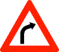

**Beskrivelse fra nettsiden:**

100 Farlig sving

### 100.2 — Farlig sving

- **Skilt-/symbolnummer:** 100.2
- **Bildefil:** [sf-20051007-1219-100-2-01.gif](sf-20051007-1219-100-2-01.gif)
- **Forskrift:** [§ 4.De enkelte fareskilt](https://lovdata.no/dokument/SF/forskrift/2005-10-07-1219#PARAGRAF_4)
- **Originalbilde:** [Lovdata](https://lovdata.no/static/SF/sf-20051007-1219-100-2-01.gif?timestamp=1788973220930)

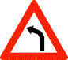

**Beskrivelse fra nettsiden:**

100 Farlig sving

### 102.1 — Farlige svinger

- **Skilt-/symbolnummer:** 102.1
- **Bildefil:** [sf-20051007-1219-102-1-01.gif](sf-20051007-1219-102-1-01.gif)
- **Forskrift:** [§ 4.De enkelte fareskilt](https://lovdata.no/dokument/SF/forskrift/2005-10-07-1219#PARAGRAF_4)
- **Originalbilde:** [Lovdata](https://lovdata.no/static/SF/sf-20051007-1219-102-1-01.gif?timestamp=1788973220930)

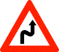

**Beskrivelse fra nettsiden:**

102 Farlige svinger

### 102.2 — Farlige svinger

- **Skilt-/symbolnummer:** 102.2
- **Bildefil:** [sf-20051007-1219-102-2-01.gif](sf-20051007-1219-102-2-01.gif)
- **Forskrift:** [§ 4.De enkelte fareskilt](https://lovdata.no/dokument/SF/forskrift/2005-10-07-1219#PARAGRAF_4)
- **Originalbilde:** [Lovdata](https://lovdata.no/static/SF/sf-20051007-1219-102-2-01.gif?timestamp=1788973220930)

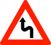

**Beskrivelse fra nettsiden:**

102 Farlige svinger

### 104.1 — Bratt bakke

- **Skilt-/symbolnummer:** 104.1
- **Bildefil:** [sf-20051007-1219-104-1-01.gif](sf-20051007-1219-104-1-01.gif)
- **Forskrift:** [§ 4.De enkelte fareskilt](https://lovdata.no/dokument/SF/forskrift/2005-10-07-1219#PARAGRAF_4)
- **Originalbilde:** [Lovdata](https://lovdata.no/static/SF/sf-20051007-1219-104-1-01.gif?timestamp=1788973220930)

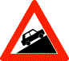

**Beskrivelse fra nettsiden:**

104 Bratt bakke

### 104.2 — Bratt bakke

- **Skilt-/symbolnummer:** 104.2
- **Bildefil:** [sf-20051007-1219-104-2-01.gif](sf-20051007-1219-104-2-01.gif)
- **Forskrift:** [§ 4.De enkelte fareskilt](https://lovdata.no/dokument/SF/forskrift/2005-10-07-1219#PARAGRAF_4)
- **Originalbilde:** [Lovdata](https://lovdata.no/static/SF/sf-20051007-1219-104-2-01.gif?timestamp=1788973220930)

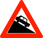

**Beskrivelse fra nettsiden:**

104 Bratt bakke

### 106.1 — Smalere veg

- **Skilt-/symbolnummer:** 106.1
- **Bildefil:** [sf-20051007-1219-106-1-01.gif](sf-20051007-1219-106-1-01.gif)
- **Forskrift:** [§ 4.De enkelte fareskilt](https://lovdata.no/dokument/SF/forskrift/2005-10-07-1219#PARAGRAF_4)
- **Originalbilde:** [Lovdata](https://lovdata.no/static/SF/sf-20051007-1219-106-1-01.gif?timestamp=1788973220930)

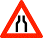

**Beskrivelse fra nettsiden:**

106 Smalere veg

### 106.2 — Smalere veg

- **Skilt-/symbolnummer:** 106.2
- **Bildefil:** [sf-20051007-1219-106-2-01.gif](sf-20051007-1219-106-2-01.gif)
- **Forskrift:** [§ 4.De enkelte fareskilt](https://lovdata.no/dokument/SF/forskrift/2005-10-07-1219#PARAGRAF_4)
- **Originalbilde:** [Lovdata](https://lovdata.no/static/SF/sf-20051007-1219-106-2-01.gif?timestamp=1788973220930)

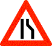

**Beskrivelse fra nettsiden:**

106 Smalere veg

### 106.3 — Smalere veg

- **Skilt-/symbolnummer:** 106.3
- **Bildefil:** [sf-20051007-1219-106-3-01.gif](sf-20051007-1219-106-3-01.gif)
- **Forskrift:** [§ 4.De enkelte fareskilt](https://lovdata.no/dokument/SF/forskrift/2005-10-07-1219#PARAGRAF_4)
- **Originalbilde:** [Lovdata](https://lovdata.no/static/SF/sf-20051007-1219-106-3-01.gif?timestamp=1788973220930)

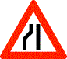

**Beskrivelse fra nettsiden:**

106 Smalere veg

### 108 — Ujevn veg

- **Skilt-/symbolnummer:** 108
- **Bildefil:** [sf-20051007-1219-108-01.gif](sf-20051007-1219-108-01.gif)
- **Forskrift:** [§ 4.De enkelte fareskilt](https://lovdata.no/dokument/SF/forskrift/2005-10-07-1219#PARAGRAF_4)
- **Originalbilde:** [Lovdata](https://lovdata.no/static/SF/sf-20051007-1219-108-01.gif?timestamp=1788973220930)

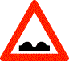

**Beskrivelse fra nettsiden:**

108 Ujevn veg

### 109 — Fartshump

- **Skilt-/symbolnummer:** 109
- **Bildefil:** [sf-20051007-1219-109-01.gif](sf-20051007-1219-109-01.gif)
- **Forskrift:** [§ 4.De enkelte fareskilt](https://lovdata.no/dokument/SF/forskrift/2005-10-07-1219#PARAGRAF_4)
- **Originalbilde:** [Lovdata](https://lovdata.no/static/SF/sf-20051007-1219-109-01.gif?timestamp=1788973220930)

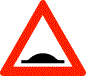

**Beskrivelse fra nettsiden:**

109 Fartshump

### 110 — Vegarbeid

- **Skilt-/symbolnummer:** 110
- **Bildefil:** [sf-20051007-1219-110-01.gif](sf-20051007-1219-110-01.gif)
- **Forskrift:** [§ 4.De enkelte fareskilt](https://lovdata.no/dokument/SF/forskrift/2005-10-07-1219#PARAGRAF_4)
- **Originalbilde:** [Lovdata](https://lovdata.no/static/SF/sf-20051007-1219-110-01.gif?timestamp=1788973220930)

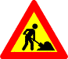

**Beskrivelse fra nettsiden:**

110 Vegarbeid

### 112 — Steinsprut

- **Skilt-/symbolnummer:** 112
- **Bildefil:** [sf-20051007-1219-112-01.gif](sf-20051007-1219-112-01.gif)
- **Forskrift:** [§ 4.De enkelte fareskilt](https://lovdata.no/dokument/SF/forskrift/2005-10-07-1219#PARAGRAF_4)
- **Originalbilde:** [Lovdata](https://lovdata.no/static/SF/sf-20051007-1219-112-01.gif?timestamp=1788973220930)

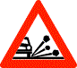

**Beskrivelse fra nettsiden:**

112 Steinsprut

### 114 — Rasfare

- **Skilt-/symbolnummer:** 114
- **Bildefil:** [sf-20051007-1219-114-01.gif](sf-20051007-1219-114-01.gif)
- **Forskrift:** [§ 4.De enkelte fareskilt](https://lovdata.no/dokument/SF/forskrift/2005-10-07-1219#PARAGRAF_4)
- **Originalbilde:** [Lovdata](https://lovdata.no/static/SF/sf-20051007-1219-114-01.gif?timestamp=1788973220930)

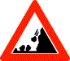

**Beskrivelse fra nettsiden:**

114 Rasfare

Skiltet varsler om fare for ras av stein, jord, snø e.l., og at rasmaterialer kan ligge på kjørebanen.

### 116 — Glatt kjørebane

- **Skilt-/symbolnummer:** 116
- **Bildefil:** [sf-20051007-1219-116-01.gif](sf-20051007-1219-116-01.gif)
- **Forskrift:** [§ 4.De enkelte fareskilt](https://lovdata.no/dokument/SF/forskrift/2005-10-07-1219#PARAGRAF_4)
- **Originalbilde:** [Lovdata](https://lovdata.no/static/SF/sf-20051007-1219-116-01.gif?timestamp=1788973220930)

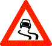

**Beskrivelse fra nettsiden:**

116 Glatt kjørebane

Skiltet varsler om fare for glatt kjørebane på grunn av særlige forhold.

### 117 — Farlig vegskulder

- **Skilt-/symbolnummer:** 117
- **Bildefil:** [sf-20051007-1219-117-01.gif](sf-20051007-1219-117-01.gif)
- **Forskrift:** [§ 4.De enkelte fareskilt](https://lovdata.no/dokument/SF/forskrift/2005-10-07-1219#PARAGRAF_4)
- **Originalbilde:** [Lovdata](https://lovdata.no/static/SF/sf-20051007-1219-117-01.gif?timestamp=1788973220930)

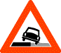

**Beskrivelse fra nettsiden:**

117 Farlig vegskulder

### 118 — Bevegelig bru

- **Skilt-/symbolnummer:** 118
- **Bildefil:** [sf-20051007-1219-118-01.gif](sf-20051007-1219-118-01.gif)
- **Forskrift:** [§ 4.De enkelte fareskilt](https://lovdata.no/dokument/SF/forskrift/2005-10-07-1219#PARAGRAF_4)
- **Originalbilde:** [Lovdata](https://lovdata.no/static/SF/sf-20051007-1219-118-01.gif?timestamp=1788973220930)

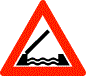

**Beskrivelse fra nettsiden:**

118 Bevegelig bru

### 120 — Kai, strand eller ferjeleie

- **Skilt-/symbolnummer:** 120
- **Bildefil:** [sf-20051007-1219-120-01.gif](sf-20051007-1219-120-01.gif)
- **Forskrift:** [§ 4.De enkelte fareskilt](https://lovdata.no/dokument/SF/forskrift/2005-10-07-1219#PARAGRAF_4)
- **Originalbilde:** [Lovdata](https://lovdata.no/static/SF/sf-20051007-1219-120-01.gif?timestamp=1788973220930)

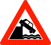

**Beskrivelse fra nettsiden:**

120 Kai, strand eller ferjeleie

### 122 — Tunnel

- **Skilt-/symbolnummer:** 122
- **Bildefil:** [sf-20051007-1219-122-01.gif](sf-20051007-1219-122-01.gif)
- **Forskrift:** [§ 4.De enkelte fareskilt](https://lovdata.no/dokument/SF/forskrift/2005-10-07-1219#PARAGRAF_4)
- **Originalbilde:** [Lovdata](https://lovdata.no/static/SF/sf-20051007-1219-122-01.gif?timestamp=1788973220930)

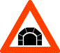

**Beskrivelse fra nettsiden:**

122 Tunnel

### 124 — Farlig vegkryss

- **Skilt-/symbolnummer:** 124
- **Bildefil:** [sf-20051007-1219-124-01.gif](sf-20051007-1219-124-01.gif)
- **Forskrift:** [§ 4.De enkelte fareskilt](https://lovdata.no/dokument/SF/forskrift/2005-10-07-1219#PARAGRAF_4)
- **Originalbilde:** [Lovdata](https://lovdata.no/static/SF/sf-20051007-1219-124-01.gif?timestamp=1788973220930)

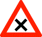

**Beskrivelse fra nettsiden:**

124 Farlig vegkryss

Skiltet varsler om farlig vegkryss hvor det gjelder vanlig vikeplikt overfor kjørende fra høyre.

### 126 — Rundkjøring

- **Skilt-/symbolnummer:** 126
- **Bildefil:** [sf-20051007-1219-126-01.gif](sf-20051007-1219-126-01.gif)
- **Forskrift:** [§ 4.De enkelte fareskilt](https://lovdata.no/dokument/SF/forskrift/2005-10-07-1219#PARAGRAF_4)
- **Originalbilde:** [Lovdata](https://lovdata.no/static/SF/sf-20051007-1219-126-01.gif?timestamp=1788973220930)

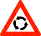

**Beskrivelse fra nettsiden:**

126 Rundkjøring

### 132 — Trafikklyssignal

- **Skilt-/symbolnummer:** 132
- **Bildefil:** [sf-20051007-1219-132-01.gif](sf-20051007-1219-132-01.gif)
- **Forskrift:** [§ 4.De enkelte fareskilt](https://lovdata.no/dokument/SF/forskrift/2005-10-07-1219#PARAGRAF_4)
- **Originalbilde:** [Lovdata](https://lovdata.no/static/SF/sf-20051007-1219-132-01.gif?timestamp=1788973220930)

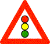

**Beskrivelse fra nettsiden:**

132 Trafikklyssignal

### 134 — Planovergang med bom

- **Skilt-/symbolnummer:** 134
- **Bildefil:** [sf-20051007-1219-134-01.gif](sf-20051007-1219-134-01.gif)
- **Forskrift:** [§ 4.De enkelte fareskilt](https://lovdata.no/dokument/SF/forskrift/2005-10-07-1219#PARAGRAF_4)
- **Originalbilde:** [Lovdata](https://lovdata.no/static/SF/sf-20051007-1219-134-01.gif?timestamp=1788973220930)

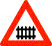

**Beskrivelse fra nettsiden:**

134 Planovergang med bom

### 135 — Planovergang uten bom

- **Skilt-/symbolnummer:** 135
- **Bildefil:** [sf-20051007-1219-135-01.gif](sf-20051007-1219-135-01.gif)
- **Forskrift:** [§ 4.De enkelte fareskilt](https://lovdata.no/dokument/SF/forskrift/2005-10-07-1219#PARAGRAF_4)
- **Originalbilde:** [Lovdata](https://lovdata.no/static/SF/sf-20051007-1219-135-01.gif?timestamp=1788973220930)

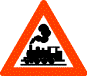

**Beskrivelse fra nettsiden:**

135 Planovergang uten bom

### 136.1 — Avstandsskilt

- **Skilt-/symbolnummer:** 136.1
- **Bildefil:** [sf-20051007-1219-136-1-01.gif](sf-20051007-1219-136-1-01.gif)
- **Forskrift:** [§ 4.De enkelte fareskilt](https://lovdata.no/dokument/SF/forskrift/2005-10-07-1219#PARAGRAF_4)
- **Originalbilde:** [Lovdata](https://lovdata.no/static/SF/sf-20051007-1219-136-1-01.gif?timestamp=1788973220930)

**Beskrivelse fra nettsiden:**

136 Avstandsskilt

Skiltet gir forvarsel om planovergang varslet med skilt 134 eller 135.

### 136.2 — Avstandsskilt

- **Skilt-/symbolnummer:** 136.2
- **Bildefil:** [sf-20051007-1219-136-2-01.gif](sf-20051007-1219-136-2-01.gif)
- **Forskrift:** [§ 4.De enkelte fareskilt](https://lovdata.no/dokument/SF/forskrift/2005-10-07-1219#PARAGRAF_4)
- **Originalbilde:** [Lovdata](https://lovdata.no/static/SF/sf-20051007-1219-136-2-01.gif?timestamp=1788973220930)

**Beskrivelse fra nettsiden:**

136 Avstandsskilt

Skiltet gir forvarsel om planovergang varslet med skilt 134 eller 135.

### 136.3 — Avstandsskilt

- **Skilt-/symbolnummer:** 136.3
- **Bildefil:** [sf-20051007-1219-136-3-01.gif](sf-20051007-1219-136-3-01.gif)
- **Forskrift:** [§ 4.De enkelte fareskilt](https://lovdata.no/dokument/SF/forskrift/2005-10-07-1219#PARAGRAF_4)
- **Originalbilde:** [Lovdata](https://lovdata.no/static/SF/sf-20051007-1219-136-3-01.gif?timestamp=1788973220930)

**Beskrivelse fra nettsiden:**

136 Avstandsskilt

Skiltet gir forvarsel om planovergang varslet med skilt 134 eller 135.

### 138.1 — Jernbanespor

- **Skilt-/symbolnummer:** 138.1
- **Bildefil:** [sf-20051007-1219-138-1-01.gif](sf-20051007-1219-138-1-01.gif)
- **Forskrift:** [§ 4.De enkelte fareskilt](https://lovdata.no/dokument/SF/forskrift/2005-10-07-1219#PARAGRAF_4)
- **Originalbilde:** [Lovdata](https://lovdata.no/static/SF/sf-20051007-1219-138-1-01.gif?timestamp=1788973220930)
- **Bildetekst på nettsiden:** 138.1 Enkeltsporet

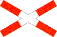

**Beskrivelse fra nettsiden:**

138 Jernbanespor

Skiltet angir stedet hvor jernbane eller forstadsbane krysser vegen i plan.

### 138.2 — Jernbanespor

- **Skilt-/symbolnummer:** 138.2
- **Bildefil:** [sf-20051007-1219-138-2-01.gif](sf-20051007-1219-138-2-01.gif)
- **Forskrift:** [§ 4.De enkelte fareskilt](https://lovdata.no/dokument/SF/forskrift/2005-10-07-1219#PARAGRAF_4)
- **Originalbilde:** [Lovdata](https://lovdata.no/static/SF/sf-20051007-1219-138-2-01.gif?timestamp=1788973220930)
- **Bildetekst på nettsiden:** 138.2 Flersporet

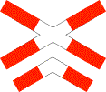

**Beskrivelse fra nettsiden:**

138 Jernbanespor

Skiltet angir stedet hvor jernbane eller forstadsbane krysser vegen i plan.

### 139 — Sporvogn

- **Skilt-/symbolnummer:** 139
- **Bildefil:** [sf-20051007-1219-139-01.gif](sf-20051007-1219-139-01.gif)
- **Forskrift:** [§ 4.De enkelte fareskilt](https://lovdata.no/dokument/SF/forskrift/2005-10-07-1219#PARAGRAF_4)
- **Originalbilde:** [Lovdata](https://lovdata.no/static/SF/sf-20051007-1219-139-01.gif?timestamp=1788973220930)

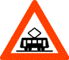

**Beskrivelse fra nettsiden:**

139 Sporvogn

### 140 — Avstand til gangfelt

- **Skilt-/symbolnummer:** 140
- **Bildefil:** [sf-20051007-1219-140-01.gif](sf-20051007-1219-140-01.gif)
- **Forskrift:** [§ 4.De enkelte fareskilt](https://lovdata.no/dokument/SF/forskrift/2005-10-07-1219#PARAGRAF_4)
- **Originalbilde:** [Lovdata](https://lovdata.no/static/SF/sf-20051007-1219-140-01.gif?timestamp=1788973220930)

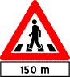

**Beskrivelse fra nettsiden:**

140 Avstand til gangfelt

### 142 — Barn

- **Skilt-/symbolnummer:** 142
- **Bildefil:** [sf-20051007-1219-142-01.gif](sf-20051007-1219-142-01.gif)
- **Forskrift:** [§ 4.De enkelte fareskilt](https://lovdata.no/dokument/SF/forskrift/2005-10-07-1219#PARAGRAF_4)
- **Originalbilde:** [Lovdata](https://lovdata.no/static/SF/sf-20051007-1219-142-01.gif?timestamp=1788973220930)

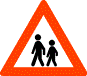

**Beskrivelse fra nettsiden:**

142 Barn

Skiltet varsler om sted på eller langs veg hvor barn ofte ferdes eller oppholder seg i forbindelse med skole, barnehage, lekeplass e.l.

### 144 — Syklende

- **Skilt-/symbolnummer:** 144
- **Bildefil:** [sf-20051007-1219-144-01.gif](sf-20051007-1219-144-01.gif)
- **Forskrift:** [§ 4.De enkelte fareskilt](https://lovdata.no/dokument/SF/forskrift/2005-10-07-1219#PARAGRAF_4)
- **Originalbilde:** [Lovdata](https://lovdata.no/static/SF/sf-20051007-1219-144-01.gif?timestamp=1788973220930)

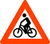

**Beskrivelse fra nettsiden:**

144 Syklende

Skiltet varsler om sted hvor syklende ofte krysser eller kjører ut på vegen, eller om syklende i tunnel.

### 146.1 — Dyr

- **Skilt-/symbolnummer:** 146.1
- **Bildefil:** [sf-20051007-1219-146-1-01.gif](sf-20051007-1219-146-1-01.gif)
- **Forskrift:** [§ 4.De enkelte fareskilt](https://lovdata.no/dokument/SF/forskrift/2005-10-07-1219#PARAGRAF_4)
- **Originalbilde:** [Lovdata](https://lovdata.no/static/SF/sf-20051007-1219-146-1-01.gif?timestamp=1788973220930)

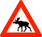

**Beskrivelse fra nettsiden:**

146 Dyr

Skiltet varsler at dyr ofte ferdes over eller langs vegen.

### 146.2 — Dyr

- **Skilt-/symbolnummer:** 146.2
- **Bildefil:** [sf-20051007-1219-146-2-01.gif](sf-20051007-1219-146-2-01.gif)
- **Forskrift:** [§ 4.De enkelte fareskilt](https://lovdata.no/dokument/SF/forskrift/2005-10-07-1219#PARAGRAF_4)
- **Originalbilde:** [Lovdata](https://lovdata.no/static/SF/sf-20051007-1219-146-2-01.gif?timestamp=1788973220930)

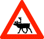

**Beskrivelse fra nettsiden:**

146 Dyr

Skiltet varsler at dyr ofte ferdes over eller langs vegen.

### 146.3 — Dyr

- **Skilt-/symbolnummer:** 146.3
- **Bildefil:** [sf-20051007-1219-146-3-01.gif](sf-20051007-1219-146-3-01.gif)
- **Forskrift:** [§ 4.De enkelte fareskilt](https://lovdata.no/dokument/SF/forskrift/2005-10-07-1219#PARAGRAF_4)
- **Originalbilde:** [Lovdata](https://lovdata.no/static/SF/sf-20051007-1219-146-3-01.gif?timestamp=1788973220930)

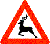

**Beskrivelse fra nettsiden:**

146 Dyr

Skiltet varsler at dyr ofte ferdes over eller langs vegen.

### 146.4 — Dyr

- **Skilt-/symbolnummer:** 146.4
- **Bildefil:** [sf-20051007-1219-146-4-01.gif](sf-20051007-1219-146-4-01.gif)
- **Forskrift:** [§ 4.De enkelte fareskilt](https://lovdata.no/dokument/SF/forskrift/2005-10-07-1219#PARAGRAF_4)
- **Originalbilde:** [Lovdata](https://lovdata.no/static/SF/sf-20051007-1219-146-4-01.gif?timestamp=1788973220930)

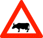

**Beskrivelse fra nettsiden:**

146 Dyr

Skiltet varsler at dyr ofte ferdes over eller langs vegen.

### 146.5 — Dyr

- **Skilt-/symbolnummer:** 146.5
- **Bildefil:** [sf-20051007-1219-146-5-01.gif](sf-20051007-1219-146-5-01.gif)
- **Forskrift:** [§ 4.De enkelte fareskilt](https://lovdata.no/dokument/SF/forskrift/2005-10-07-1219#PARAGRAF_4)
- **Originalbilde:** [Lovdata](https://lovdata.no/static/SF/sf-20051007-1219-146-5-01.gif?timestamp=1788973220930)

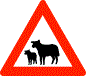

**Beskrivelse fra nettsiden:**

146 Dyr

Skiltet varsler at dyr ofte ferdes over eller langs vegen.

### 148 — Møtende trafikk

- **Skilt-/symbolnummer:** 148
- **Bildefil:** [sf-20051007-1219-148-01.gif](sf-20051007-1219-148-01.gif)
- **Forskrift:** [§ 4.De enkelte fareskilt](https://lovdata.no/dokument/SF/forskrift/2005-10-07-1219#PARAGRAF_4)
- **Originalbilde:** [Lovdata](https://lovdata.no/static/SF/sf-20051007-1219-148-01.gif?timestamp=1788973220930)

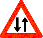

**Beskrivelse fra nettsiden:**

148 Møtende trafikk

Skiltet varsler at kjørebanen har kjørende trafikk i begge retninger.

### 149 — Kø

- **Skilt-/symbolnummer:** 149
- **Bildefil:** [sf-20051007-1219-149-01.gif](sf-20051007-1219-149-01.gif)
- **Forskrift:** [§ 4.De enkelte fareskilt](https://lovdata.no/dokument/SF/forskrift/2005-10-07-1219#PARAGRAF_4)
- **Originalbilde:** [Lovdata](https://lovdata.no/static/SF/sf-20051007-1219-149-01.gif?timestamp=1788973220930)

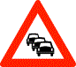

**Beskrivelse fra nettsiden:**

149 Kø

### 150 — Fly

- **Skilt-/symbolnummer:** 150
- **Bildefil:** [sf-20051007-1219-150-01.gif](sf-20051007-1219-150-01.gif)
- **Forskrift:** [§ 4.De enkelte fareskilt](https://lovdata.no/dokument/SF/forskrift/2005-10-07-1219#PARAGRAF_4)
- **Originalbilde:** [Lovdata](https://lovdata.no/static/SF/sf-20051007-1219-150-01.gif?timestamp=1788973220930)

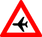

**Beskrivelse fra nettsiden:**

150 Fly

Skiltet varsler at fly kan fly lavt over eller nær vegen.

### 151 — Militær aktivitet

- **Skilt-/symbolnummer:** 151
- **Bildefil:** [sf-20051007-1219-151-01.gif](sf-20051007-1219-151-01.gif)
- **Forskrift:** [§ 4.De enkelte fareskilt](https://lovdata.no/dokument/SF/forskrift/2005-10-07-1219#PARAGRAF_4)
- **Originalbilde:** [Lovdata](https://lovdata.no/static/SF/sf-20051007-1219-151-01.gif?timestamp=1788973220930)

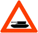

**Beskrivelse fra nettsiden:**

151 Militær aktivitet

### 152 — Sidevind

- **Skilt-/symbolnummer:** 152
- **Bildefil:** [sf-20051007-1219-152-01.gif](sf-20051007-1219-152-01.gif)
- **Forskrift:** [§ 4.De enkelte fareskilt](https://lovdata.no/dokument/SF/forskrift/2005-10-07-1219#PARAGRAF_4)
- **Originalbilde:** [Lovdata](https://lovdata.no/static/SF/sf-20051007-1219-152-01.gif?timestamp=1788973220930)

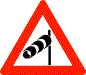

**Beskrivelse fra nettsiden:**

152 Sidevind

Skiltet varsler om sted hvor det ofte forekommer sterk sidevind.

### 153 — Trafikkulykke

- **Skilt-/symbolnummer:** 153
- **Bildefil:** [sf-20051007-1219-153-01.gif](sf-20051007-1219-153-01.gif)
- **Forskrift:** [§ 4.De enkelte fareskilt](https://lovdata.no/dokument/SF/forskrift/2005-10-07-1219#PARAGRAF_4)
- **Originalbilde:** [Lovdata](https://lovdata.no/static/SF/sf-20051007-1219-153-01.gif?timestamp=1788973220930)

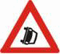

**Beskrivelse fra nettsiden:**

153 Trafikkulykke

### 154 — Skiløpere

- **Skilt-/symbolnummer:** 154
- **Bildefil:** [sf-20051007-1219-154-01.gif](sf-20051007-1219-154-01.gif)
- **Forskrift:** [§ 4.De enkelte fareskilt](https://lovdata.no/dokument/SF/forskrift/2005-10-07-1219#PARAGRAF_4)
- **Originalbilde:** [Lovdata](https://lovdata.no/static/SF/sf-20051007-1219-154-01.gif?timestamp=1788973220930)

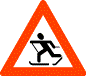

**Beskrivelse fra nettsiden:**

154 Skiløpere

Skiltet varsler om sted hvor skiløpere ofte krysser vegen.

### 155 — Ridende

- **Skilt-/symbolnummer:** 155
- **Bildefil:** [sf-20051007-1219-155-01.gif](sf-20051007-1219-155-01.gif)
- **Forskrift:** [§ 4.De enkelte fareskilt](https://lovdata.no/dokument/SF/forskrift/2005-10-07-1219#PARAGRAF_4)
- **Originalbilde:** [Lovdata](https://lovdata.no/static/SF/sf-20051007-1219-155-01.gif?timestamp=1788973220930)

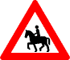

**Beskrivelse fra nettsiden:**

155 Ridende

Skiltet varsler om sted hvor ridende ofte krysser eller rir ut i vegen.

### 156 — Annen fare

- **Skilt-/symbolnummer:** 156
- **Bildefil:** [sf-20051007-1219-156-01.gif](sf-20051007-1219-156-01.gif)
- **Forskrift:** [§ 4.De enkelte fareskilt](https://lovdata.no/dokument/SF/forskrift/2005-10-07-1219#PARAGRAF_4)
- **Originalbilde:** [Lovdata](https://lovdata.no/static/SF/sf-20051007-1219-156-01.gif?timestamp=1788973220930)

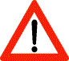

**Beskrivelse fra nettsiden:**

156 Annen fare

Farens art er angitt på underskilt.

## Kapittel 3. Vikeplikt- og forkjørsskilt

### 202 — Vikeplikt

- **Skilt-/symbolnummer:** 202
- **Bildefil:** [sf-20051007-1219-202-01.gif](sf-20051007-1219-202-01.gif)
- **Forskrift:** [§ 6.De enkelte vikeplikt- og forkjørsskilt](https://lovdata.no/dokument/SF/forskrift/2005-10-07-1219#PARAGRAF_6)
- **Originalbilde:** [Lovdata](https://lovdata.no/static/SF/sf-20051007-1219-202-01.gif?timestamp=1788973220930)

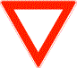

**Beskrivelse fra nettsiden:**

202 Vikeplikt

Skiltet angir at kjørende har vikeplikt for kjørende trafikk i begge retninger på kryssende veg.

### 204 — Stopp

- **Skilt-/symbolnummer:** 204
- **Bildefil:** [sf-20051007-1219-204-01.gif](sf-20051007-1219-204-01.gif)
- **Forskrift:** [§ 6.De enkelte vikeplikt- og forkjørsskilt](https://lovdata.no/dokument/SF/forskrift/2005-10-07-1219#PARAGRAF_6)
- **Originalbilde:** [Lovdata](https://lovdata.no/static/SF/sf-20051007-1219-204-01.gif?timestamp=1788973220930)

**Beskrivelse fra nettsiden:**

204 Stopp

Skiltet angir at kjørende skal stanse helt før kjøring inn på kryssende veg eller før kryssing av planovergang, og at den kjørende har vikeplikt for kjørende trafikk i begge retninger på kryssende veg eller at den kjørende skal gi fri veg for sporvogn og jernbanetog på kryssende planovergang.

Stansen skal skje foran og inntil stopplinje, eller dersom stopplinje mangler, så nær den kryssende veg som mulig.

### 206 — Forkjørsveg

- **Skilt-/symbolnummer:** 206
- **Bildefil:** [sf-20051007-1219-206-01.gif](sf-20051007-1219-206-01.gif)
- **Forskrift:** [§ 6.De enkelte vikeplikt- og forkjørsskilt](https://lovdata.no/dokument/SF/forskrift/2005-10-07-1219#PARAGRAF_6)
- **Originalbilde:** [Lovdata](https://lovdata.no/static/SF/sf-20051007-1219-206-01.gif?timestamp=1788973220930)

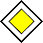

**Beskrivelse fra nettsiden:**

206 Forkjørsveg

Skiltet angir at kjørende som kommer fra sideveg eller kryssende veg, er pålagt vikeplikt med skilt 202 «Vikeplikt» eller 204 «Stopp».

Skiltet gjelder til det blir opphevet med skilt 208 «Slutt på forkjørsveg» eller skilt 202 «Vikeplikt» eller skilt 204 «Stopp».

I kjørefelt med skilt 531 «Felt for fartsøkning» gjelder likevel trafikkreglenes bestemmelser om kjøring i slikt felt.

### 208 — Slutt på forkjørsveg

- **Skilt-/symbolnummer:** 208
- **Bildefil:** [sf-20051007-1219-208-01.gif](sf-20051007-1219-208-01.gif)
- **Forskrift:** [§ 6.De enkelte vikeplikt- og forkjørsskilt](https://lovdata.no/dokument/SF/forskrift/2005-10-07-1219#PARAGRAF_6)
- **Originalbilde:** [Lovdata](https://lovdata.no/static/SF/sf-20051007-1219-208-01.gif?timestamp=1788973220930)

**Beskrivelse fra nettsiden:**

208 Slutt på forkjørsveg

### 210 — Forkjørskryss

- **Skilt-/symbolnummer:** 210
- **Bildefil:** [sf-20051007-1219-210-01.gif](sf-20051007-1219-210-01.gif)
- **Forskrift:** [§ 6.De enkelte vikeplikt- og forkjørsskilt](https://lovdata.no/dokument/SF/forskrift/2005-10-07-1219#PARAGRAF_6)
- **Originalbilde:** [Lovdata](https://lovdata.no/static/SF/sf-20051007-1219-210-01.gif?timestamp=1788973220930)

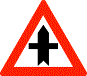

**Beskrivelse fra nettsiden:**

210 Forkjørskryss

Skiltet varsler om farlig vegkryss hvor kjørende fra sideveg eller kryssende veg er pålagt vikeplikt med skilt 202 «Vikeplikt» eller 204 «Stopp».

### 212 — Vikeplikt overfor møtende kjørende

- **Skilt-/symbolnummer:** 212
- **Bildefil:** [sf-20051007-1219-212-01.gif](sf-20051007-1219-212-01.gif)
- **Forskrift:** [§ 6.De enkelte vikeplikt- og forkjørsskilt](https://lovdata.no/dokument/SF/forskrift/2005-10-07-1219#PARAGRAF_6)
- **Originalbilde:** [Lovdata](https://lovdata.no/static/SF/sf-20051007-1219-212-01.gif?timestamp=1788973220930)

**Beskrivelse fra nettsiden:**

212 Vikeplikt overfor møtende kjørende

Skiltet angir forbud mot å kjøre inn på smal vegstrekning dersom slik kjøring medfører at møtende kjørende blir hindret.

### 214 — Møtende kjørende har vikeplikt

- **Skilt-/symbolnummer:** 214
- **Bildefil:** [sf-20051007-1219-214-01.gif](sf-20051007-1219-214-01.gif)
- **Forskrift:** [§ 6.De enkelte vikeplikt- og forkjørsskilt](https://lovdata.no/dokument/SF/forskrift/2005-10-07-1219#PARAGRAF_6)
- **Originalbilde:** [Lovdata](https://lovdata.no/static/SF/sf-20051007-1219-214-01.gif?timestamp=1788973220930)

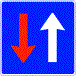

**Beskrivelse fra nettsiden:**

214 Møtende kjørende har vikeplikt

Skiltet angir at møtende kjørende er pålagt vikeplikt med skilt 212 «Vikeplikt overfor møtende kjørende».

## Kapittel 4. Forbudsskilt

### 302 — Innkjøring forbudt

- **Skilt-/symbolnummer:** 302
- **Bildefil:** [sf-20051007-1219-302-01.gif](sf-20051007-1219-302-01.gif)
- **Forskrift:** [§ 8.De enkelte forbudsskilt](https://lovdata.no/dokument/SF/forskrift/2005-10-07-1219#PARAGRAF_8)
- **Originalbilde:** [Lovdata](https://lovdata.no/static/SF/sf-20051007-1219-302-01.gif?timestamp=1788973220930)

**Beskrivelse fra nettsiden:**

302 Innkjøring forbudt

Skiltet angir forbud mot å kjøre forbi skiltet. Sykling og bruk av liten elektrisk motorvogn på fortau kan likevel foregå i samsvar med trafikkreglene.

### 306.0 — Forbudt for alle kjøretøy

- **Skilt-/symbolnummer:** 306.0
- **Bildefil:** [sf-20051007-1219-306-0-01.gif](sf-20051007-1219-306-0-01.gif)
- **Forskrift:** [§ 8.De enkelte forbudsskilt](https://lovdata.no/dokument/SF/forskrift/2005-10-07-1219#PARAGRAF_8)
- **Originalbilde:** [Lovdata](https://lovdata.no/static/SF/sf-20051007-1219-306-0-01.gif?timestamp=1788973220930)

**Beskrivelse fra nettsiden:**

306 Trafikkforbud

306.0 Forbudt for alle kjøretøy

### 306.1 — Forbudt for motorvogn med unntak av liten elektrisk motorvogn

- **Skilt-/symbolnummer:** 306.1
- **Bildefil:** [sf-20051007-1219-306-1-01.gif](sf-20051007-1219-306-1-01.gif)
- **Forskrift:** [§ 8.De enkelte forbudsskilt](https://lovdata.no/dokument/SF/forskrift/2005-10-07-1219#PARAGRAF_8)
- **Originalbilde:** [Lovdata](https://lovdata.no/static/SF/sf-20051007-1219-306-1-01.gif?timestamp=1788973220930)

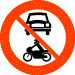

**Beskrivelse fra nettsiden:**

306 Trafikkforbud

306.1 Forbudt for motorvogn med unntak av liten elektrisk motorvogn

### 306.3 — Forbudt for alle traktorer og for motorredskap konstruert for fart mindre enn 40 km/t.

- **Skilt-/symbolnummer:** 306.3
- **Bildefil:** [sf-20051007-1219-306-3-01.gif](sf-20051007-1219-306-3-01.gif)
- **Forskrift:** [§ 8.De enkelte forbudsskilt](https://lovdata.no/dokument/SF/forskrift/2005-10-07-1219#PARAGRAF_8)
- **Originalbilde:** [Lovdata](https://lovdata.no/static/SF/sf-20051007-1219-306-3-01.gif?timestamp=1788973220930)

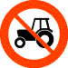

**Beskrivelse fra nettsiden:**

306 Trafikkforbud

306.3 Forbudt for alle traktorer og for motorredskap konstruert for fart mindre enn 40 km/t.

### 306.4 — Forbudt for motorsykkel og moped

- **Skilt-/symbolnummer:** 306.4
- **Bildefil:** [sf-20051007-1219-306-4-01.gif](sf-20051007-1219-306-4-01.gif)
- **Forskrift:** [§ 8.De enkelte forbudsskilt](https://lovdata.no/dokument/SF/forskrift/2005-10-07-1219#PARAGRAF_8)
- **Originalbilde:** [Lovdata](https://lovdata.no/static/SF/sf-20051007-1219-306-4-01.gif?timestamp=1788973220930)

**Beskrivelse fra nettsiden:**

306 Trafikkforbud

306.4 Forbudt for motorsykkel og moped

### 306.5 — Forbudt for lastebil og trekkbil

- **Skilt-/symbolnummer:** 306.5
- **Bildefil:** [sf-20051007-1219-306-5-01.gif](sf-20051007-1219-306-5-01.gif)
- **Forskrift:** [§ 8.De enkelte forbudsskilt](https://lovdata.no/dokument/SF/forskrift/2005-10-07-1219#PARAGRAF_8)
- **Originalbilde:** [Lovdata](https://lovdata.no/static/SF/sf-20051007-1219-306-5-01.gif?timestamp=1788973220930)

**Beskrivelse fra nettsiden:**

306 Trafikkforbud

306.5 Forbudt for lastebil og trekkbil

### 306.6 — Forbudt for syklende og fører av liten elektrisk motorvogn

- **Skilt-/symbolnummer:** 306.6
- **Bildefil:** [sf-20051007-1219-306-6-01.gif](sf-20051007-1219-306-6-01.gif)
- **Forskrift:** [§ 8.De enkelte forbudsskilt](https://lovdata.no/dokument/SF/forskrift/2005-10-07-1219#PARAGRAF_8)
- **Originalbilde:** [Lovdata](https://lovdata.no/static/SF/sf-20051007-1219-306-6-01.gif?timestamp=1788973220930)

**Beskrivelse fra nettsiden:**

306 Trafikkforbud

306.6 Forbudt for syklende og fører av liten elektrisk motorvogn

### 306.7 — Forbudt for gående

- **Skilt-/symbolnummer:** 306.7
- **Bildefil:** [sf-20051007-1219-306-7-01.gif](sf-20051007-1219-306-7-01.gif)
- **Forskrift:** [§ 8.De enkelte forbudsskilt](https://lovdata.no/dokument/SF/forskrift/2005-10-07-1219#PARAGRAF_8)
- **Originalbilde:** [Lovdata](https://lovdata.no/static/SF/sf-20051007-1219-306-7-01.gif?timestamp=1788973220930)

**Beskrivelse fra nettsiden:**

306 Trafikkforbud

306.7 Forbudt for gående

### 306.8 — Forbudt for gående, syklende og fører av liten elektrisk motorvogn

- **Skilt-/symbolnummer:** 306.8
- **Bildefil:** [sf-20051007-1219-306-8-01.gif](sf-20051007-1219-306-8-01.gif)
- **Forskrift:** [§ 8.De enkelte forbudsskilt](https://lovdata.no/dokument/SF/forskrift/2005-10-07-1219#PARAGRAF_8)
- **Originalbilde:** [Lovdata](https://lovdata.no/static/SF/sf-20051007-1219-306-8-01.gif?timestamp=1788973220930)

**Beskrivelse fra nettsiden:**

306 Trafikkforbud

306.8 Forbudt for gående, syklende og fører av liten elektrisk motorvogn

### 306.9 — Forbudt for ridende

- **Skilt-/symbolnummer:** 306.9
- **Bildefil:** [sf-20051007-1219-306-9-01.gif](sf-20051007-1219-306-9-01.gif)
- **Forskrift:** [§ 8.De enkelte forbudsskilt](https://lovdata.no/dokument/SF/forskrift/2005-10-07-1219#PARAGRAF_8)
- **Originalbilde:** [Lovdata](https://lovdata.no/static/SF/sf-20051007-1219-306-9-01.gif?timestamp=1788973220930)

**Beskrivelse fra nettsiden:**

306 Trafikkforbud

306.9 Forbudt for ridende

### 306.10 — Forbudt for liten elektrisk motorvogn

- **Skilt-/symbolnummer:** 306.10
- **Bildefil:** [sf-20051007-1219-306-10-01.png](sf-20051007-1219-306-10-01.png)
- **Forskrift:** [§ 8.De enkelte forbudsskilt](https://lovdata.no/dokument/SF/forskrift/2005-10-07-1219#PARAGRAF_8)
- **Originalbilde:** [Lovdata](https://lovdata.no/static/SF/sf-20051007-1219-306-10-01.png?timestamp=1788973220930)

**Beskrivelse fra nettsiden:**

306 Trafikkforbud

306.10 Forbudt for liten elektrisk motorvogn

Forbudet gjelder ferdsel på veg og fortau med liten elektrisk motorvogn.

### 308 — Forbudt for transport av farlig gods

- **Skilt-/symbolnummer:** 308
- **Bildefil:** [sf-20051007-1219-308-01.gif](sf-20051007-1219-308-01.gif)
- **Forskrift:** [§ 8.De enkelte forbudsskilt](https://lovdata.no/dokument/SF/forskrift/2005-10-07-1219#PARAGRAF_8)
- **Originalbilde:** [Lovdata](https://lovdata.no/static/SF/sf-20051007-1219-308-01.gif?timestamp=1788973220930)

**Beskrivelse fra nettsiden:**

308 Forbudt for transport av farlig gods

Forbudet gjelder for kjøretøy som transporterer farlig gods hvor merking med oransje skilter i henhold til avsnitt 5.3.2 i ADR kreves for transportenheten. I de tilfeller hvor forbudet gjelder for vegtunneler, omfatter forbudet de kjøretøy som angis i avsnitt 1.9.5.3.6 i ADR.

### 310 — Forbudt for motorvogn med flere enn to hjul og med tillatt totalvekt høyere enn angitt

- **Skilt-/symbolnummer:** 310
- **Bildefil:** [sf-20051007-1219-310-01.gif](sf-20051007-1219-310-01.gif)
- **Forskrift:** [§ 8.De enkelte forbudsskilt](https://lovdata.no/dokument/SF/forskrift/2005-10-07-1219#PARAGRAF_8)
- **Originalbilde:** [Lovdata](https://lovdata.no/static/SF/sf-20051007-1219-310-01.gif?timestamp=1788973220930)

**Beskrivelse fra nettsiden:**

310 Forbudt for motorvogn med flere enn to hjul og med tillatt totalvekt høyere enn angitt

### 312 — Breddegrense

- **Skilt-/symbolnummer:** 312
- **Bildefil:** [sf-20051007-1219-312-01.gif](sf-20051007-1219-312-01.gif)
- **Forskrift:** [§ 8.De enkelte forbudsskilt](https://lovdata.no/dokument/SF/forskrift/2005-10-07-1219#PARAGRAF_8)
- **Originalbilde:** [Lovdata](https://lovdata.no/static/SF/sf-20051007-1219-312-01.gif?timestamp=1788973220930)

**Beskrivelse fra nettsiden:**

312 Breddegrense

Forbudet gjelder kjøretøy, medregnet gods, med større bredde enn angitt.

### 314 — Høydegrense

- **Skilt-/symbolnummer:** 314
- **Bildefil:** [sf-20051007-1219-314-01.gif](sf-20051007-1219-314-01.gif)
- **Forskrift:** [§ 8.De enkelte forbudsskilt](https://lovdata.no/dokument/SF/forskrift/2005-10-07-1219#PARAGRAF_8)
- **Originalbilde:** [Lovdata](https://lovdata.no/static/SF/sf-20051007-1219-314-01.gif?timestamp=1788973220930)

**Beskrivelse fra nettsiden:**

314 Høydegrense

Forbudet gjelder kjøretøy, medregnet gods, med større høyde enn angitt.

### 316 — Lengdegrense

- **Skilt-/symbolnummer:** 316
- **Bildefil:** [sf-20051007-1219-316-01.gif](sf-20051007-1219-316-01.gif)
- **Forskrift:** [§ 8.De enkelte forbudsskilt](https://lovdata.no/dokument/SF/forskrift/2005-10-07-1219#PARAGRAF_8)
- **Originalbilde:** [Lovdata](https://lovdata.no/static/SF/sf-20051007-1219-316-01.gif?timestamp=1788973220930)

**Beskrivelse fra nettsiden:**

316 Lengdegrense

Forbudet gjelder kjøretøy eller vogntog, medregnet gods, med større lengde enn angitt.

### 318.1 — for kjøretøy

- **Skilt-/symbolnummer:** 318.1
- **Bildefil:** [sf-20051007-1219-318-1-01.gif](sf-20051007-1219-318-1-01.gif)
- **Forskrift:** [§ 8.De enkelte forbudsskilt](https://lovdata.no/dokument/SF/forskrift/2005-10-07-1219#PARAGRAF_8)
- **Originalbilde:** [Lovdata](https://lovdata.no/static/SF/sf-20051007-1219-318-1-01.gif?timestamp=1788973220930)

**Beskrivelse fra nettsiden:**

318 Totalvektgrense

318.1 for kjøretøy

Forbudet gjelder kjøretøy hvor aktuell totalvekt er høyere enn angitt. For vogntog gjelder forbudet hvert enkelt kjøretøy.

### 318.2 — for vogntog

- **Skilt-/symbolnummer:** 318.2
- **Bildefil:** [sf-20051007-1219-318-2-01.gif](sf-20051007-1219-318-2-01.gif)
- **Forskrift:** [§ 8.De enkelte forbudsskilt](https://lovdata.no/dokument/SF/forskrift/2005-10-07-1219#PARAGRAF_8)
- **Originalbilde:** [Lovdata](https://lovdata.no/static/SF/sf-20051007-1219-318-2-01.gif?timestamp=1788973220930)

**Beskrivelse fra nettsiden:**

318 Totalvektgrense

318.2 for vogntog

Forbudet gjelder vogntog hvor samlet aktuell totalvekt er høyere enn angitt. Forbudet gjelder også enkelt kjøretøy hvor aktuell totalvekt er høyere enn angitt.

### 320 — Aksellastgrense

- **Skilt-/symbolnummer:** 320
- **Bildefil:** [sf-20051007-1219-320-01.gif](sf-20051007-1219-320-01.gif)
- **Forskrift:** [§ 8.De enkelte forbudsskilt](https://lovdata.no/dokument/SF/forskrift/2005-10-07-1219#PARAGRAF_8)
- **Originalbilde:** [Lovdata](https://lovdata.no/static/SF/sf-20051007-1219-320-01.gif?timestamp=1788973220930)

**Beskrivelse fra nettsiden:**

320 Aksellastgrense

Forbudet gjelder kjøretøy med aktuell aksellast høyere enn angitt, aktuell boggilast høyere enn 1,5 ganger angitt aksellast eller aktuell trippelboggilast høyere enn 2 ganger angitt aksellast.

### 322 — Boggilastgrense

- **Skilt-/symbolnummer:** 322
- **Bildefil:** [sf-20051007-1219-322-01.gif](sf-20051007-1219-322-01.gif)
- **Forskrift:** [§ 8.De enkelte forbudsskilt](https://lovdata.no/dokument/SF/forskrift/2005-10-07-1219#PARAGRAF_8)
- **Originalbilde:** [Lovdata](https://lovdata.no/static/SF/sf-20051007-1219-322-01.gif?timestamp=1788973220930)

**Beskrivelse fra nettsiden:**

322 Boggilastgrense

Forbudet gjelder kjøretøy med aktuell boggilast høyere enn angitt.

### 324 — Stopp for angitt formål

- **Skilt-/symbolnummer:** 324
- **Bildefil:** [sf-20051007-1219-324-01.gif](sf-20051007-1219-324-01.gif)
- **Forskrift:** [§ 8.De enkelte forbudsskilt](https://lovdata.no/dokument/SF/forskrift/2005-10-07-1219#PARAGRAF_8)
- **Originalbilde:** [Lovdata](https://lovdata.no/static/SF/sf-20051007-1219-324-01.gif?timestamp=1788973220930)

**Beskrivelse fra nettsiden:**

324 Stopp for angitt formål

Skiltet angir forbud mot å kjøre videre før det er foretatt stans for det formål som er angitt i tekst på skiltet.

### 326 — Stopp for toll

- **Skilt-/symbolnummer:** 326
- **Bildefil:** [sf-20051007-1219-326-01.gif](sf-20051007-1219-326-01.gif)
- **Forskrift:** [§ 8.De enkelte forbudsskilt](https://lovdata.no/dokument/SF/forskrift/2005-10-07-1219#PARAGRAF_8)
- **Originalbilde:** [Lovdata](https://lovdata.no/static/SF/sf-20051007-1219-326-01.gif?timestamp=1788973220930)

**Beskrivelse fra nettsiden:**

326 Stopp for toll

Skiltet angir plikt til å stanse for tollklarering i samsvar med gjeldende tollbestemmelser.

### 330.1 — Svingeforbud

- **Skilt-/symbolnummer:** 330.1
- **Bildefil:** [sf-20051007-1219-330-1-01.gif](sf-20051007-1219-330-1-01.gif)
- **Forskrift:** [§ 8.De enkelte forbudsskilt](https://lovdata.no/dokument/SF/forskrift/2005-10-07-1219#PARAGRAF_8)
- **Originalbilde:** [Lovdata](https://lovdata.no/static/SF/sf-20051007-1219-330-1-01.gif?timestamp=1788973220930)

**Beskrivelse fra nettsiden:**

330 Svingeforbud

Forbudet gjelder bare for det vegkryss som skiltet er plassert i eller ved, eventuelt for første vegkryss etter skiltet. Annet virkeområde kan fastsettes ved underskilt.

### 330.2 — Svingeforbud

- **Skilt-/symbolnummer:** 330.2
- **Bildefil:** [sf-20051007-1219-330-2-01.gif](sf-20051007-1219-330-2-01.gif)
- **Forskrift:** [§ 8.De enkelte forbudsskilt](https://lovdata.no/dokument/SF/forskrift/2005-10-07-1219#PARAGRAF_8)
- **Originalbilde:** [Lovdata](https://lovdata.no/static/SF/sf-20051007-1219-330-2-01.gif?timestamp=1788973220930)

**Beskrivelse fra nettsiden:**

330 Svingeforbud

Forbudet gjelder bare for det vegkryss som skiltet er plassert i eller ved, eventuelt for første vegkryss etter skiltet. Annet virkeområde kan fastsettes ved underskilt.

### 332 — Vendingsforbud

- **Skilt-/symbolnummer:** 332
- **Bildefil:** [sf-20051007-1219-332-01.gif](sf-20051007-1219-332-01.gif)
- **Forskrift:** [§ 8.De enkelte forbudsskilt](https://lovdata.no/dokument/SF/forskrift/2005-10-07-1219#PARAGRAF_8)
- **Originalbilde:** [Lovdata](https://lovdata.no/static/SF/sf-20051007-1219-332-01.gif?timestamp=1788973220930)

**Beskrivelse fra nettsiden:**

332 Vendingsforbud

Forbudet gjelder til og med første vegkryss.

### 334 — Forbikjøringsforbud

- **Skilt-/symbolnummer:** 334
- **Bildefil:** [sf-20051007-1219-334-01.gif](sf-20051007-1219-334-01.gif)
- **Forskrift:** [§ 8.De enkelte forbudsskilt](https://lovdata.no/dokument/SF/forskrift/2005-10-07-1219#PARAGRAF_8)
- **Originalbilde:** [Lovdata](https://lovdata.no/static/SF/sf-20051007-1219-334-01.gif?timestamp=1788973220930)

**Beskrivelse fra nettsiden:**

334 Forbikjøringsforbud

Forbudet gjelder forbikjøring av motorvogn som har flere enn to hjul.

Forbudet gjelder ikke forbikjøring som etter trafikkreglene lovlig kan skje til høyre. Forbudet gjelder fram til skilt 336 «Slutt på forbikjøringsforbud», eller over en strekning som angitt med underskilt.

### 335 — Forbikjøringsforbud for lastebil

- **Skilt-/symbolnummer:** 335
- **Bildefil:** [sf-20051007-1219-335-01.gif](sf-20051007-1219-335-01.gif)
- **Forskrift:** [§ 8.De enkelte forbudsskilt](https://lovdata.no/dokument/SF/forskrift/2005-10-07-1219#PARAGRAF_8)
- **Originalbilde:** [Lovdata](https://lovdata.no/static/SF/sf-20051007-1219-335-01.gif?timestamp=1788973220930)

**Beskrivelse fra nettsiden:**

335 Forbikjøringsforbud for lastebil

Forbudet gjelder lastebil med tillatt totalvekt over 3.500 kg som kjører forbi motorvogn som har flere enn to hjul.

Forbudet gjelder ikke forbikjøring som etter trafikkreglene lovlig kan skje til høyre. Forbudet gjelder fram til skilt 337 «Slutt på forbikjøringsforbud for lastebil», eller over en strekning som angitt med underskilt.

### 336 — Slutt på forbikjøringsforbud

- **Skilt-/symbolnummer:** 336
- **Bildefil:** [sf-20051007-1219-336-01.gif](sf-20051007-1219-336-01.gif)
- **Forskrift:** [§ 8.De enkelte forbudsskilt](https://lovdata.no/dokument/SF/forskrift/2005-10-07-1219#PARAGRAF_8)
- **Originalbilde:** [Lovdata](https://lovdata.no/static/SF/sf-20051007-1219-336-01.gif?timestamp=1788973220930)

**Beskrivelse fra nettsiden:**

336 Slutt på forbikjøringsforbud

### 337 — Slutt på forbikjøringsforbud for lastebil

- **Skilt-/symbolnummer:** 337
- **Bildefil:** [sf-20051007-1219-337-01.gif](sf-20051007-1219-337-01.gif)
- **Forskrift:** [§ 8.De enkelte forbudsskilt](https://lovdata.no/dokument/SF/forskrift/2005-10-07-1219#PARAGRAF_8)
- **Originalbilde:** [Lovdata](https://lovdata.no/static/SF/sf-20051007-1219-337-01.gif?timestamp=1788973220930)

**Beskrivelse fra nettsiden:**

337 Slutt på forbikjøringsforbud for lastebil

### 362 — Fartsgrense

- **Skilt-/symbolnummer:** 362
- **Bildefil:** [sf-20051007-1219-362-01.gif](sf-20051007-1219-362-01.gif)
- **Forskrift:** [§ 8.De enkelte forbudsskilt](https://lovdata.no/dokument/SF/forskrift/2005-10-07-1219#PARAGRAF_8)
- **Originalbilde:** [Lovdata](https://lovdata.no/static/SF/sf-20051007-1219-362-01.gif?timestamp=1788973220930)

**Beskrivelse fra nettsiden:**

362 Fartsgrense

Forbudet gjelder kjøring med høyere fart enn angitt antall km/t.

Forbudet gjelder på vedkommende vegstrekning fram til annen fartsgrense er angitt ved

a) nytt skilt 362 «Fartsgrense» eller

b) skilt 366 «Fartsgrensesone» eller til der ett av følgende skilt er satt opp:

c) skilt 364 «Slutt på særskilt fartsgrense»

d) skilt 540 «Gatetun»

e) skilt 548 «Gågate».

Når skiltet nyttes til midlertidig regulering, kan det ha gul bunnfarge.

### 364 — Slutt på særskilt fartsgrense

- **Skilt-/symbolnummer:** 364
- **Bildefil:** [sf-20051007-1219-364-01.gif](sf-20051007-1219-364-01.gif)
- **Forskrift:** [§ 8.De enkelte forbudsskilt](https://lovdata.no/dokument/SF/forskrift/2005-10-07-1219#PARAGRAF_8)
- **Originalbilde:** [Lovdata](https://lovdata.no/static/SF/sf-20051007-1219-364-01.gif?timestamp=1788973220930)

**Beskrivelse fra nettsiden:**

364 Slutt på særskilt fartsgrense

### 366 — Fartsgrensesone

- **Skilt-/symbolnummer:** 366
- **Bildefil:** [sf-20051007-1219-366-01.gif](sf-20051007-1219-366-01.gif)
- **Forskrift:** [§ 8.De enkelte forbudsskilt](https://lovdata.no/dokument/SF/forskrift/2005-10-07-1219#PARAGRAF_8)
- **Originalbilde:** [Lovdata](https://lovdata.no/static/SF/sf-20051007-1219-366-01.gif?timestamp=1788973220930)

**Beskrivelse fra nettsiden:**

366 Fartsgrensesone

Skiltet angir grense for område hvor det gjelder forbud mot kjøring med større fart enn angitt antall km/t.

Forbudet gjelder til det blir opphevet ved skilt 368 «Slutt på fartsgrensesone», skilt 540 «Gatetun» eller skilt 548 «Gågate».

Skiltet varsler også at fysiske fartsdempende anordninger kan være plassert i kjørebanen.

### 367 — Fartsgrensesone for liten elektrisk motorvogn

- **Skilt-/symbolnummer:** 367
- **Bildefil:** [sf-20051007-1219-367-01.png](sf-20051007-1219-367-01.png)
- **Forskrift:** [§ 8.De enkelte forbudsskilt](https://lovdata.no/dokument/SF/forskrift/2005-10-07-1219#PARAGRAF_8)
- **Originalbilde:** [Lovdata](https://lovdata.no/static/SF/sf-20051007-1219-367-01.png?timestamp=1788973220930)

**Beskrivelse fra nettsiden:**

367 Fartsgrensesone for liten elektrisk motorvogn

Skiltet angir grense for område hvor det gjelder forbud mot kjøring på veg og fortau med større fart enn 6 km/t med liten elektrisk motorvogn. Forbudet gjelder til det blir opphevet ved skilt 369 «slutt på fartsgrensesone for liten elektrisk motorvogn».

### 368 — Slutt på fartsgrensesone

- **Skilt-/symbolnummer:** 368
- **Bildefil:** [sf-20051007-1219-368-01.gif](sf-20051007-1219-368-01.gif)
- **Forskrift:** [§ 8.De enkelte forbudsskilt](https://lovdata.no/dokument/SF/forskrift/2005-10-07-1219#PARAGRAF_8)
- **Originalbilde:** [Lovdata](https://lovdata.no/static/SF/sf-20051007-1219-368-01.gif?timestamp=1788973220930)

**Beskrivelse fra nettsiden:**

368 Slutt på fartsgrensesone

### 369 — Slutt på fartsgrensesone for liten elektrisk motorvogn

- **Skilt-/symbolnummer:** 369
- **Bildefil:** [sf-20051007-1219-369-01.png](sf-20051007-1219-369-01.png)
- **Forskrift:** [§ 8.De enkelte forbudsskilt](https://lovdata.no/dokument/SF/forskrift/2005-10-07-1219#PARAGRAF_8)
- **Originalbilde:** [Lovdata](https://lovdata.no/static/SF/sf-20051007-1219-369-01.png?timestamp=1788973220930)

**Beskrivelse fra nettsiden:**

369 Slutt på fartsgrensesone for liten elektrisk motorvogn

### 370 — Stans forbudt

- **Skilt-/symbolnummer:** 370
- **Bildefil:** [sf-20051007-1219-370-01.gif](sf-20051007-1219-370-01.gif)
- **Forskrift:** [§ 8.De enkelte forbudsskilt](https://lovdata.no/dokument/SF/forskrift/2005-10-07-1219#PARAGRAF_8)
- **Originalbilde:** [Lovdata](https://lovdata.no/static/SF/sf-20051007-1219-370-01.gif?timestamp=1788973220930)

**Beskrivelse fra nettsiden:**

370 Stans forbudt

Skiltet angir forbud mot å stanse kjøretøy på den side av vegen hvor skiltet er satt opp.

Skiltet gjelder fram til nærmeste vegkryss, eller til nytt skilt 370 «Stans forbudt», 372 «Parkering forbudt», 376 «Parkeringssone», 378 «Slutt på parkeringssone» og 552 «Parkering».

### 372 — Parkering forbudt

- **Skilt-/symbolnummer:** 372
- **Bildefil:** [sf-20051007-1219-372-01.gif](sf-20051007-1219-372-01.gif)
- **Forskrift:** [§ 8.De enkelte forbudsskilt](https://lovdata.no/dokument/SF/forskrift/2005-10-07-1219#PARAGRAF_8)
- **Originalbilde:** [Lovdata](https://lovdata.no/static/SF/sf-20051007-1219-372-01.gif?timestamp=1788973220930)

**Beskrivelse fra nettsiden:**

372 Parkering forbudt

Skiltet angir forbud mot parkering på den side av vegen hvor skiltet er satt opp.

Skiltet gjelder fram til nærmeste vegkryss, eller til nytt skilt 372 «Parkering forbudt», 370 «Stans forbudt», 376 «Parkeringssone», 378 «Slutt på parkeringssone» og 552 «Parkering».

### 376.1 — Parkeringssone

- **Skilt-/symbolnummer:** 376.1
- **Bildefil:** [sf-20051007-1219-376-1-01.gif](sf-20051007-1219-376-1-01.gif)
- **Forskrift:** [§ 8.De enkelte forbudsskilt](https://lovdata.no/dokument/SF/forskrift/2005-10-07-1219#PARAGRAF_8)
- **Originalbilde:** [Lovdata](https://lovdata.no/static/SF/sf-20051007-1219-376-1-01.gif?timestamp=1788973220930)
- **Bildetekst på nettsiden:** 376.1 (Eks.)

**Beskrivelse fra nettsiden:**

376 Parkeringssone

Skiltet angir grense for område hvor det gjelder særlige bestemmelser om parkering eller stans av kjøretøy. De særlige bestemmelser som gjelder, framgår av symboler og tekst på skiltet.

Skiltet gjelder til det blir opphevet av skilt 378 «Slutt på parkeringssone».

For bestemte vegstrekninger innenfor området kan det ved skilt være fastsatt avvikende bestemmelser om parkering eller stans. For disse vegstrekninger gjelder ikke soneskiltets bestemmelser.

### 376.2 — Parkeringssone

- **Skilt-/symbolnummer:** 376.2
- **Bildefil:** [sf-20051007-1219-376-2-01.gif](sf-20051007-1219-376-2-01.gif)
- **Forskrift:** [§ 8.De enkelte forbudsskilt](https://lovdata.no/dokument/SF/forskrift/2005-10-07-1219#PARAGRAF_8)
- **Originalbilde:** [Lovdata](https://lovdata.no/static/SF/sf-20051007-1219-376-2-01.gif?timestamp=1788973220930)
- **Bildetekst på nettsiden:** 376.2 (Eks.)

**Beskrivelse fra nettsiden:**

376 Parkeringssone

Skiltet angir grense for område hvor det gjelder særlige bestemmelser om parkering eller stans av kjøretøy. De særlige bestemmelser som gjelder, framgår av symboler og tekst på skiltet.

Skiltet gjelder til det blir opphevet av skilt 378 «Slutt på parkeringssone».

For bestemte vegstrekninger innenfor området kan det ved skilt være fastsatt avvikende bestemmelser om parkering eller stans. For disse vegstrekninger gjelder ikke soneskiltets bestemmelser.

### 377 — Sone med parkeringsforbud for liten elektrisk motorvogn

- **Skilt-/symbolnummer:** 377
- **Bildefil:** [sf-20051007-1219-377-01.png](sf-20051007-1219-377-01.png)
- **Forskrift:** [§ 8.De enkelte forbudsskilt](https://lovdata.no/dokument/SF/forskrift/2005-10-07-1219#PARAGRAF_8)
- **Originalbilde:** [Lovdata](https://lovdata.no/static/SF/sf-20051007-1219-377-01.png?timestamp=1788973220930)

**Beskrivelse fra nettsiden:**

377 Sone med parkeringsforbud for liten elektrisk motorvogn

Skiltet angir grense for område hvor det er forbudt å parkere liten elektrisk motorvogn. Skiltet gjelder til det blir opphevet av skilt 379 «slutt på sone med parkeringsforbud for liten elektrisk motorvogn». Innenfor området kan det være fastsatt avvikende bestemmelser om parkering eller stans. For disse stedene gjelder ikke soneskiltets bestemmelser.

### 378.1 — Slutt på parkeringssone

- **Skilt-/symbolnummer:** 378.1
- **Bildefil:** [sf-20051007-1219-378-1-01.gif](sf-20051007-1219-378-1-01.gif)
- **Forskrift:** [§ 8.De enkelte forbudsskilt](https://lovdata.no/dokument/SF/forskrift/2005-10-07-1219#PARAGRAF_8)
- **Originalbilde:** [Lovdata](https://lovdata.no/static/SF/sf-20051007-1219-378-1-01.gif?timestamp=1788973220930)

**Beskrivelse fra nettsiden:**

378 Slutt på parkeringssone

### 378.2 — Slutt på parkeringssone

- **Skilt-/symbolnummer:** 378.2
- **Bildefil:** [sf-20051007-1219-378-2-01.gif](sf-20051007-1219-378-2-01.gif)
- **Forskrift:** [§ 8.De enkelte forbudsskilt](https://lovdata.no/dokument/SF/forskrift/2005-10-07-1219#PARAGRAF_8)
- **Originalbilde:** [Lovdata](https://lovdata.no/static/SF/sf-20051007-1219-378-2-01.gif?timestamp=1788973220930)

**Beskrivelse fra nettsiden:**

378 Slutt på parkeringssone

### 379 — Slutt på sone med parkeringsforbud for liten elektrisk motorvogn

- **Skilt-/symbolnummer:** 379
- **Bildefil:** [sf-20051007-1219-379-01.png](sf-20051007-1219-379-01.png)
- **Forskrift:** [§ 8.De enkelte forbudsskilt](https://lovdata.no/dokument/SF/forskrift/2005-10-07-1219#PARAGRAF_8)
- **Originalbilde:** [Lovdata](https://lovdata.no/static/SF/sf-20051007-1219-379-01.png?timestamp=1788973220930)

**Beskrivelse fra nettsiden:**

379 Slutt på sone med parkeringsforbud for liten elektrisk motorvogn

### 380 — Sone med bruksforbud for liten elektrisk motorvogn

- **Skilt-/symbolnummer:** 380
- **Bildefil:** [sf-20051007-1219-380-01.png](sf-20051007-1219-380-01.png)
- **Forskrift:** [§ 8.De enkelte forbudsskilt](https://lovdata.no/dokument/SF/forskrift/2005-10-07-1219#PARAGRAF_8)
- **Originalbilde:** [Lovdata](https://lovdata.no/static/SF/sf-20051007-1219-380-01.png?timestamp=1788973220930)

**Beskrivelse fra nettsiden:**

380 Sone med bruksforbud for liten elektrisk motorvogn

Skiltet angir grense for område hvor det er forbudt å bruke liten elektrisk motorvogn. Skiltet gjelder til det blir opphevet av skilt 382 «slutt på sone med bruksforbud for liten elektrisk motorvogn».

### 382 — Slutt på sone med bruksforbud for liten elektrisk motorvogn

- **Skilt-/symbolnummer:** 382
- **Bildefil:** [sf-20051007-1219-382-01.png](sf-20051007-1219-382-01.png)
- **Forskrift:** [§ 8.De enkelte forbudsskilt](https://lovdata.no/dokument/SF/forskrift/2005-10-07-1219#PARAGRAF_8)
- **Originalbilde:** [Lovdata](https://lovdata.no/static/SF/sf-20051007-1219-382-01.png?timestamp=1788973220930)

**Beskrivelse fra nettsiden:**

382 Slutt på sone med bruksforbud for liten elektrisk motorvogn

## Kapittel 5. Påbudsskilt

### 402.1 — Påbudt kjøreretning

- **Skilt-/symbolnummer:** 402.1
- **Bildefil:** [sf-20051007-1219-402-1-01.gif](sf-20051007-1219-402-1-01.gif)
- **Forskrift:** [§ 10.De enkelte påbudsskilt](https://lovdata.no/dokument/SF/forskrift/2005-10-07-1219#PARAGRAF_10)
- **Originalbilde:** [Lovdata](https://lovdata.no/static/SF/sf-20051007-1219-402-1-01.gif?timestamp=1788973220930)

**Beskrivelse fra nettsiden:**

402 Påbudt kjøreretning

Skiltet angir at kjørende skal forlate vegkrysset i den retning som er angitt på skiltet.

### 402.2 — Påbudt kjøreretning

- **Skilt-/symbolnummer:** 402.2
- **Bildefil:** [sf-20051007-1219-402-2-01.gif](sf-20051007-1219-402-2-01.gif)
- **Forskrift:** [§ 10.De enkelte påbudsskilt](https://lovdata.no/dokument/SF/forskrift/2005-10-07-1219#PARAGRAF_10)
- **Originalbilde:** [Lovdata](https://lovdata.no/static/SF/sf-20051007-1219-402-2-01.gif?timestamp=1788973220930)

**Beskrivelse fra nettsiden:**

402 Påbudt kjøreretning

Skiltet angir at kjørende skal forlate vegkrysset i den retning som er angitt på skiltet.

### 402.3 — Påbudt kjøreretning

- **Skilt-/symbolnummer:** 402.3
- **Bildefil:** [sf-20051007-1219-402-3-01.gif](sf-20051007-1219-402-3-01.gif)
- **Forskrift:** [§ 10.De enkelte påbudsskilt](https://lovdata.no/dokument/SF/forskrift/2005-10-07-1219#PARAGRAF_10)
- **Originalbilde:** [Lovdata](https://lovdata.no/static/SF/sf-20051007-1219-402-3-01.gif?timestamp=1788973220930)

**Beskrivelse fra nettsiden:**

402 Påbudt kjøreretning

Skiltet angir at kjørende skal forlate vegkrysset i den retning som er angitt på skiltet.

### 402.4 — Påbudt kjøreretning

- **Skilt-/symbolnummer:** 402.4
- **Bildefil:** [sf-20051007-1219-402-4-01.gif](sf-20051007-1219-402-4-01.gif)
- **Forskrift:** [§ 10.De enkelte påbudsskilt](https://lovdata.no/dokument/SF/forskrift/2005-10-07-1219#PARAGRAF_10)
- **Originalbilde:** [Lovdata](https://lovdata.no/static/SF/sf-20051007-1219-402-4-01.gif?timestamp=1788973220930)

**Beskrivelse fra nettsiden:**

402 Påbudt kjøreretning

Skiltet angir at kjørende skal forlate vegkrysset i den retning som er angitt på skiltet.

### 402.5 — Påbudt kjøreretning

- **Skilt-/symbolnummer:** 402.5
- **Bildefil:** [sf-20051007-1219-402-5-01.gif](sf-20051007-1219-402-5-01.gif)
- **Forskrift:** [§ 10.De enkelte påbudsskilt](https://lovdata.no/dokument/SF/forskrift/2005-10-07-1219#PARAGRAF_10)
- **Originalbilde:** [Lovdata](https://lovdata.no/static/SF/sf-20051007-1219-402-5-01.gif?timestamp=1788973220930)

**Beskrivelse fra nettsiden:**

402 Påbudt kjøreretning

Skiltet angir at kjørende skal forlate vegkrysset i den retning som er angitt på skiltet.

### 402.6 — Påbudt kjøreretning

- **Skilt-/symbolnummer:** 402.6
- **Bildefil:** [sf-20051007-1219-402-6-01.gif](sf-20051007-1219-402-6-01.gif)
- **Forskrift:** [§ 10.De enkelte påbudsskilt](https://lovdata.no/dokument/SF/forskrift/2005-10-07-1219#PARAGRAF_10)
- **Originalbilde:** [Lovdata](https://lovdata.no/static/SF/sf-20051007-1219-402-6-01.gif?timestamp=1788973220930)

**Beskrivelse fra nettsiden:**

402 Påbudt kjøreretning

Skiltet angir at kjørende skal forlate vegkrysset i den retning som er angitt på skiltet.

### 402.7 — Påbudt kjøreretning

- **Skilt-/symbolnummer:** 402.7
- **Bildefil:** [sf-20051007-1219-402-7-01.gif](sf-20051007-1219-402-7-01.gif)
- **Forskrift:** [§ 10.De enkelte påbudsskilt](https://lovdata.no/dokument/SF/forskrift/2005-10-07-1219#PARAGRAF_10)
- **Originalbilde:** [Lovdata](https://lovdata.no/static/SF/sf-20051007-1219-402-7-01.gif?timestamp=1788973220930)

**Beskrivelse fra nettsiden:**

402 Påbudt kjøreretning

Skiltet angir at kjørende skal forlate vegkrysset i den retning som er angitt på skiltet.

### 402.8 — Påbudt kjøreretning

- **Skilt-/symbolnummer:** 402.8
- **Bildefil:** [sf-20051007-1219-402-8-01.gif](sf-20051007-1219-402-8-01.gif)
- **Forskrift:** [§ 10.De enkelte påbudsskilt](https://lovdata.no/dokument/SF/forskrift/2005-10-07-1219#PARAGRAF_10)
- **Originalbilde:** [Lovdata](https://lovdata.no/static/SF/sf-20051007-1219-402-8-01.gif?timestamp=1788973220930)

**Beskrivelse fra nettsiden:**

402 Påbudt kjøreretning

Skiltet angir at kjørende skal forlate vegkrysset i den retning som er angitt på skiltet.

### 404.1 — Påbudt kjørefelt

- **Skilt-/symbolnummer:** 404.1
- **Bildefil:** [sf-20051007-1219-404-1-01.gif](sf-20051007-1219-404-1-01.gif)
- **Forskrift:** [§ 10.De enkelte påbudsskilt](https://lovdata.no/dokument/SF/forskrift/2005-10-07-1219#PARAGRAF_10)
- **Originalbilde:** [Lovdata](https://lovdata.no/static/SF/sf-20051007-1219-404-1-01.gif?timestamp=1788973220930)

**Beskrivelse fra nettsiden:**

404 Påbudt kjørefelt

Skiltet angir at kjørende skal passere skiltet på den side som pilen peker mot.

### 404.2 — Påbudt kjørefelt

- **Skilt-/symbolnummer:** 404.2
- **Bildefil:** [sf-20051007-1219-404-2-01.gif](sf-20051007-1219-404-2-01.gif)
- **Forskrift:** [§ 10.De enkelte påbudsskilt](https://lovdata.no/dokument/SF/forskrift/2005-10-07-1219#PARAGRAF_10)
- **Originalbilde:** [Lovdata](https://lovdata.no/static/SF/sf-20051007-1219-404-2-01.gif?timestamp=1788973220930)

**Beskrivelse fra nettsiden:**

404 Påbudt kjørefelt

Skiltet angir at kjørende skal passere skiltet på den side som pilen peker mot.

### 406 — Påbudt rundkjøring

- **Skilt-/symbolnummer:** 406
- **Bildefil:** [sf-20051007-1219-406-01.gif](sf-20051007-1219-406-01.gif)
- **Forskrift:** [§ 10.De enkelte påbudsskilt](https://lovdata.no/dokument/SF/forskrift/2005-10-07-1219#PARAGRAF_10)
- **Originalbilde:** [Lovdata](https://lovdata.no/static/SF/sf-20051007-1219-406-01.gif?timestamp=1788973220930)

**Beskrivelse fra nettsiden:**

406 Påbudt rundkjøring

### 408 — Påbudt kjøreretning i rundkjøring

- **Skilt-/symbolnummer:** 408
- **Bildefil:** [sf-20051007-1219-408-01.gif](sf-20051007-1219-408-01.gif)
- **Forskrift:** [§ 10.De enkelte påbudsskilt](https://lovdata.no/dokument/SF/forskrift/2005-10-07-1219#PARAGRAF_10)
- **Originalbilde:** [Lovdata](https://lovdata.no/static/SF/sf-20051007-1219-408-01.gif?timestamp=1788973220930)

**Beskrivelse fra nettsiden:**

408 Påbudt kjøreretning i rundkjøring

## Kapittel 6. Opplysningsskilt

### 502 — Motorveg

- **Skilt-/symbolnummer:** 502
- **Bildefil:** [sf-20051007-1219-502-01.gif](sf-20051007-1219-502-01.gif)
- **Forskrift:** [§ 12.De enkelte opplysningsskilt](https://lovdata.no/dokument/SF/forskrift/2005-10-07-1219#PARAGRAF_12)
- **Originalbilde:** [Lovdata](https://lovdata.no/static/SF/sf-20051007-1219-502-01.gif?timestamp=1788973220930)

**Beskrivelse fra nettsiden:**

502 Motorveg

Skiltet angir at trafikkreglenes bestemmelser om motorveg gjelder fra skiltet og til skilt 504 «Slutt på motorveg», til skilt 503 «Motortrafikkveg» eller til kryss mellom avkjøringsveg fra motorveg og veg som ikke er motorveg.

### 503 — Motortrafikkveg

- **Skilt-/symbolnummer:** 503
- **Bildefil:** [sf-20051007-1219-503-01.gif](sf-20051007-1219-503-01.gif)
- **Forskrift:** [§ 12.De enkelte opplysningsskilt](https://lovdata.no/dokument/SF/forskrift/2005-10-07-1219#PARAGRAF_12)
- **Originalbilde:** [Lovdata](https://lovdata.no/static/SF/sf-20051007-1219-503-01.gif?timestamp=1788973220930)

**Beskrivelse fra nettsiden:**

503 Motortrafikkveg

Skiltet angir at trafikkreglenes bestemmelser om motortrafikkveg gjelder fra skiltet og til skilt 505 «Slutt på motortrafikkveg», til skilt 502 «Motorveg» eller til kryss mellom avkjøringsveg fra motortrafikkveg og veg som ikke er motortrafikkveg.

### 504 — Slutt på motorveg

- **Skilt-/symbolnummer:** 504
- **Bildefil:** [sf-20051007-1219-504-01.gif](sf-20051007-1219-504-01.gif)
- **Forskrift:** [§ 12.De enkelte opplysningsskilt](https://lovdata.no/dokument/SF/forskrift/2005-10-07-1219#PARAGRAF_12)
- **Originalbilde:** [Lovdata](https://lovdata.no/static/SF/sf-20051007-1219-504-01.gif?timestamp=1788973220930)

**Beskrivelse fra nettsiden:**

504 Slutt på motorveg

### 505 — Slutt på motortrafikkveg

- **Skilt-/symbolnummer:** 505
- **Bildefil:** [sf-20051007-1219-505-01.gif](sf-20051007-1219-505-01.gif)
- **Forskrift:** [§ 12.De enkelte opplysningsskilt](https://lovdata.no/dokument/SF/forskrift/2005-10-07-1219#PARAGRAF_12)
- **Originalbilde:** [Lovdata](https://lovdata.no/static/SF/sf-20051007-1219-505-01.gif?timestamp=1788973220930)

**Beskrivelse fra nettsiden:**

505 Slutt på motortrafikkveg

### 506 — Tungtrafikkfelt

- **Skilt-/symbolnummer:** 506
- **Bildefil:** [sf-20051007-1219-506-01.gif](sf-20051007-1219-506-01.gif)
- **Forskrift:** [§ 12.De enkelte opplysningsskilt](https://lovdata.no/dokument/SF/forskrift/2005-10-07-1219#PARAGRAF_12)
- **Originalbilde:** [Lovdata](https://lovdata.no/static/SF/sf-20051007-1219-506-01.gif?timestamp=1788973220930)
- **Bildetekst på nettsiden:** 506 (Eksempel)

**Beskrivelse fra nettsiden:**

506 Tungtrafikkfelt

Kjørefelt for motorvogn med tillatt totalvekt høyere enn angitt. Skiltet angir at kjørefelt for tungtrafikk begynner og at trafikkreglenes bestemmelser om tungtrafikkfelt gjelder. Skiltet gjelder fram til skilt 507 «Slutt på tungtrafikkfelt» eller til første vegkryss. Skiltet oppheves også av vegvisningsskilt som angir annen bruk av feltet.

### 507 — Slutt på tungtrafikkfelt

- **Skilt-/symbolnummer:** 507
- **Bildefil:** [sf-20051007-1219-507-01.gif](sf-20051007-1219-507-01.gif)
- **Forskrift:** [§ 12.De enkelte opplysningsskilt](https://lovdata.no/dokument/SF/forskrift/2005-10-07-1219#PARAGRAF_12)
- **Originalbilde:** [Lovdata](https://lovdata.no/static/SF/sf-20051007-1219-507-01.gif?timestamp=1788973220930)
- **Bildetekst på nettsiden:** 507 (Eksempel)

**Beskrivelse fra nettsiden:**

507 Slutt på tungtrafikkfelt

### 508.1 — Kollektivfelt

- **Skilt-/symbolnummer:** 508.1
- **Bildefil:** [sf-20051007-1219-508-1-01.gif](sf-20051007-1219-508-1-01.gif)
- **Forskrift:** [§ 12.De enkelte opplysningsskilt](https://lovdata.no/dokument/SF/forskrift/2005-10-07-1219#PARAGRAF_12)
- **Originalbilde:** [Lovdata](https://lovdata.no/static/SF/sf-20051007-1219-508-1-01.gif?timestamp=1788973220930)

**Beskrivelse fra nettsiden:**

508 Kollektivfelt

508.1 for buss

508.2 for buss og drosje

Skiltet angir at kollektivfelt begynner og at trafikkreglenes bestemmelser om kollektivfelt gjelder. Buss med inntil 16 passasjerplasser i tillegg til førerplass kan bare brukes i kollektivfelt ved utøvelse av løyvepliktig persontransport eller med minst 7 passasjerer i tillegg til fører. Drosje kan bare brukes i kollektivfelt når drosjen er utstyrt med taklykt. Skiltet gjelder fram til skilt 510 «Slutt på kollektivfelt» eller til første vegkryss. Skiltet oppheves også av vegvisningsskilt som angir annen bruk av feltet.

### 508.2 — Kollektivfelt

- **Skilt-/symbolnummer:** 508.2
- **Bildefil:** [sf-20051007-1219-508-2-01.gif](sf-20051007-1219-508-2-01.gif)
- **Forskrift:** [§ 12.De enkelte opplysningsskilt](https://lovdata.no/dokument/SF/forskrift/2005-10-07-1219#PARAGRAF_12)
- **Originalbilde:** [Lovdata](https://lovdata.no/static/SF/sf-20051007-1219-508-2-01.gif?timestamp=1788973220930)

**Beskrivelse fra nettsiden:**

508 Kollektivfelt

508.1 for buss

508.2 for buss og drosje

Skiltet angir at kollektivfelt begynner og at trafikkreglenes bestemmelser om kollektivfelt gjelder. Buss med inntil 16 passasjerplasser i tillegg til førerplass kan bare brukes i kollektivfelt ved utøvelse av løyvepliktig persontransport eller med minst 7 passasjerer i tillegg til fører. Drosje kan bare brukes i kollektivfelt når drosjen er utstyrt med taklykt. Skiltet gjelder fram til skilt 510 «Slutt på kollektivfelt» eller til første vegkryss. Skiltet oppheves også av vegvisningsskilt som angir annen bruk av feltet.

### 509 — Sambruksfelt

- **Skilt-/symbolnummer:** 509
- **Bildefil:** [sf-20051007-1219-509-01.gif](sf-20051007-1219-509-01.gif)
- **Forskrift:** [§ 12.De enkelte opplysningsskilt](https://lovdata.no/dokument/SF/forskrift/2005-10-07-1219#PARAGRAF_12)
- **Originalbilde:** [Lovdata](https://lovdata.no/static/SF/sf-20051007-1219-509-01.gif?timestamp=1788973220930)

**Beskrivelse fra nettsiden:**

509 Sambruksfelt

Skiltet angir at sambruksfelt begynner og at trafikkreglenes bestemmelser om sambruksfelt gjelder. Feltet kan brukes av drosje utstyrt med taklykt og buss, samt av motorvogn som transporterer minst det antall personer som er angitt ved tall på skiltet. Buss med inntil 16 passasjerplasser i tillegg til førerplass, og som ikke brukes i løyvepliktig persontransport, omfattes også av skiltets krav om antall personer. Skiltet gjelder fram til skilt 511 «Slutt på sambruksfelt» eller til første vegkryss. Skiltet oppheves også av vegvisningsskilt som angir annen bruk av feltet.

### 510.1 — Slutt på kollektivfelt

- **Skilt-/symbolnummer:** 510.1
- **Bildefil:** [sf-20051007-1219-510-1-01.gif](sf-20051007-1219-510-1-01.gif)
- **Forskrift:** [§ 12.De enkelte opplysningsskilt](https://lovdata.no/dokument/SF/forskrift/2005-10-07-1219#PARAGRAF_12)
- **Originalbilde:** [Lovdata](https://lovdata.no/static/SF/sf-20051007-1219-510-1-01.gif?timestamp=1788973220930)

**Beskrivelse fra nettsiden:**

510 Slutt på kollektivfelt

### 510.2 — Slutt på kollektivfelt

- **Skilt-/symbolnummer:** 510.2
- **Bildefil:** [sf-20051007-1219-510-2-01.gif](sf-20051007-1219-510-2-01.gif)
- **Forskrift:** [§ 12.De enkelte opplysningsskilt](https://lovdata.no/dokument/SF/forskrift/2005-10-07-1219#PARAGRAF_12)
- **Originalbilde:** [Lovdata](https://lovdata.no/static/SF/sf-20051007-1219-510-2-01.gif?timestamp=1788973220930)

**Beskrivelse fra nettsiden:**

510 Slutt på kollektivfelt

### 511 — Slutt på sambruksfelt

- **Skilt-/symbolnummer:** 511
- **Bildefil:** [sf-20051007-1219-511-01.gif](sf-20051007-1219-511-01.gif)
- **Forskrift:** [§ 12.De enkelte opplysningsskilt](https://lovdata.no/dokument/SF/forskrift/2005-10-07-1219#PARAGRAF_12)
- **Originalbilde:** [Lovdata](https://lovdata.no/static/SF/sf-20051007-1219-511-01.gif?timestamp=1788973220930)

**Beskrivelse fra nettsiden:**

511 Slutt på sambruksfelt

### 512 — Holdeplass for buss

- **Skilt-/symbolnummer:** 512
- **Bildefil:** [sf-20051007-1219-512-01.gif](sf-20051007-1219-512-01.gif)
- **Forskrift:** [§ 12.De enkelte opplysningsskilt](https://lovdata.no/dokument/SF/forskrift/2005-10-07-1219#PARAGRAF_12)
- **Originalbilde:** [Lovdata](https://lovdata.no/static/SF/sf-20051007-1219-512-01.gif?timestamp=1788973220930)

**Beskrivelse fra nettsiden:**

512 Holdeplass for buss

Skiltet angir at det er holdeplass for buss på stedet og at trafikkreglenes bestemmelser om holdeplass gjelder. Skiltet kan plasseres på leskur og på rutetavle.

### 513 — Holdeplass for sporvogn

- **Skilt-/symbolnummer:** 513
- **Bildefil:** [sf-20051007-1219-513-01.gif](sf-20051007-1219-513-01.gif)
- **Forskrift:** [§ 12.De enkelte opplysningsskilt](https://lovdata.no/dokument/SF/forskrift/2005-10-07-1219#PARAGRAF_12)
- **Originalbilde:** [Lovdata](https://lovdata.no/static/SF/sf-20051007-1219-513-01.gif?timestamp=1788973220930)

**Beskrivelse fra nettsiden:**

513 Holdeplass for sporvogn

Skiltet angir at det er holdeplass for sporvogn på stedet og at trafikkreglenes bestemmelser om holdeplass gjelder. Skiltet kan plasseres på leskur og på rutetavle.

### 514 — Holdeplass for drosje

- **Skilt-/symbolnummer:** 514
- **Bildefil:** [sf-20051007-1219-514-01.gif](sf-20051007-1219-514-01.gif)
- **Forskrift:** [§ 12.De enkelte opplysningsskilt](https://lovdata.no/dokument/SF/forskrift/2005-10-07-1219#PARAGRAF_12)
- **Originalbilde:** [Lovdata](https://lovdata.no/static/SF/sf-20051007-1219-514-01.gif?timestamp=1788973220930)

**Beskrivelse fra nettsiden:**

514 Holdeplass for drosje

Skiltet angir at det er holdeplass for drosje på stedet og at trafikkreglenes bestemmelser om holdeplass gjelder. Skiltet kan plasseres på leskur.

### 516 — Gangfelt

- **Skilt-/symbolnummer:** 516
- **Bildefil:** [sf-20051007-1219-516-01.gif](sf-20051007-1219-516-01.gif)
- **Forskrift:** [§ 12.De enkelte opplysningsskilt](https://lovdata.no/dokument/SF/forskrift/2005-10-07-1219#PARAGRAF_12)
- **Originalbilde:** [Lovdata](https://lovdata.no/static/SF/sf-20051007-1219-516-01.gif?timestamp=1788973220930)

**Beskrivelse fra nettsiden:**

516 Gangfelt

Skiltet angir kryssingssted for gående hvor trafikkreglenes bestemmelser om gangfelt gjelder.

### 518 — Gangveg

- **Skilt-/symbolnummer:** 518
- **Bildefil:** [sf-20051007-1219-518-01.gif](sf-20051007-1219-518-01.gif)
- **Forskrift:** [§ 12.De enkelte opplysningsskilt](https://lovdata.no/dokument/SF/forskrift/2005-10-07-1219#PARAGRAF_12)
- **Originalbilde:** [Lovdata](https://lovdata.no/static/SF/sf-20051007-1219-518-01.gif?timestamp=1788973220930)

**Beskrivelse fra nettsiden:**

518 Gangveg

Skiltet angir veg som er anlagt for gående. Skiltet angir dessuten at trafikkreglenes bestemmelser om bruk av slik veg gjelder.

### 520 — Sykkelveg

- **Skilt-/symbolnummer:** 520
- **Bildefil:** [sf-20051007-1219-520-01.gif](sf-20051007-1219-520-01.gif)
- **Forskrift:** [§ 12.De enkelte opplysningsskilt](https://lovdata.no/dokument/SF/forskrift/2005-10-07-1219#PARAGRAF_12)
- **Originalbilde:** [Lovdata](https://lovdata.no/static/SF/sf-20051007-1219-520-01.gif?timestamp=1788973220930)

**Beskrivelse fra nettsiden:**

520 Sykkelveg

Skiltet angir veg som er anlagt for syklende og fører av liten elektrisk motorvogn. Skiltet angir dessuten at trafikkreglenes bestemmelser om bruk av slik veg gjelder.

### 521.1 — Sykkelfelt – sideplassert

- **Skilt-/symbolnummer:** 521.1
- **Bildefil:** [sf-20051007-1219-521-01.gif](sf-20051007-1219-521-01.gif)
- **Forskrift:** [§ 12.De enkelte opplysningsskilt](https://lovdata.no/dokument/SF/forskrift/2005-10-07-1219#PARAGRAF_12)
- **Originalbilde:** [Lovdata](https://lovdata.no/static/SF/sf-20051007-1219-521-01.gif?timestamp=1788973220930)

**Beskrivelse fra nettsiden:**

521.1 Sykkelfelt – sideplassert

Skiltet angir at kjørebanen har eget kjørefelt for syklende og fører av liten elektrisk motorvogn. Skiltet angir dessuten at trafikkreglenes bestemmelser om bruk av sykkelfelt gjelder.

### 521.2 — Sykkelfelt – Midtstilt

- **Skilt-/symbolnummer:** 521.2
- **Bildefil:** [sf-20051007-1219-521-2-01.gif](sf-20051007-1219-521-2-01.gif)
- **Forskrift:** [§ 12.De enkelte opplysningsskilt](https://lovdata.no/dokument/SF/forskrift/2005-10-07-1219#PARAGRAF_12)
- **Originalbilde:** [Lovdata](https://lovdata.no/static/SF/sf-20051007-1219-521-2-01.gif?timestamp=1788973220930)

**Beskrivelse fra nettsiden:**

521.2 Sykkelfelt – Midtstilt

Skiltet angir at kjørebanen har eget kjørefelt for syklende og fører av liten elektrisk motorvogn. Skiltet angir dessuten at trafikkreglenes bestemmelser om bruk av sykkelfelt gjelder.

### 522 — Gang- og sykkelveg

- **Skilt-/symbolnummer:** 522
- **Bildefil:** [sf-20051007-1219-522-01.gif](sf-20051007-1219-522-01.gif)
- **Forskrift:** [§ 12.De enkelte opplysningsskilt](https://lovdata.no/dokument/SF/forskrift/2005-10-07-1219#PARAGRAF_12)
- **Originalbilde:** [Lovdata](https://lovdata.no/static/SF/sf-20051007-1219-522-01.gif?timestamp=1788973220930)

**Beskrivelse fra nettsiden:**

522 Gang- og sykkelveg

Skiltet angir veg som er anlagt for gående, syklende og fører av liten elektrisk motorvogn. Skiltet angir dessuten at trafikkreglenes bestemmelser om bruk av slik veg gjelder.

### 524 — Møteplass

- **Skilt-/symbolnummer:** 524
- **Bildefil:** [sf-20051007-1219-524-01.gif](sf-20051007-1219-524-01.gif)
- **Forskrift:** [§ 12.De enkelte opplysningsskilt](https://lovdata.no/dokument/SF/forskrift/2005-10-07-1219#PARAGRAF_12)
- **Originalbilde:** [Lovdata](https://lovdata.no/static/SF/sf-20051007-1219-524-01.gif?timestamp=1788973220930)

**Beskrivelse fra nettsiden:**

524 Møteplass

Skiltet angir sted hvor trafikkreglenes bestemmelser om møteplass gjelder.

### 526.1 — Envegskjøring

- **Skilt-/symbolnummer:** 526.1
- **Bildefil:** [sf-20051007-1219-526-1-01.gif](sf-20051007-1219-526-1-01.gif)
- **Forskrift:** [§ 12.De enkelte opplysningsskilt](https://lovdata.no/dokument/SF/forskrift/2005-10-07-1219#PARAGRAF_12)
- **Originalbilde:** [Lovdata](https://lovdata.no/static/SF/sf-20051007-1219-526-1-01.gif?timestamp=1788973220930)

**Beskrivelse fra nettsiden:**

526 Envegskjøring

Skiltet angir at kjøring bare er tillatt i pilens retning fram til første vegkryss.

### 526.2 — Envegskjøring

- **Skilt-/symbolnummer:** 526.2
- **Bildefil:** [sf-20051007-1219-526-2-01.gif](sf-20051007-1219-526-2-01.gif)
- **Forskrift:** [§ 12.De enkelte opplysningsskilt](https://lovdata.no/dokument/SF/forskrift/2005-10-07-1219#PARAGRAF_12)
- **Originalbilde:** [Lovdata](https://lovdata.no/static/SF/sf-20051007-1219-526-2-01.gif?timestamp=1788973220930)

**Beskrivelse fra nettsiden:**

526 Envegskjøring

Skiltet angir at kjøring bare er tillatt i pilens retning fram til første vegkryss.

### 527.1 — Blindveg

- **Skilt-/symbolnummer:** 527.1
- **Bildefil:** [sf-20051007-1219-527-1-01.gif](sf-20051007-1219-527-1-01.gif)
- **Forskrift:** [§ 12.De enkelte opplysningsskilt](https://lovdata.no/dokument/SF/forskrift/2005-10-07-1219#PARAGRAF_12)
- **Originalbilde:** [Lovdata](https://lovdata.no/static/SF/sf-20051007-1219-527-1-01.gif?timestamp=1788973220930)
- **Bildetekst på nettsiden:** 527.1 / 527.3

**Beskrivelse fra nettsiden:**

527 Blindveg

527.1 Skiltet viser at vegen er fysisk stengt.

527.2 Skiltet viser at kryssende veg er fysisk stengt.

Skiltets utforming tilpasses forholdene på stedet.

527.3 Skiltet viser at vegen er stengt for biltrafikk, men åpen for gående og syklende.

527.4 Skiltet viser at kryssende veg er stengt for biltrafikk, men åpen for gående og syklende. Skiltets utforming tilpasses forholdet på stedet.

Sykkelsymbolet på skiltene 527.3 og 527.4 kan erstattes av symbol for gående dersom vegen videre bare er beregnet for gående.

### 527.1 — Blindveg

- **Skilt-/symbolnummer:** 527.1
- **Bildefil:** [sf-20051007-1219-527-3-01.gif](sf-20051007-1219-527-3-01.gif)
- **Forskrift:** [§ 12.De enkelte opplysningsskilt](https://lovdata.no/dokument/SF/forskrift/2005-10-07-1219#PARAGRAF_12)
- **Originalbilde:** [Lovdata](https://lovdata.no/static/SF/sf-20051007-1219-527-3-01.gif?timestamp=1788973220930)
- **Bildetekst på nettsiden:** 527.1 / 527.3

**Beskrivelse fra nettsiden:**

527 Blindveg

527.1 Skiltet viser at vegen er fysisk stengt.

527.2 Skiltet viser at kryssende veg er fysisk stengt.

Skiltets utforming tilpasses forholdene på stedet.

527.3 Skiltet viser at vegen er stengt for biltrafikk, men åpen for gående og syklende.

527.4 Skiltet viser at kryssende veg er stengt for biltrafikk, men åpen for gående og syklende. Skiltets utforming tilpasses forholdet på stedet.

Sykkelsymbolet på skiltene 527.3 og 527.4 kan erstattes av symbol for gående dersom vegen videre bare er beregnet for gående.

### 527.2 — Blindveg

- **Skilt-/symbolnummer:** 527.2
- **Bildefil:** [sf-20051007-1219-527-2-01.gif](sf-20051007-1219-527-2-01.gif)
- **Forskrift:** [§ 12.De enkelte opplysningsskilt](https://lovdata.no/dokument/SF/forskrift/2005-10-07-1219#PARAGRAF_12)
- **Originalbilde:** [Lovdata](https://lovdata.no/static/SF/sf-20051007-1219-527-2-01.gif?timestamp=1788973220930)
- **Bildetekst på nettsiden:** 527.2 / 527.4

**Beskrivelse fra nettsiden:**

527 Blindveg

527.1 Skiltet viser at vegen er fysisk stengt.

527.2 Skiltet viser at kryssende veg er fysisk stengt.

Skiltets utforming tilpasses forholdene på stedet.

527.3 Skiltet viser at vegen er stengt for biltrafikk, men åpen for gående og syklende.

527.4 Skiltet viser at kryssende veg er stengt for biltrafikk, men åpen for gående og syklende. Skiltets utforming tilpasses forholdet på stedet.

Sykkelsymbolet på skiltene 527.3 og 527.4 kan erstattes av symbol for gående dersom vegen videre bare er beregnet for gående.

### 527.2 — Blindveg

- **Skilt-/symbolnummer:** 527.2
- **Bildefil:** [sf-20051007-1219-527-4-01.gif](sf-20051007-1219-527-4-01.gif)
- **Forskrift:** [§ 12.De enkelte opplysningsskilt](https://lovdata.no/dokument/SF/forskrift/2005-10-07-1219#PARAGRAF_12)
- **Originalbilde:** [Lovdata](https://lovdata.no/static/SF/sf-20051007-1219-527-4-01.gif?timestamp=1788973220930)
- **Bildetekst på nettsiden:** 527.2 / 527.4

**Beskrivelse fra nettsiden:**

527 Blindveg

527.1 Skiltet viser at vegen er fysisk stengt.

527.2 Skiltet viser at kryssende veg er fysisk stengt.

Skiltets utforming tilpasses forholdene på stedet.

527.3 Skiltet viser at vegen er stengt for biltrafikk, men åpen for gående og syklende.

527.4 Skiltet viser at kryssende veg er stengt for biltrafikk, men åpen for gående og syklende. Skiltets utforming tilpasses forholdet på stedet.

Sykkelsymbolet på skiltene 527.3 og 527.4 kan erstattes av symbol for gående dersom vegen videre bare er beregnet for gående.

### 528 — Valgfritt kjørefelt

- **Skilt-/symbolnummer:** 528
- **Bildefil:** [sf-20051007-1219-528-01.gif](sf-20051007-1219-528-01.gif)
- **Forskrift:** [§ 12.De enkelte opplysningsskilt](https://lovdata.no/dokument/SF/forskrift/2005-10-07-1219#PARAGRAF_12)
- **Originalbilde:** [Lovdata](https://lovdata.no/static/SF/sf-20051007-1219-528-01.gif?timestamp=1788973220930)

**Beskrivelse fra nettsiden:**

528 Valgfritt kjørefelt

### 530 — Sammenfletting

- **Skilt-/symbolnummer:** 530
- **Bildefil:** [sf-20051007-1219-530a-01.gif](sf-20051007-1219-530a-01.gif)
- **Forskrift:** [§ 12.De enkelte opplysningsskilt](https://lovdata.no/dokument/SF/forskrift/2005-10-07-1219#PARAGRAF_12)
- **Originalbilde:** [Lovdata](https://lovdata.no/static/SF/sf-20051007-1219-530a-01.gif?timestamp=1788973220930)

**Beskrivelse fra nettsiden:**

530 Sammenfletting

Skiltet angir at kjørefelt føres sammen til ett med gjensidig tilpassing i samsvar med trafikkreglenes bestemmelser (fletting).

530 (Eksempler)

### 530 — Sammenfletting

- **Skilt-/symbolnummer:** 530
- **Bildefil:** [sf-20051007-1219-530b-01.gif](sf-20051007-1219-530b-01.gif)
- **Forskrift:** [§ 12.De enkelte opplysningsskilt](https://lovdata.no/dokument/SF/forskrift/2005-10-07-1219#PARAGRAF_12)
- **Originalbilde:** [Lovdata](https://lovdata.no/static/SF/sf-20051007-1219-530b-01.gif?timestamp=1788973220930)

**Beskrivelse fra nettsiden:**

530 Sammenfletting

Skiltet angir at kjørefelt føres sammen til ett med gjensidig tilpassing i samsvar med trafikkreglenes bestemmelser (fletting).

530 (Eksempler)

### 531.1 — Felt for fartsøkning

- **Skilt-/symbolnummer:** 531.1
- **Bildefil:** [sf-20051007-1219-531-1-01.gif](sf-20051007-1219-531-1-01.gif)
- **Forskrift:** [§ 12.De enkelte opplysningsskilt](https://lovdata.no/dokument/SF/forskrift/2005-10-07-1219#PARAGRAF_12)
- **Originalbilde:** [Lovdata](https://lovdata.no/static/SF/sf-20051007-1219-531-1-01.gif?timestamp=1788973220930)
- **Bildetekst på nettsiden:** 531.1 (Eks.)

**Beskrivelse fra nettsiden:**

531 Felt for fartsøkning

Skiltet angir at felt for fartsøkning føres inn på annet kjørefelt med gjensidig tilpassing i samsvar med trafikkreglenes bestemmelser (fletting).

### 531.2 — Felt for fartsøkning

- **Skilt-/symbolnummer:** 531.2
- **Bildefil:** [sf-20051007-1219-531-2-01.gif](sf-20051007-1219-531-2-01.gif)
- **Forskrift:** [§ 12.De enkelte opplysningsskilt](https://lovdata.no/dokument/SF/forskrift/2005-10-07-1219#PARAGRAF_12)
- **Originalbilde:** [Lovdata](https://lovdata.no/static/SF/sf-20051007-1219-531-2-01.gif?timestamp=1788973220930)
- **Bildetekst på nettsiden:** 531.2 (Eks.)

**Beskrivelse fra nettsiden:**

531 Felt for fartsøkning

Skiltet angir at felt for fartsøkning føres inn på annet kjørefelt med gjensidig tilpassing i samsvar med trafikkreglenes bestemmelser (fletting).

### 532 — Kjørefelt slutter

- **Skilt-/symbolnummer:** 532
- **Bildefil:** [sf-20051007-1219-532a-01.gif](sf-20051007-1219-532a-01.gif)
- **Forskrift:** [§ 12.De enkelte opplysningsskilt](https://lovdata.no/dokument/SF/forskrift/2005-10-07-1219#PARAGRAF_12)
- **Originalbilde:** [Lovdata](https://lovdata.no/static/SF/sf-20051007-1219-532a-01.gif?timestamp=1788973220930)

**Beskrivelse fra nettsiden:**

532 Kjørefelt slutter

Kjørende i felt som slutter, skal skifte felt og har vikeplikt i samsvar med trafikkreglenes bestemmelser.

532 (Eksempler)

### 532 — Kjørefelt slutter

- **Skilt-/symbolnummer:** 532
- **Bildefil:** [sf-20051007-1219-532b-01.gif](sf-20051007-1219-532b-01.gif)
- **Forskrift:** [§ 12.De enkelte opplysningsskilt](https://lovdata.no/dokument/SF/forskrift/2005-10-07-1219#PARAGRAF_12)
- **Originalbilde:** [Lovdata](https://lovdata.no/static/SF/sf-20051007-1219-532b-01.gif?timestamp=1788973220930)

**Beskrivelse fra nettsiden:**

532 Kjørefelt slutter

Kjørende i felt som slutter, skal skifte felt og har vikeplikt i samsvar med trafikkreglenes bestemmelser.

532 (Eksempler)

### 534 — Kjørefelt begynner

- **Skilt-/symbolnummer:** 534
- **Bildefil:** [sf-20051007-1219-534a-01.gif](sf-20051007-1219-534a-01.gif)
- **Forskrift:** [§ 12.De enkelte opplysningsskilt](https://lovdata.no/dokument/SF/forskrift/2005-10-07-1219#PARAGRAF_12)
- **Originalbilde:** [Lovdata](https://lovdata.no/static/SF/sf-20051007-1219-534a-01.gif?timestamp=1788973220930)

**Beskrivelse fra nettsiden:**

534 Kjørefelt begynner

534 (Eksempler)

### 534 — Kjørefelt begynner

- **Skilt-/symbolnummer:** 534
- **Bildefil:** [sf-20051007-1219-534b-01.gif](sf-20051007-1219-534b-01.gif)
- **Forskrift:** [§ 12.De enkelte opplysningsskilt](https://lovdata.no/dokument/SF/forskrift/2005-10-07-1219#PARAGRAF_12)
- **Originalbilde:** [Lovdata](https://lovdata.no/static/SF/sf-20051007-1219-534b-01.gif?timestamp=1788973220930)

**Beskrivelse fra nettsiden:**

534 Kjørefelt begynner

534 (Eksempler)

### 536.1 — Påkjøring fortsetter i eget kjørefelt

- **Skilt-/symbolnummer:** 536.1
- **Bildefil:** [sf-20051007-1219-536-1-01.gif](sf-20051007-1219-536-1-01.gif)
- **Forskrift:** [§ 12.De enkelte opplysningsskilt](https://lovdata.no/dokument/SF/forskrift/2005-10-07-1219#PARAGRAF_12)
- **Originalbilde:** [Lovdata](https://lovdata.no/static/SF/sf-20051007-1219-536-1-01.gif?timestamp=1788973220930)
- **Bildetekst på nettsiden:** 536.1 (Eks.)

**Beskrivelse fra nettsiden:**

536 Påkjøring fortsetter i eget kjørefelt

### 536.2 — Påkjøring fortsetter i eget kjørefelt

- **Skilt-/symbolnummer:** 536.2
- **Bildefil:** [sf-20051007-1219-536-2-01.gif](sf-20051007-1219-536-2-01.gif)
- **Forskrift:** [§ 12.De enkelte opplysningsskilt](https://lovdata.no/dokument/SF/forskrift/2005-10-07-1219#PARAGRAF_12)
- **Originalbilde:** [Lovdata](https://lovdata.no/static/SF/sf-20051007-1219-536-2-01.gif?timestamp=1788973220930)
- **Bildetekst på nettsiden:** 536.2 (Eks.)

**Beskrivelse fra nettsiden:**

536 Påkjøring fortsetter i eget kjørefelt

### 538 — Kjørefeltinndeling

- **Skilt-/symbolnummer:** 538
- **Bildefil:** [sf-20051007-1219-538-01.gif](sf-20051007-1219-538-01.gif)
- **Forskrift:** [§ 12.De enkelte opplysningsskilt](https://lovdata.no/dokument/SF/forskrift/2005-10-07-1219#PARAGRAF_12)
- **Originalbilde:** [Lovdata](https://lovdata.no/static/SF/sf-20051007-1219-538-01.gif?timestamp=1788973220930)
- **Bildetekst på nettsiden:** 538 (Eksempel)

**Beskrivelse fra nettsiden:**

538 Kjørefeltinndeling

Skiltet angir antall kjørefelt på kjørebanen, og kjøreretningen for de enkelte felt.

Spesielle reguleringer som gjelder for enkelte felt, kan være vist på skiltet.

### 539 — Endret kjøremønster

- **Skilt-/symbolnummer:** 539
- **Bildefil:** [sf-20051007-1219-539-01.gif](sf-20051007-1219-539-01.gif)
- **Forskrift:** [§ 12.De enkelte opplysningsskilt](https://lovdata.no/dokument/SF/forskrift/2005-10-07-1219#PARAGRAF_12)
- **Originalbilde:** [Lovdata](https://lovdata.no/static/SF/sf-20051007-1219-539-01.gif?timestamp=1788973220930)
- **Bildetekst på nettsiden:** 539 (Eksempel)

**Beskrivelse fra nettsiden:**

539 Endret kjøremønster

### 540 — Gatetun

- **Skilt-/symbolnummer:** 540
- **Bildefil:** [sf-20051007-1219-540-01.gif](sf-20051007-1219-540-01.gif)
- **Forskrift:** [§ 12.De enkelte opplysningsskilt](https://lovdata.no/dokument/SF/forskrift/2005-10-07-1219#PARAGRAF_12)
- **Originalbilde:** [Lovdata](https://lovdata.no/static/SF/sf-20051007-1219-540-01.gif?timestamp=1788973220930)

**Beskrivelse fra nettsiden:**

540 Gatetun

Skiltet angir grense for område hvor trafikkreglenes bestemmelser om gatetun gjelder. Hindringer er ikke særskilt merket eller varslet.

Skiltet gjelder til det blir opphevet av skilt 542 «Slutt på gatetun».

### 542 — Slutt på gatetun

- **Skilt-/symbolnummer:** 542
- **Bildefil:** [sf-20051007-1219-542-01.gif](sf-20051007-1219-542-01.gif)
- **Forskrift:** [§ 12.De enkelte opplysningsskilt](https://lovdata.no/dokument/SF/forskrift/2005-10-07-1219#PARAGRAF_12)
- **Originalbilde:** [Lovdata](https://lovdata.no/static/SF/sf-20051007-1219-542-01.gif?timestamp=1788973220930)

**Beskrivelse fra nettsiden:**

542 Slutt på gatetun

### 548 — Gågate

- **Skilt-/symbolnummer:** 548
- **Bildefil:** [sf-20051007-1219-548-01.gif](sf-20051007-1219-548-01.gif)
- **Forskrift:** [§ 12.De enkelte opplysningsskilt](https://lovdata.no/dokument/SF/forskrift/2005-10-07-1219#PARAGRAF_12)
- **Originalbilde:** [Lovdata](https://lovdata.no/static/SF/sf-20051007-1219-548-01.gif?timestamp=1788973220930)

**Beskrivelse fra nettsiden:**

548 Gågate

Skiltet angir grense for område hvor det er forbudt å kjøre motorvogn unntatt liten elektrisk motorvogn og hvor trafikkreglenes bestemmelser om gågate gjelder. Skiltet gjelder til det blir opphevet av skilt 550 «Slutt på gågate».

### 550 — Slutt på gågate

- **Skilt-/symbolnummer:** 550
- **Bildefil:** [sf-20051007-1219-550-01.gif](sf-20051007-1219-550-01.gif)
- **Forskrift:** [§ 12.De enkelte opplysningsskilt](https://lovdata.no/dokument/SF/forskrift/2005-10-07-1219#PARAGRAF_12)
- **Originalbilde:** [Lovdata](https://lovdata.no/static/SF/sf-20051007-1219-550-01.gif?timestamp=1788973220930)

**Beskrivelse fra nettsiden:**

550 Slutt på gågate

### 552 — Parkering

- **Skilt-/symbolnummer:** 552
- **Bildefil:** [sf-20051007-1219-552-01.gif](sf-20051007-1219-552-01.gif)
- **Forskrift:** [§ 12.De enkelte opplysningsskilt](https://lovdata.no/dokument/SF/forskrift/2005-10-07-1219#PARAGRAF_12)
- **Originalbilde:** [Lovdata](https://lovdata.no/static/SF/sf-20051007-1219-552-01.gif?timestamp=1788973220930)

**Beskrivelse fra nettsiden:**

552 Parkering

Skiltet angir at parkering er tillatt på stedet, dersom parkeringen ikke er i strid med trafikkreglenes bestemmelser om stans eller parkering.

Har skiltet underskilt 828 «Utstrekning av stans- eller parkeringsregulering», er det likevel tillatt å parkere i anvist retning selv om parkeringen er i strid med trafikkreglenes bestemmelser om stans og parkering.

Dersom underskilt angir at parkering er forbeholdt bestemte kjøretøy- eller trafikantgrupper, er parkering forbudt for andre.

Er skiltet plassert på eller ved særskilt avgrenset område, f.eks. parkeringsplass, gjelder skiltet for hele området. Ellers gjelder skiltet bare på den side av vegen hvor det er satt opp. Skiltet gjelder da fram til nærmeste vegkryss eller til nytt skilt 552 «Parkering», skilt 370 «Stans forbudt», skilt 372 «Parkering forbudt» eller til skilt 376 «Parkeringssone».

Dersom miniatyr av skiltet, eventuelt med underskilt, er anbrakt på parkometer, er parkering tillatt i overensstemmelse med særlige regler om avgiftsparkering. Skiltet gjelder da for vedkommende parkeringsfelt uten hensyn til trafikkreglenes bestemmelser om stans og parkering.

### 555 — Havarilomme

- **Skilt-/symbolnummer:** 555
- **Bildefil:** [sf-20051007-1219-555-01.gif](sf-20051007-1219-555-01.gif)
- **Forskrift:** [§ 12.De enkelte opplysningsskilt](https://lovdata.no/dokument/SF/forskrift/2005-10-07-1219#PARAGRAF_12)
- **Originalbilde:** [Lovdata](https://lovdata.no/static/SF/sf-20051007-1219-555-01.gif?timestamp=1788973220930)

**Beskrivelse fra nettsiden:**

555 Havarilomme

### 556.1 — Automatisk trafikkontroll – punktmåling

- **Skilt-/symbolnummer:** 556.1
- **Bildefil:** [sf-20051007-1219-556-1-01.gif](sf-20051007-1219-556-1-01.gif)
- **Forskrift:** [§ 12.De enkelte opplysningsskilt](https://lovdata.no/dokument/SF/forskrift/2005-10-07-1219#PARAGRAF_12)
- **Originalbilde:** [Lovdata](https://lovdata.no/static/SF/sf-20051007-1219-556-1-01.gif?timestamp=1788973220930)

**Beskrivelse fra nettsiden:**

556.1 Automatisk trafikkontroll – punktmåling

### 556.2 — Automatisk trafikkontroll – strekningsmåling

- **Skilt-/symbolnummer:** 556.2
- **Bildefil:** [sf-20051007-1219-556-2-01.gif](sf-20051007-1219-556-2-01.gif)
- **Forskrift:** [§ 12.De enkelte opplysningsskilt](https://lovdata.no/dokument/SF/forskrift/2005-10-07-1219#PARAGRAF_12)
- **Originalbilde:** [Lovdata](https://lovdata.no/static/SF/sf-20051007-1219-556-2-01.gif?timestamp=1788973220930)

**Beskrivelse fra nettsiden:**

556.2 Automatisk trafikkontroll – strekningsmåling

### 558 — Videokontroll/-overvåking

- **Skilt-/symbolnummer:** 558
- **Bildefil:** [sf-20051007-1219-558-01.gif](sf-20051007-1219-558-01.gif)
- **Forskrift:** [§ 12.De enkelte opplysningsskilt](https://lovdata.no/dokument/SF/forskrift/2005-10-07-1219#PARAGRAF_12)
- **Originalbilde:** [Lovdata](https://lovdata.no/static/SF/sf-20051007-1219-558-01.gif?timestamp=1788973220930)

**Beskrivelse fra nettsiden:**

558 Videokontroll/-overvåking

### 560 — Opplysningstavle

- **Skilt-/symbolnummer:** 560
- **Bildefil:** [sf-20051007-1219-560-01.gif](sf-20051007-1219-560-01.gif)
- **Forskrift:** [§ 12.De enkelte opplysningsskilt](https://lovdata.no/dokument/SF/forskrift/2005-10-07-1219#PARAGRAF_12)
- **Originalbilde:** [Lovdata](https://lovdata.no/static/SF/sf-20051007-1219-560-01.gif?timestamp=1788973220930)
- **Bildetekst på nettsiden:** 560 (Eksempel)

**Beskrivelse fra nettsiden:**

560 Opplysningstavle

Skiltet kan gi opplysning om veg- og trafikkforhold som ikke kan formidles ved andre trafikkskilt.

Ved opplysning om planlagt eller pågående vegarbeid kan aktuell vegmyndighet angis ved bruk av navn.

Ved opplysning av særlig interesse for turisttrafikk kan skiltet ha brun bunnfarge.

Ved midlertidig opplysning kan skiltet ha gul bunn, sort bord og sort symbol eller tekst.

Ved opplysning om omkjøring kan skiltet ha oransje bunn, sort bord og sort symbol eller tekst.

### 565 — Feil kjøreretning

- **Skilt-/symbolnummer:** 565
- **Bildefil:** [sf-20051007-1219-565-01.gif](sf-20051007-1219-565-01.gif)
- **Forskrift:** [§ 12.De enkelte opplysningsskilt](https://lovdata.no/dokument/SF/forskrift/2005-10-07-1219#PARAGRAF_12)
- **Originalbilde:** [Lovdata](https://lovdata.no/static/SF/sf-20051007-1219-565-01.gif?timestamp=1788973220930)

**Beskrivelse fra nettsiden:**

565 Feil kjøreretning

### 570.1V — Nødutgangsskilt for tunnel

- **Skilt-/symbolnummer:** 570.1V
- **Bildefil:** [sf-20051007-1219-570-1V-01.gif](sf-20051007-1219-570-1V-01.gif)
- **Forskrift:** [§ 12.De enkelte opplysningsskilt](https://lovdata.no/dokument/SF/forskrift/2005-10-07-1219#PARAGRAF_12)
- **Originalbilde:** [Lovdata](https://lovdata.no/static/SF/sf-20051007-1219-570-1V-01.gif?timestamp=1788973220930)

**Beskrivelse fra nettsiden:**

570 Nødutgangsskilt for tunnel

570.1 Nødutgang

### 570.1H — Nødutgangsskilt for tunnel

- **Skilt-/symbolnummer:** 570.1H
- **Bildefil:** [sf-20051007-1219-570-1H-01.gif](sf-20051007-1219-570-1H-01.gif)
- **Forskrift:** [§ 12.De enkelte opplysningsskilt](https://lovdata.no/dokument/SF/forskrift/2005-10-07-1219#PARAGRAF_12)
- **Originalbilde:** [Lovdata](https://lovdata.no/static/SF/sf-20051007-1219-570-1H-01.gif?timestamp=1788973220930)

**Beskrivelse fra nettsiden:**

570 Nødutgangsskilt for tunnel

570.1 Nødutgang

### 570.2V — Retning og avstand til nødutgang

- **Skilt-/symbolnummer:** 570.2V
- **Bildefil:** [sf-20051007-1219-570-2V-01.gif](sf-20051007-1219-570-2V-01.gif)
- **Forskrift:** [§ 12.De enkelte opplysningsskilt](https://lovdata.no/dokument/SF/forskrift/2005-10-07-1219#PARAGRAF_12)
- **Originalbilde:** [Lovdata](https://lovdata.no/static/SF/sf-20051007-1219-570-2V-01.gif?timestamp=1788973220930)

**Beskrivelse fra nettsiden:**

570 Nødutgangsskilt for tunnel

570.1 Nødutgang

570.2 Retning og avstand til nødutgang

### 570.2H — Retning og avstand til nødutgang

- **Skilt-/symbolnummer:** 570.2H
- **Bildefil:** [sf-20051007-1219-570-2H-01.gif](sf-20051007-1219-570-2H-01.gif)
- **Forskrift:** [§ 12.De enkelte opplysningsskilt](https://lovdata.no/dokument/SF/forskrift/2005-10-07-1219#PARAGRAF_12)
- **Originalbilde:** [Lovdata](https://lovdata.no/static/SF/sf-20051007-1219-570-2H-01.gif?timestamp=1788973220930)

**Beskrivelse fra nettsiden:**

570 Nødutgangsskilt for tunnel

570.1 Nødutgang

570.2 Retning og avstand til nødutgang

## Kapittel 6a. Skilt med trafikksikkerhetsinformasjon

### 590 — Trafikksikkerhetsinformasjon

- **Skilt-/symbolnummer:** 590
- **Bildefil:** [sf-20051007-1219-590-01.jpg](sf-20051007-1219-590-01.jpg)
- **Forskrift:** [§ 12b.De enkelte skilt](https://lovdata.no/dokument/SF/forskrift/2005-10-07-1219#PARAGRAF_12b)
- **Originalbilde:** [Lovdata](https://lovdata.no/static/SF/sf-20051007-1219-590-01.jpg?timestamp=1788973220930)

**Beskrivelse fra nettsiden:**

590 Trafikksikkerhetsinformasjon

## Kapittel 7. Serviceskilt

### 601 — Lytt til radio

- **Skilt-/symbolnummer:** 601
- **Bildefil:** [sf-20051007-1219-601-02.png](sf-20051007-1219-601-02.png)
- **Forskrift:** [§ 14.De enkelte serviceskilt](https://lovdata.no/dokument/SF/forskrift/2005-10-07-1219#PARAGRAF_14)
- **Originalbilde:** [Lovdata](https://lovdata.no/static/SF/sf-20051007-1219-601-02.png?timestamp=1788973220930)

**Beskrivelse fra nettsiden:**

601 Lytt til radio

### 602 — Førstehjelp

- **Skilt-/symbolnummer:** 602
- **Bildefil:** [sf-20051007-1219-602-01.gif](sf-20051007-1219-602-01.gif)
- **Forskrift:** [§ 14.De enkelte serviceskilt](https://lovdata.no/dokument/SF/forskrift/2005-10-07-1219#PARAGRAF_14)
- **Originalbilde:** [Lovdata](https://lovdata.no/static/SF/sf-20051007-1219-602-01.gif?timestamp=1788973220930)

**Beskrivelse fra nettsiden:**

602 Førstehjelp

### 605 — Nødtelefon

- **Skilt-/symbolnummer:** 605
- **Bildefil:** [sf-20051007-1219-605-01.gif](sf-20051007-1219-605-01.gif)
- **Forskrift:** [§ 14.De enkelte serviceskilt](https://lovdata.no/dokument/SF/forskrift/2005-10-07-1219#PARAGRAF_14)
- **Originalbilde:** [Lovdata](https://lovdata.no/static/SF/sf-20051007-1219-605-01.gif?timestamp=1788973220930)

**Beskrivelse fra nettsiden:**

605 Nødtelefon

### 606 — Brannslokningsapparat

- **Skilt-/symbolnummer:** 606
- **Bildefil:** [sf-20051007-1219-606-01.gif](sf-20051007-1219-606-01.gif)
- **Forskrift:** [§ 14.De enkelte serviceskilt](https://lovdata.no/dokument/SF/forskrift/2005-10-07-1219#PARAGRAF_14)
- **Originalbilde:** [Lovdata](https://lovdata.no/static/SF/sf-20051007-1219-606-01.gif?timestamp=1788973220930)

**Beskrivelse fra nettsiden:**

606 Brannslokningsapparat

### 608 — Kjøretøyverksted

- **Skilt-/symbolnummer:** 608
- **Bildefil:** [sf-20051007-1219-608-01.gif](sf-20051007-1219-608-01.gif)
- **Forskrift:** [§ 14.De enkelte serviceskilt](https://lovdata.no/dokument/SF/forskrift/2005-10-07-1219#PARAGRAF_14)
- **Originalbilde:** [Lovdata](https://lovdata.no/static/SF/sf-20051007-1219-608-01.gif?timestamp=1788973220930)

**Beskrivelse fra nettsiden:**

608 Kjøretøyverksted

### 609 — Hurtiglading av motorvogn

- **Skilt-/symbolnummer:** 609
- **Bildefil:** [sf-20051007-1219-609-01.gif](sf-20051007-1219-609-01.gif)
- **Forskrift:** [§ 14.De enkelte serviceskilt](https://lovdata.no/dokument/SF/forskrift/2005-10-07-1219#PARAGRAF_14)
- **Originalbilde:** [Lovdata](https://lovdata.no/static/SF/sf-20051007-1219-609-01.gif?timestamp=1788973220930)

**Beskrivelse fra nettsiden:**

609 Hurtiglading av motorvogn

### 610.1 — Drivstoff

- **Skilt-/symbolnummer:** 610.1
- **Bildefil:** [sf-20051007-1219-610-1-01.gif](sf-20051007-1219-610-1-01.gif)
- **Forskrift:** [§ 14.De enkelte serviceskilt](https://lovdata.no/dokument/SF/forskrift/2005-10-07-1219#PARAGRAF_14)
- **Originalbilde:** [Lovdata](https://lovdata.no/static/SF/sf-20051007-1219-610-1-01.gif?timestamp=1788973220930)

**Beskrivelse fra nettsiden:**

610.1 Drivstoff

### 610.2 — Eksempel

- **Skilt-/symbolnummer:** 610.2
- **Bildefil:** [sf-20051007-1219-610-2-01.gif](sf-20051007-1219-610-2-01.gif)
- **Forskrift:** [§ 14.De enkelte serviceskilt](https://lovdata.no/dokument/SF/forskrift/2005-10-07-1219#PARAGRAF_14)
- **Originalbilde:** [Lovdata](https://lovdata.no/static/SF/sf-20051007-1219-610-2-01.gif?timestamp=1788973220930)

**Beskrivelse fra nettsiden:**

610.2 Eksempel

### 611 — Toalettømmeanlegg

- **Skilt-/symbolnummer:** 611
- **Bildefil:** [sf-20051007-1219-611-01.gif](sf-20051007-1219-611-01.gif)
- **Forskrift:** [§ 14.De enkelte serviceskilt](https://lovdata.no/dokument/SF/forskrift/2005-10-07-1219#PARAGRAF_14)
- **Originalbilde:** [Lovdata](https://lovdata.no/static/SF/sf-20051007-1219-611-01.gif?timestamp=1788973220930)

**Beskrivelse fra nettsiden:**

611 Toalettømmeanlegg

Skiltet angir mottaksanlegg for toalettavfall fra campingvogner, bobiler og busser.

### 612 — Toalett

- **Skilt-/symbolnummer:** 612
- **Bildefil:** [sf-20051007-1219-612-01.gif](sf-20051007-1219-612-01.gif)
- **Forskrift:** [§ 14.De enkelte serviceskilt](https://lovdata.no/dokument/SF/forskrift/2005-10-07-1219#PARAGRAF_14)
- **Originalbilde:** [Lovdata](https://lovdata.no/static/SF/sf-20051007-1219-612-01.gif?timestamp=1788973220930)

**Beskrivelse fra nettsiden:**

612 Toalett

### 613.1 — Rasteplass

- **Skilt-/symbolnummer:** 613.1
- **Bildefil:** [sf-20051007-1219-613-1-01.gif](sf-20051007-1219-613-1-01.gif)
- **Forskrift:** [§ 14.De enkelte serviceskilt](https://lovdata.no/dokument/SF/forskrift/2005-10-07-1219#PARAGRAF_14)
- **Originalbilde:** [Lovdata](https://lovdata.no/static/SF/sf-20051007-1219-613-1-01.gif?timestamp=1788973220930)

**Beskrivelse fra nettsiden:**

613 Rasteplass

### 613.2 — Rasteplass

- **Skilt-/symbolnummer:** 613.2
- **Bildefil:** [sf-20051007-1219-613-2-01.gif](sf-20051007-1219-613-2-01.gif)
- **Forskrift:** [§ 14.De enkelte serviceskilt](https://lovdata.no/dokument/SF/forskrift/2005-10-07-1219#PARAGRAF_14)
- **Originalbilde:** [Lovdata](https://lovdata.no/static/SF/sf-20051007-1219-613-2-01.gif?timestamp=1788973220930)

**Beskrivelse fra nettsiden:**

613 Rasteplass

### 614 — Enklere servering

- **Skilt-/symbolnummer:** 614
- **Bildefil:** [sf-20051007-1219-614-01.gif](sf-20051007-1219-614-01.gif)
- **Forskrift:** [§ 14.De enkelte serviceskilt](https://lovdata.no/dokument/SF/forskrift/2005-10-07-1219#PARAGRAF_14)
- **Originalbilde:** [Lovdata](https://lovdata.no/static/SF/sf-20051007-1219-614-01.gif?timestamp=1788973220930)

**Beskrivelse fra nettsiden:**

614 Enklere servering

### 616 — Spisested

- **Skilt-/symbolnummer:** 616
- **Bildefil:** [sf-20051007-1219-616-01.gif](sf-20051007-1219-616-01.gif)
- **Forskrift:** [§ 14.De enkelte serviceskilt](https://lovdata.no/dokument/SF/forskrift/2005-10-07-1219#PARAGRAF_14)
- **Originalbilde:** [Lovdata](https://lovdata.no/static/SF/sf-20051007-1219-616-01.gif?timestamp=1788973220930)

**Beskrivelse fra nettsiden:**

616 Spisested

### 618 — Campingplass

- **Skilt-/symbolnummer:** 618
- **Bildefil:** [sf-20051007-1219-618-01.gif](sf-20051007-1219-618-01.gif)
- **Forskrift:** [§ 14.De enkelte serviceskilt](https://lovdata.no/dokument/SF/forskrift/2005-10-07-1219#PARAGRAF_14)
- **Originalbilde:** [Lovdata](https://lovdata.no/static/SF/sf-20051007-1219-618-01.gif?timestamp=1788973220930)

**Beskrivelse fra nettsiden:**

618 Campingplass

### 621 — Bobilplass

- **Skilt-/symbolnummer:** 621
- **Bildefil:** [sf-20051007-1219-621-01.gif](sf-20051007-1219-621-01.gif)
- **Forskrift:** [§ 14.De enkelte serviceskilt](https://lovdata.no/dokument/SF/forskrift/2005-10-07-1219#PARAGRAF_14)
- **Originalbilde:** [Lovdata](https://lovdata.no/static/SF/sf-20051007-1219-621-01.gif?timestamp=1788973220930)

**Beskrivelse fra nettsiden:**

621 Bobilplass

### 622 — Campinghytter

- **Skilt-/symbolnummer:** 622
- **Bildefil:** [sf-20051007-1219-622-01.gif](sf-20051007-1219-622-01.gif)
- **Forskrift:** [§ 14.De enkelte serviceskilt](https://lovdata.no/dokument/SF/forskrift/2005-10-07-1219#PARAGRAF_14)
- **Originalbilde:** [Lovdata](https://lovdata.no/static/SF/sf-20051007-1219-622-01.gif?timestamp=1788973220930)

**Beskrivelse fra nettsiden:**

622 Campinghytter

### 624 — Vandrerhjem

- **Skilt-/symbolnummer:** 624
- **Bildefil:** [sf-20051007-1219-624-01.gif](sf-20051007-1219-624-01.gif)
- **Forskrift:** [§ 14.De enkelte serviceskilt](https://lovdata.no/dokument/SF/forskrift/2005-10-07-1219#PARAGRAF_14)
- **Originalbilde:** [Lovdata](https://lovdata.no/static/SF/sf-20051007-1219-624-01.gif?timestamp=1788973220930)

**Beskrivelse fra nettsiden:**

624 Vandrerhjem

### 625 — Rom og frokost

- **Skilt-/symbolnummer:** 625
- **Bildefil:** [sf-20051007-1219-625-01.gif](sf-20051007-1219-625-01.gif)
- **Forskrift:** [§ 14.De enkelte serviceskilt](https://lovdata.no/dokument/SF/forskrift/2005-10-07-1219#PARAGRAF_14)
- **Originalbilde:** [Lovdata](https://lovdata.no/static/SF/sf-20051007-1219-625-01.gif?timestamp=1788973220930)

**Beskrivelse fra nettsiden:**

625 Rom og frokost

### 626 — Overnattingssted

- **Skilt-/symbolnummer:** 626
- **Bildefil:** [sf-20051007-1219-626-01.gif](sf-20051007-1219-626-01.gif)
- **Forskrift:** [§ 14.De enkelte serviceskilt](https://lovdata.no/dokument/SF/forskrift/2005-10-07-1219#PARAGRAF_14)
- **Originalbilde:** [Lovdata](https://lovdata.no/static/SF/sf-20051007-1219-626-01.gif?timestamp=1788973220930)

**Beskrivelse fra nettsiden:**

626 Overnattingssted

### 635 — Informasjon

- **Skilt-/symbolnummer:** 635
- **Bildefil:** [sf-20051007-1219-635-01.gif](sf-20051007-1219-635-01.gif)
- **Forskrift:** [§ 14.De enkelte serviceskilt](https://lovdata.no/dokument/SF/forskrift/2005-10-07-1219#PARAGRAF_14)
- **Originalbilde:** [Lovdata](https://lovdata.no/static/SF/sf-20051007-1219-635-01.gif?timestamp=1788973220930)

**Beskrivelse fra nettsiden:**

635 Informasjon

### 637 — Turistkontor

- **Skilt-/symbolnummer:** 637
- **Bildefil:** [sf-20051007-1219-637-01.gif](sf-20051007-1219-637-01.gif)
- **Forskrift:** [§ 14.De enkelte serviceskilt](https://lovdata.no/dokument/SF/forskrift/2005-10-07-1219#PARAGRAF_14)
- **Originalbilde:** [Lovdata](https://lovdata.no/static/SF/sf-20051007-1219-637-01.gif?timestamp=1788973220930)

**Beskrivelse fra nettsiden:**

637 Turistkontor

### 638 — Døgnhvileplass

- **Skilt-/symbolnummer:** 638
- **Bildefil:** [sf-20051007-1219-638-01-01.png](sf-20051007-1219-638-01-01.png)
- **Forskrift:** [§ 14.De enkelte serviceskilt](https://lovdata.no/dokument/SF/forskrift/2005-10-07-1219#PARAGRAF_14)
- **Originalbilde:** [Lovdata](https://lovdata.no/static/SF/sf-20051007-1219-638-01-01.png?timestamp=1788973220930)

**Beskrivelse fra nettsiden:**

638 Døgnhvileplass

### 640.10 — Severdighet

- **Skilt-/symbolnummer:** 640.10
- **Bildefil:** [sf-20051007-1219-640-10-01.gif](sf-20051007-1219-640-10-01.gif)
- **Forskrift:** [§ 14.De enkelte serviceskilt](https://lovdata.no/dokument/SF/forskrift/2005-10-07-1219#PARAGRAF_14)
- **Originalbilde:** [Lovdata](https://lovdata.no/static/SF/sf-20051007-1219-640-10-01.gif?timestamp=1788973220930)

**Beskrivelse fra nettsiden:**

640.10 Severdighet

For severdighet av særlig stor betydning kan symbolet erstattes av symbol tilpasset severdigheten.

### 640.12 — Museum/galleri

- **Skilt-/symbolnummer:** 640.12
- **Bildefil:** [sf-20051007-1219-640-12-01.gif](sf-20051007-1219-640-12-01.gif)
- **Forskrift:** [§ 14.De enkelte serviceskilt](https://lovdata.no/dokument/SF/forskrift/2005-10-07-1219#PARAGRAF_14)
- **Originalbilde:** [Lovdata](https://lovdata.no/static/SF/sf-20051007-1219-640-12-01.gif?timestamp=1788973220930)

**Beskrivelse fra nettsiden:**

640.12 Museum/galleri

### 640.20 — Utsiktspunkt

- **Skilt-/symbolnummer:** 640.20
- **Bildefil:** [sf-20051007-1219-640-20-01.gif](sf-20051007-1219-640-20-01.gif)
- **Forskrift:** [§ 14.De enkelte serviceskilt](https://lovdata.no/dokument/SF/forskrift/2005-10-07-1219#PARAGRAF_14)
- **Originalbilde:** [Lovdata](https://lovdata.no/static/SF/sf-20051007-1219-640-20-01.gif?timestamp=1788973220930)

**Beskrivelse fra nettsiden:**

640.20 Utsiktspunkt

### 640.30 — Naturvernområde

- **Skilt-/symbolnummer:** 640.30
- **Bildefil:** [sf-20051007-1219-640-30-02.png](sf-20051007-1219-640-30-02.png)
- **Forskrift:** [§ 14.De enkelte serviceskilt](https://lovdata.no/dokument/SF/forskrift/2005-10-07-1219#PARAGRAF_14)
- **Originalbilde:** [Lovdata](https://lovdata.no/static/SF/sf-20051007-1219-640-30-02.png?timestamp=1788973220930)

**Beskrivelse fra nettsiden:**

640.30 Naturvernområde

### 640.101 — Verdensarv

- **Skilt-/symbolnummer:** 640.101
- **Bildefil:** [sf-20051007-1219-640-101-01.png](sf-20051007-1219-640-101-01.png)
- **Forskrift:** [§ 14.De enkelte serviceskilt](https://lovdata.no/dokument/SF/forskrift/2005-10-07-1219#PARAGRAF_14)
- **Originalbilde:** [Lovdata](https://lovdata.no/static/SF/sf-20051007-1219-640-101-01.png?timestamp=1788973220930)

**Beskrivelse fra nettsiden:**

640.101 Verdensarv

### 640.102 — Nasjonale festningsverk

- **Skilt-/symbolnummer:** 640.102
- **Bildefil:** [sf-20051007-1219-640-102-01.png](sf-20051007-1219-640-102-01.png)
- **Forskrift:** [§ 14.De enkelte serviceskilt](https://lovdata.no/dokument/SF/forskrift/2005-10-07-1219#PARAGRAF_14)
- **Originalbilde:** [Lovdata](https://lovdata.no/static/SF/sf-20051007-1219-640-102-01.png?timestamp=1788973220930)

**Beskrivelse fra nettsiden:**

640.102 Nasjonale festningsverk

### 650.10 — Badeplass

- **Skilt-/symbolnummer:** 650.10
- **Bildefil:** [sf-20051007-1219-650-10-01.gif](sf-20051007-1219-650-10-01.gif)
- **Forskrift:** [§ 14.De enkelte serviceskilt](https://lovdata.no/dokument/SF/forskrift/2005-10-07-1219#PARAGRAF_14)
- **Originalbilde:** [Lovdata](https://lovdata.no/static/SF/sf-20051007-1219-650-10-01.gif?timestamp=1788973220930)

**Beskrivelse fra nettsiden:**

650.10 Badeplass

### 650.11 — Fiskeplass

- **Skilt-/symbolnummer:** 650.11
- **Bildefil:** [sf-20051007-1219-650-11-01.gif](sf-20051007-1219-650-11-01.gif)
- **Forskrift:** [§ 14.De enkelte serviceskilt](https://lovdata.no/dokument/SF/forskrift/2005-10-07-1219#PARAGRAF_14)
- **Originalbilde:** [Lovdata](https://lovdata.no/static/SF/sf-20051007-1219-650-11-01.gif?timestamp=1788973220930)

**Beskrivelse fra nettsiden:**

650.11 Fiskeplass

### 650.20 — Tursti

- **Skilt-/symbolnummer:** 650.20
- **Bildefil:** [sf-20051007-1219-650-20-01.gif](sf-20051007-1219-650-20-01.gif)
- **Forskrift:** [§ 14.De enkelte serviceskilt](https://lovdata.no/dokument/SF/forskrift/2005-10-07-1219#PARAGRAF_14)
- **Originalbilde:** [Lovdata](https://lovdata.no/static/SF/sf-20051007-1219-650-20-01.gif?timestamp=1788973220930)

**Beskrivelse fra nettsiden:**

650.20 Tursti

### 650.21 — Skiløype

- **Skilt-/symbolnummer:** 650.21
- **Bildefil:** [sf-20051007-1219-650-21-01.gif](sf-20051007-1219-650-21-01.gif)
- **Forskrift:** [§ 14.De enkelte serviceskilt](https://lovdata.no/dokument/SF/forskrift/2005-10-07-1219#PARAGRAF_14)
- **Originalbilde:** [Lovdata](https://lovdata.no/static/SF/sf-20051007-1219-650-21-01.gif?timestamp=1788973220930)

**Beskrivelse fra nettsiden:**

650.21 Skiløype

### 650.22 — Sykkelløype

- **Skilt-/symbolnummer:** 650.22
- **Bildefil:** [sf-20051007-1219-650-22-01.gif](sf-20051007-1219-650-22-01.gif)
- **Forskrift:** [§ 14.De enkelte serviceskilt](https://lovdata.no/dokument/SF/forskrift/2005-10-07-1219#PARAGRAF_14)
- **Originalbilde:** [Lovdata](https://lovdata.no/static/SF/sf-20051007-1219-650-22-01.gif?timestamp=1788973220930)

**Beskrivelse fra nettsiden:**

650.22 Sykkelløype

### 650.40 — Gardsmat/bygdeturisme

- **Skilt-/symbolnummer:** 650.40
- **Bildefil:** [sf-20051007-1219-650-40-01.gif](sf-20051007-1219-650-40-01.gif)
- **Forskrift:** [§ 14.De enkelte serviceskilt](https://lovdata.no/dokument/SF/forskrift/2005-10-07-1219#PARAGRAF_14)
- **Originalbilde:** [Lovdata](https://lovdata.no/static/SF/sf-20051007-1219-650-40-01.gif?timestamp=1788973220930)

**Beskrivelse fra nettsiden:**

650.40 Gardsmat/bygdeturisme

### 650.41 — Olavsrosa

- **Skilt-/symbolnummer:** 650.41
- **Bildefil:** [sf-20051007-1219-650-41-01.png](sf-20051007-1219-650-41-01.png)
- **Forskrift:** [§ 14.De enkelte serviceskilt](https://lovdata.no/dokument/SF/forskrift/2005-10-07-1219#PARAGRAF_14)
- **Originalbilde:** [Lovdata](https://lovdata.no/static/SF/sf-20051007-1219-650-41-01.png?timestamp=1788973220930)

**Beskrivelse fra nettsiden:**

650.41 Olavsrosa

## Kapittel 8. Vegvisningsskilt

### 701 — Tabellorienteringstavle

- **Skilt-/symbolnummer:** 701
- **Bildefil:** [sf-20051007-1219-701-01.gif](sf-20051007-1219-701-01.gif)
- **Forskrift:** [§ 16.De enkelte vegvisningsskilt](https://lovdata.no/dokument/SF/forskrift/2005-10-07-1219#PARAGRAF_16)
- **Originalbilde:** [Lovdata](https://lovdata.no/static/SF/sf-20051007-1219-701-01.gif?timestamp=1788973220930)
- **Bildetekst på nettsiden:** 701 (Eksempler)

**Beskrivelse fra nettsiden:**

701 Tabellorienteringstavle

### 703 — Diagramorienteringstavle

- **Skilt-/symbolnummer:** 703
- **Bildefil:** [sf-20051007-1219-703-01.gif](sf-20051007-1219-703-01.gif)
- **Forskrift:** [§ 16.De enkelte vegvisningsskilt](https://lovdata.no/dokument/SF/forskrift/2005-10-07-1219#PARAGRAF_16)
- **Originalbilde:** [Lovdata](https://lovdata.no/static/SF/sf-20051007-1219-703-01.gif?timestamp=1788973220930)
- **Bildetekst på nettsiden:** 703 (Eksempler)

**Beskrivelse fra nettsiden:**

703 Diagramorienteringstavle

### 705 — Avkjøringstavle

- **Skilt-/symbolnummer:** 705
- **Bildefil:** [sf-20051007-1219-705-01.gif](sf-20051007-1219-705-01.gif)
- **Forskrift:** [§ 16.De enkelte vegvisningsskilt](https://lovdata.no/dokument/SF/forskrift/2005-10-07-1219#PARAGRAF_16)
- **Originalbilde:** [Lovdata](https://lovdata.no/static/SF/sf-20051007-1219-705-01.gif?timestamp=1788973220930)
- **Bildetekst på nettsiden:** 705 (Eksempler)

**Beskrivelse fra nettsiden:**

705 Avkjøringstavle

### 707 — Kjørefeltorienteringstavle

- **Skilt-/symbolnummer:** 707
- **Bildefil:** [sf-20051007-1219-707-01.gif](sf-20051007-1219-707-01.gif)
- **Forskrift:** [§ 16.De enkelte vegvisningsskilt](https://lovdata.no/dokument/SF/forskrift/2005-10-07-1219#PARAGRAF_16)
- **Originalbilde:** [Lovdata](https://lovdata.no/static/SF/sf-20051007-1219-707-01.gif?timestamp=1788973220930)
- **Bildetekst på nettsiden:** 707 (Eksempler)

**Beskrivelse fra nettsiden:**

707 Kjørefeltorienteringstavle

Skiltet viser antall kjørefelt fram mot kryss eller avkjøringsveg, og hvilke kjøreretninger eller reisemål de enkelte kjørefelt er beregnet for.

### 709 — Portalorienteringstavle

- **Skilt-/symbolnummer:** 709
- **Bildefil:** [sf-20051007-1219-709-01.gif](sf-20051007-1219-709-01.gif)
- **Forskrift:** [§ 16.De enkelte vegvisningsskilt](https://lovdata.no/dokument/SF/forskrift/2005-10-07-1219#PARAGRAF_16)
- **Originalbilde:** [Lovdata](https://lovdata.no/static/SF/sf-20051007-1219-709-01.gif?timestamp=1788973220930)
- **Bildetekst på nettsiden:** 709 (Eksempler)

**Beskrivelse fra nettsiden:**

709 Portalorienteringstavle

Skiltet viser hvilke kjøreretninger eller reisemål kjørefelt er beregnet for.

### 711 — Tabellvegviser

- **Skilt-/symbolnummer:** 711
- **Bildefil:** [sf-20051007-1219-711-01.gif](sf-20051007-1219-711-01.gif)
- **Forskrift:** [§ 16.De enkelte vegvisningsskilt](https://lovdata.no/dokument/SF/forskrift/2005-10-07-1219#PARAGRAF_16)
- **Originalbilde:** [Lovdata](https://lovdata.no/static/SF/sf-20051007-1219-711-01.gif?timestamp=1788973220930)
- **Bildetekst på nettsiden:** 711 (Eksempel)

**Beskrivelse fra nettsiden:**

711 Tabellvegviser

### 713 — Vanlig vegviser

- **Skilt-/symbolnummer:** 713
- **Bildefil:** [sf-20051007-1219-713-01.gif](sf-20051007-1219-713-01.gif)
- **Forskrift:** [§ 16.De enkelte vegvisningsskilt](https://lovdata.no/dokument/SF/forskrift/2005-10-07-1219#PARAGRAF_16)
- **Originalbilde:** [Lovdata](https://lovdata.no/static/SF/sf-20051007-1219-713-01.gif?timestamp=1788973220930)
- **Bildetekst på nettsiden:** 713 (Eksempler)

**Beskrivelse fra nettsiden:**

713 Vanlig vegviser

### 715 — Avkjøringsvegviser

- **Skilt-/symbolnummer:** 715
- **Bildefil:** [sf-20051007-1219-715-01.gif](sf-20051007-1219-715-01.gif)
- **Forskrift:** [§ 16.De enkelte vegvisningsskilt](https://lovdata.no/dokument/SF/forskrift/2005-10-07-1219#PARAGRAF_16)
- **Originalbilde:** [Lovdata](https://lovdata.no/static/SF/sf-20051007-1219-715-01.gif?timestamp=1788973220930)
- **Bildetekst på nettsiden:** 715 (Eksempler)

**Beskrivelse fra nettsiden:**

715 Avkjøringsvegviser

### 717 — Kjørefeltvegviser

- **Skilt-/symbolnummer:** 717
- **Bildefil:** [sf-20051007-1219-717-01.gif](sf-20051007-1219-717-01.gif)
- **Forskrift:** [§ 16.De enkelte vegvisningsskilt](https://lovdata.no/dokument/SF/forskrift/2005-10-07-1219#PARAGRAF_16)
- **Originalbilde:** [Lovdata](https://lovdata.no/static/SF/sf-20051007-1219-717-01.gif?timestamp=1788973220930)
- **Bildetekst på nettsiden:** 717 (Eksempel)

**Beskrivelse fra nettsiden:**

717 Kjørefeltvegviser

Skiltet viser hvilke reisemål kjørefelt er beregnet for.

### 719 — Portalvegviser

- **Skilt-/symbolnummer:** 719
- **Bildefil:** [sf-20051007-1219-719-01.gif](sf-20051007-1219-719-01.gif)
- **Forskrift:** [§ 16.De enkelte vegvisningsskilt](https://lovdata.no/dokument/SF/forskrift/2005-10-07-1219#PARAGRAF_16)
- **Originalbilde:** [Lovdata](https://lovdata.no/static/SF/sf-20051007-1219-719-01.gif?timestamp=1788973220930)
- **Bildetekst på nettsiden:** 719 (Eksempler)

**Beskrivelse fra nettsiden:**

719 Portalvegviser

Skiltet viser hvilke reisemål kjørefelt er beregnet for.

### 723.11 — Vegnummer for europaveg

- **Skilt-/symbolnummer:** 723.11
- **Bildefil:** [sf-20051007-1219-723-11-01.gif](sf-20051007-1219-723-11-01.gif)
- **Forskrift:** [§ 16.De enkelte vegvisningsskilt](https://lovdata.no/dokument/SF/forskrift/2005-10-07-1219#PARAGRAF_16)
- **Originalbilde:** [Lovdata](https://lovdata.no/static/SF/sf-20051007-1219-723-11-01.gif?timestamp=1788973220930)

**Beskrivelse fra nettsiden:**

723.11-12 Vegnummer for europaveg

### 723.12 — Vegnummer for europaveg

- **Skilt-/symbolnummer:** 723.12
- **Bildefil:** [sf-20051007-1219-723-12-01.gif](sf-20051007-1219-723-12-01.gif)
- **Forskrift:** [§ 16.De enkelte vegvisningsskilt](https://lovdata.no/dokument/SF/forskrift/2005-10-07-1219#PARAGRAF_16)
- **Originalbilde:** [Lovdata](https://lovdata.no/static/SF/sf-20051007-1219-723-12-01.gif?timestamp=1788973220930)

**Beskrivelse fra nettsiden:**

723.11-12 Vegnummer for europaveg

### 723.13 — Vegnummer for riksveg som ikke er europaveg

- **Skilt-/symbolnummer:** 723.13
- **Bildefil:** [sf-20051007-1219-723-13-01.gif](sf-20051007-1219-723-13-01.gif)
- **Forskrift:** [§ 16.De enkelte vegvisningsskilt](https://lovdata.no/dokument/SF/forskrift/2005-10-07-1219#PARAGRAF_16)
- **Originalbilde:** [Lovdata](https://lovdata.no/static/SF/sf-20051007-1219-723-13-01.gif?timestamp=1788973220930)

**Beskrivelse fra nettsiden:**

723.13-14 Vegnummer for riksveg som ikke er europaveg

### 723.14 — Vegnummer for riksveg som ikke er europaveg

- **Skilt-/symbolnummer:** 723.14
- **Bildefil:** [sf-20051007-1219-723-14-01.gif](sf-20051007-1219-723-14-01.gif)
- **Forskrift:** [§ 16.De enkelte vegvisningsskilt](https://lovdata.no/dokument/SF/forskrift/2005-10-07-1219#PARAGRAF_16)
- **Originalbilde:** [Lovdata](https://lovdata.no/static/SF/sf-20051007-1219-723-14-01.gif?timestamp=1788973220930)

**Beskrivelse fra nettsiden:**

723.13-14 Vegnummer for riksveg som ikke er europaveg

### 723.15 — Vegnummer for nummerert fylkesveg

- **Skilt-/symbolnummer:** 723.15
- **Bildefil:** [sf-20051007-1219-723-15-01.gif](sf-20051007-1219-723-15-01.gif)
- **Forskrift:** [§ 16.De enkelte vegvisningsskilt](https://lovdata.no/dokument/SF/forskrift/2005-10-07-1219#PARAGRAF_16)
- **Originalbilde:** [Lovdata](https://lovdata.no/static/SF/sf-20051007-1219-723-15-01.gif?timestamp=1788973220930)

**Beskrivelse fra nettsiden:**

723.15-16 Vegnummer for nummerert fylkesveg

### 723.16 — Vegnummer for nummerert fylkesveg

- **Skilt-/symbolnummer:** 723.16
- **Bildefil:** [sf-20051007-1219-723-16-01.gif](sf-20051007-1219-723-16-01.gif)
- **Forskrift:** [§ 16.De enkelte vegvisningsskilt](https://lovdata.no/dokument/SF/forskrift/2005-10-07-1219#PARAGRAF_16)
- **Originalbilde:** [Lovdata](https://lovdata.no/static/SF/sf-20051007-1219-723-16-01.gif?timestamp=1788973220930)

**Beskrivelse fra nettsiden:**

723.15-16 Vegnummer for nummerert fylkesveg

### 723.21 — Ringveg/ringrute

- **Skilt-/symbolnummer:** 723.21
- **Bildefil:** [sf-20051007-1219-723-21-01.gif](sf-20051007-1219-723-21-01.gif)
- **Forskrift:** [§ 16.De enkelte vegvisningsskilt](https://lovdata.no/dokument/SF/forskrift/2005-10-07-1219#PARAGRAF_16)
- **Originalbilde:** [Lovdata](https://lovdata.no/static/SF/sf-20051007-1219-723-21-01.gif?timestamp=1788973220930)

**Beskrivelse fra nettsiden:**

723.21-22 Ringveg/ringrute

### 723.22 — Ringveg/ringrute

- **Skilt-/symbolnummer:** 723.22
- **Bildefil:** [sf-20051007-1219-723-22-01.gif](sf-20051007-1219-723-22-01.gif)
- **Forskrift:** [§ 16.De enkelte vegvisningsskilt](https://lovdata.no/dokument/SF/forskrift/2005-10-07-1219#PARAGRAF_16)
- **Originalbilde:** [Lovdata](https://lovdata.no/static/SF/sf-20051007-1219-723-22-01.gif?timestamp=1788973220930)

**Beskrivelse fra nettsiden:**

723.21-22 Ringveg/ringrute

### 723.31 — Nasjonal turistveg

- **Skilt-/symbolnummer:** 723.31
- **Bildefil:** [sf-20051007-1219-723-31-01.gif](sf-20051007-1219-723-31-01.gif)
- **Forskrift:** [§ 16.De enkelte vegvisningsskilt](https://lovdata.no/dokument/SF/forskrift/2005-10-07-1219#PARAGRAF_16)
- **Originalbilde:** [Lovdata](https://lovdata.no/static/SF/sf-20051007-1219-723-31-01.gif?timestamp=1788973220930)

**Beskrivelse fra nettsiden:**

723.31 Nasjonal turistveg

Symbolet kan vises på serviceskilt

### 723.41 — Omkjøringsrute for store kjøretøy

- **Skilt-/symbolnummer:** 723.41
- **Bildefil:** [sf-20051007-1219-723-41-01.gif](sf-20051007-1219-723-41-01.gif)
- **Forskrift:** [§ 16.De enkelte vegvisningsskilt](https://lovdata.no/dokument/SF/forskrift/2005-10-07-1219#PARAGRAF_16)
- **Originalbilde:** [Lovdata](https://lovdata.no/static/SF/sf-20051007-1219-723-41-01.gif?timestamp=1788973220930)

**Beskrivelse fra nettsiden:**

723.41 Omkjøringsrute for store kjøretøy

### 723.51 — Rute for transport av farlig gods

- **Skilt-/symbolnummer:** 723.51
- **Bildefil:** [sf-20051007-1219-723-51-01.gif](sf-20051007-1219-723-51-01.gif)
- **Forskrift:** [§ 16.De enkelte vegvisningsskilt](https://lovdata.no/dokument/SF/forskrift/2005-10-07-1219#PARAGRAF_16)
- **Originalbilde:** [Lovdata](https://lovdata.no/static/SF/sf-20051007-1219-723-51-01.gif?timestamp=1788973220930)

**Beskrivelse fra nettsiden:**

723.51 Rute for transport av farlig gods

### 723.61 — Andre omkjøringsruter

- **Skilt-/symbolnummer:** 723.61
- **Bildefil:** [sf-20051007-1219-723-61-01.gif](sf-20051007-1219-723-61-01.gif)
- **Forskrift:** [§ 16.De enkelte vegvisningsskilt](https://lovdata.no/dokument/SF/forskrift/2005-10-07-1219#PARAGRAF_16)
- **Originalbilde:** [Lovdata](https://lovdata.no/static/SF/sf-20051007-1219-723-61-01.gif?timestamp=1788973220930)

**Beskrivelse fra nettsiden:**

723.61-66 Andre omkjøringsruter

### 723.62 — Andre omkjøringsruter

- **Skilt-/symbolnummer:** 723.62
- **Bildefil:** [sf-20051007-1219-723-62-01.gif](sf-20051007-1219-723-62-01.gif)
- **Forskrift:** [§ 16.De enkelte vegvisningsskilt](https://lovdata.no/dokument/SF/forskrift/2005-10-07-1219#PARAGRAF_16)
- **Originalbilde:** [Lovdata](https://lovdata.no/static/SF/sf-20051007-1219-723-62-01.gif?timestamp=1788973220930)

**Beskrivelse fra nettsiden:**

723.61-66 Andre omkjøringsruter

### 723.63 — Andre omkjøringsruter

- **Skilt-/symbolnummer:** 723.63
- **Bildefil:** [sf-20051007-1219-723-63-01.gif](sf-20051007-1219-723-63-01.gif)
- **Forskrift:** [§ 16.De enkelte vegvisningsskilt](https://lovdata.no/dokument/SF/forskrift/2005-10-07-1219#PARAGRAF_16)
- **Originalbilde:** [Lovdata](https://lovdata.no/static/SF/sf-20051007-1219-723-63-01.gif?timestamp=1788973220930)

**Beskrivelse fra nettsiden:**

723.61-66 Andre omkjøringsruter

### 723.64 — Andre omkjøringsruter

- **Skilt-/symbolnummer:** 723.64
- **Bildefil:** [sf-20051007-1219-723-64-01.gif](sf-20051007-1219-723-64-01.gif)
- **Forskrift:** [§ 16.De enkelte vegvisningsskilt](https://lovdata.no/dokument/SF/forskrift/2005-10-07-1219#PARAGRAF_16)
- **Originalbilde:** [Lovdata](https://lovdata.no/static/SF/sf-20051007-1219-723-64-01.gif?timestamp=1788973220930)

**Beskrivelse fra nettsiden:**

723.61-66 Andre omkjøringsruter

### 723.65 — Andre omkjøringsruter

- **Skilt-/symbolnummer:** 723.65
- **Bildefil:** [sf-20051007-1219-723-65-01.gif](sf-20051007-1219-723-65-01.gif)
- **Forskrift:** [§ 16.De enkelte vegvisningsskilt](https://lovdata.no/dokument/SF/forskrift/2005-10-07-1219#PARAGRAF_16)
- **Originalbilde:** [Lovdata](https://lovdata.no/static/SF/sf-20051007-1219-723-65-01.gif?timestamp=1788973220930)

**Beskrivelse fra nettsiden:**

723.61-66 Andre omkjøringsruter

### 723.66 — Andre omkjøringsruter

- **Skilt-/symbolnummer:** 723.66
- **Bildefil:** [sf-20051007-1219-723-66-01.gif](sf-20051007-1219-723-66-01.gif)
- **Forskrift:** [§ 16.De enkelte vegvisningsskilt](https://lovdata.no/dokument/SF/forskrift/2005-10-07-1219#PARAGRAF_16)
- **Originalbilde:** [Lovdata](https://lovdata.no/static/SF/sf-20051007-1219-723-66-01.gif?timestamp=1788973220930)

**Beskrivelse fra nettsiden:**

723.61-66 Andre omkjøringsruter

### 723.71 — Kryssnummer på flerfeltsveg

- **Skilt-/symbolnummer:** 723.71
- **Bildefil:** [sf-20051007-1219-723-71-01.gif](sf-20051007-1219-723-71-01.gif)
- **Forskrift:** [§ 16.De enkelte vegvisningsskilt](https://lovdata.no/dokument/SF/forskrift/2005-10-07-1219#PARAGRAF_16)
- **Originalbilde:** [Lovdata](https://lovdata.no/static/SF/sf-20051007-1219-723-71-01.gif?timestamp=1788973220930)

**Beskrivelse fra nettsiden:**

723.71-72 Kryssnummer på flerfeltsveg

### 723.72 — Kryssnummer på flerfeltsveg

- **Skilt-/symbolnummer:** 723.72
- **Bildefil:** [sf-20051007-1219-723-72-01.gif](sf-20051007-1219-723-72-01.gif)
- **Forskrift:** [§ 16.De enkelte vegvisningsskilt](https://lovdata.no/dokument/SF/forskrift/2005-10-07-1219#PARAGRAF_16)
- **Originalbilde:** [Lovdata](https://lovdata.no/static/SF/sf-20051007-1219-723-72-01.gif?timestamp=1788973220930)

**Beskrivelse fra nettsiden:**

723.71-72 Kryssnummer på flerfeltsveg

### 723.73 — Kryssnummer på tofeltsveg

- **Skilt-/symbolnummer:** 723.73
- **Bildefil:** [sf-20051007-1219-723-73-01.gif](sf-20051007-1219-723-73-01.gif)
- **Forskrift:** [§ 16.De enkelte vegvisningsskilt](https://lovdata.no/dokument/SF/forskrift/2005-10-07-1219#PARAGRAF_16)
- **Originalbilde:** [Lovdata](https://lovdata.no/static/SF/sf-20051007-1219-723-73-01.gif?timestamp=1788973220930)

**Beskrivelse fra nettsiden:**

723.73 Kryssnummer på tofeltsveg

### 725 — Avstandsskilt

- **Skilt-/symbolnummer:** 725
- **Bildefil:** [sf-20051007-1219-725-01.gif](sf-20051007-1219-725-01.gif)
- **Forskrift:** [§ 16.De enkelte vegvisningsskilt](https://lovdata.no/dokument/SF/forskrift/2005-10-07-1219#PARAGRAF_16)
- **Originalbilde:** [Lovdata](https://lovdata.no/static/SF/sf-20051007-1219-725-01.gif?timestamp=1788973220930)
- **Bildetekst på nettsiden:** 725 (Eksempler)

**Beskrivelse fra nettsiden:**

725 Avstandsskilt

Skiltet viser avstanden i km til angitte mål eller til nærmeste kryss eller avkjøringsmulighet.

### 727 — Stedsnavnskilt

- **Skilt-/symbolnummer:** 727
- **Bildefil:** [sf-20051007-1219-727-01.gif](sf-20051007-1219-727-01.gif)
- **Forskrift:** [§ 16.De enkelte vegvisningsskilt](https://lovdata.no/dokument/SF/forskrift/2005-10-07-1219#PARAGRAF_16)
- **Originalbilde:** [Lovdata](https://lovdata.no/static/SF/sf-20051007-1219-727-01.gif?timestamp=1788973220930)
- **Bildetekst på nettsiden:** 727 (Eksempler)

**Beskrivelse fra nettsiden:**

727 Stedsnavnskilt

Skiltet viser by, tettsted, administrativ grense eller annet sted av betydning for orienteringen.

### 729 — Gate-/vegnavnskilt

- **Skilt-/symbolnummer:** 729
- **Bildefil:** [sf-20051007-1219-729-01.gif](sf-20051007-1219-729-01.gif)
- **Forskrift:** [§ 16.De enkelte vegvisningsskilt](https://lovdata.no/dokument/SF/forskrift/2005-10-07-1219#PARAGRAF_16)
- **Originalbilde:** [Lovdata](https://lovdata.no/static/SF/sf-20051007-1219-729-01.gif?timestamp=1788973220930)

**Beskrivelse fra nettsiden:**

729 Gate-/vegnavnskilt

### 731 — Samleskilt for vegvisning

- **Skilt-/symbolnummer:** 731
- **Bildefil:** [sf-20051007-1219-731-01.gif](sf-20051007-1219-731-01.gif)
- **Forskrift:** [§ 16.De enkelte vegvisningsskilt](https://lovdata.no/dokument/SF/forskrift/2005-10-07-1219#PARAGRAF_16)
- **Originalbilde:** [Lovdata](https://lovdata.no/static/SF/sf-20051007-1219-731-01.gif?timestamp=1788973220930)

**Beskrivelse fra nettsiden:**

731 Samleskilt for vegvisning

Skiltet viser steder eller virksomheter som kan nås via et felles vegvalg i etterfølgende vegkryss eller avkjøring.

### 741 — Omkjøring for bestemte kjøretøygrupper

- **Skilt-/symbolnummer:** 741
- **Bildefil:** [sf-20051007-1219-741-01.gif](sf-20051007-1219-741-01.gif)
- **Forskrift:** [§ 16.De enkelte vegvisningsskilt](https://lovdata.no/dokument/SF/forskrift/2005-10-07-1219#PARAGRAF_16)
- **Originalbilde:** [Lovdata](https://lovdata.no/static/SF/sf-20051007-1219-741-01.gif?timestamp=1788973220930)

**Beskrivelse fra nettsiden:**

741 Omkjøring for bestemte kjøretøygrupper

Skiltet varsler om at vegen er stengt for bestemte kjøretøygrupper, og at slike kjøretøy må følge omkjøring.

### 743 — Midlertidig omkjøring

- **Skilt-/symbolnummer:** 743
- **Bildefil:** [sf-20051007-1219-743-01.gif](sf-20051007-1219-743-01.gif)
- **Forskrift:** [§ 16.De enkelte vegvisningsskilt](https://lovdata.no/dokument/SF/forskrift/2005-10-07-1219#PARAGRAF_16)
- **Originalbilde:** [Lovdata](https://lovdata.no/static/SF/sf-20051007-1219-743-01.gif?timestamp=1788973220930)

**Beskrivelse fra nettsiden:**

743 Midlertidig omkjøring

Skiltet varsler om at vegen er midlertidig stengt, og at gjennomgående trafikk må følge omkjøring.

### 745 — Slutt på midlertidig omkjøring

- **Skilt-/symbolnummer:** 745
- **Bildefil:** [sf-20051007-1219-745-01.gif](sf-20051007-1219-745-01.gif)
- **Forskrift:** [§ 16.De enkelte vegvisningsskilt](https://lovdata.no/dokument/SF/forskrift/2005-10-07-1219#PARAGRAF_16)
- **Originalbilde:** [Lovdata](https://lovdata.no/static/SF/sf-20051007-1219-745-01.gif?timestamp=1788973220930)

**Beskrivelse fra nettsiden:**

745 Slutt på midlertidig omkjøring

### 749 — Vegviser for gangtrafikk

- **Skilt-/symbolnummer:** 749
- **Bildefil:** [sf-20051007-1219-749-01.gif](sf-20051007-1219-749-01.gif)
- **Forskrift:** [§ 16.De enkelte vegvisningsskilt](https://lovdata.no/dokument/SF/forskrift/2005-10-07-1219#PARAGRAF_16)
- **Originalbilde:** [Lovdata](https://lovdata.no/static/SF/sf-20051007-1219-749-01.gif?timestamp=1788973220930)

**Beskrivelse fra nettsiden:**

749 Vegviser for gangtrafikk

Skiltet kan vise symbol for forflytningshemmet.

### 751 — Vegviser for sykkelrute

- **Skilt-/symbolnummer:** 751
- **Bildefil:** [sf-20051007-1219-751-01.gif](sf-20051007-1219-751-01.gif)
- **Forskrift:** [§ 16.De enkelte vegvisningsskilt](https://lovdata.no/dokument/SF/forskrift/2005-10-07-1219#PARAGRAF_16)
- **Originalbilde:** [Lovdata](https://lovdata.no/static/SF/sf-20051007-1219-751-01.gif?timestamp=1788973220930)

**Beskrivelse fra nettsiden:**

751 Vegviser for sykkelrute

### 753 — Tabellvegviser for sykkelrute

- **Skilt-/symbolnummer:** 753
- **Bildefil:** [sf-20051007-1219-753-01.gif](sf-20051007-1219-753-01.gif)
- **Forskrift:** [§ 16.De enkelte vegvisningsskilt](https://lovdata.no/dokument/SF/forskrift/2005-10-07-1219#PARAGRAF_16)
- **Originalbilde:** [Lovdata](https://lovdata.no/static/SF/sf-20051007-1219-753-01.gif?timestamp=1788973220930)

**Beskrivelse fra nettsiden:**

753 Tabellvegviser for sykkelrute

### 755 — Sykkelruteskilt

- **Skilt-/symbolnummer:** 755
- **Bildefil:** [sf-20051007-1219-755-01.gif](sf-20051007-1219-755-01.gif)
- **Forskrift:** [§ 16.De enkelte vegvisningsskilt](https://lovdata.no/dokument/SF/forskrift/2005-10-07-1219#PARAGRAF_16)
- **Originalbilde:** [Lovdata](https://lovdata.no/static/SF/sf-20051007-1219-755-01.gif?timestamp=1788973220930)

**Beskrivelse fra nettsiden:**

755 Sykkelruteskilt

### 757 — Avstandsskilt for sykkelrute

- **Skilt-/symbolnummer:** 757
- **Bildefil:** [sf-20051007-1219-757-01.gif](sf-20051007-1219-757-01.gif)
- **Forskrift:** [§ 16.De enkelte vegvisningsskilt](https://lovdata.no/dokument/SF/forskrift/2005-10-07-1219#PARAGRAF_16)
- **Originalbilde:** [Lovdata](https://lovdata.no/static/SF/sf-20051007-1219-757-01.gif?timestamp=1788973220930)

**Beskrivelse fra nettsiden:**

757 Avstandsskilt for sykkelrute

### 761 — Motorveg

- **Skilt-/symbolnummer:** 761
- **Bildefil:** [sf-20051007-1219-761-01.gif](sf-20051007-1219-761-01.gif)
- **Forskrift:** [§ 16.De enkelte vegvisningsskilt](https://lovdata.no/dokument/SF/forskrift/2005-10-07-1219#PARAGRAF_16)
- **Originalbilde:** [Lovdata](https://lovdata.no/static/SF/sf-20051007-1219-761-01.gif?timestamp=1788973220930)
- **Bildetekst på nettsiden:** 761 Motorveg

**Beskrivelse fra nettsiden:**

761 Motorveg

763 Motortrafikkveg

765 Bomveg/brukerbetaling på veg

767 Parkering

769 Parkeringshus

771 Lufthavn/flyplass

772 Helikopterplass

773 Busstasjon/bussterminal

774 Jernbanestasjon/togterminal

775 Bilferje

776 Godshavn

780 Kjetting

### 763 — Motortrafikkveg

- **Skilt-/symbolnummer:** 763
- **Bildefil:** [sf-20051007-1219-763-01.gif](sf-20051007-1219-763-01.gif)
- **Forskrift:** [§ 16.De enkelte vegvisningsskilt](https://lovdata.no/dokument/SF/forskrift/2005-10-07-1219#PARAGRAF_16)
- **Originalbilde:** [Lovdata](https://lovdata.no/static/SF/sf-20051007-1219-763-01.gif?timestamp=1788973220930)
- **Bildetekst på nettsiden:** 763 Motortrafikkveg

**Beskrivelse fra nettsiden:**

763 Motortrafikkveg

### 765 — Bomveg/brukerbetaling på veg

- **Skilt-/symbolnummer:** 765
- **Bildefil:** [sf-20051007-1219-765-01.gif](sf-20051007-1219-765-01.gif)
- **Forskrift:** [§ 16.De enkelte vegvisningsskilt](https://lovdata.no/dokument/SF/forskrift/2005-10-07-1219#PARAGRAF_16)
- **Originalbilde:** [Lovdata](https://lovdata.no/static/SF/sf-20051007-1219-765-01.gif?timestamp=1788973220930)
- **Bildetekst på nettsiden:** 765 Bomveg/brukerbetaling på veg

**Beskrivelse fra nettsiden:**

765 Bomveg/brukerbetaling på veg

### 767 — Parkering

- **Skilt-/symbolnummer:** 767
- **Bildefil:** [sf-20051007-1219-767-01.gif](sf-20051007-1219-767-01.gif)
- **Forskrift:** [§ 16.De enkelte vegvisningsskilt](https://lovdata.no/dokument/SF/forskrift/2005-10-07-1219#PARAGRAF_16)
- **Originalbilde:** [Lovdata](https://lovdata.no/static/SF/sf-20051007-1219-767-01.gif?timestamp=1788973220930)
- **Bildetekst på nettsiden:** 767 Parkering

**Beskrivelse fra nettsiden:**

767 Parkering

### 769 — Parkeringshus

- **Skilt-/symbolnummer:** 769
- **Bildefil:** [sf-20051007-1219-769-01.gif](sf-20051007-1219-769-01.gif)
- **Forskrift:** [§ 16.De enkelte vegvisningsskilt](https://lovdata.no/dokument/SF/forskrift/2005-10-07-1219#PARAGRAF_16)
- **Originalbilde:** [Lovdata](https://lovdata.no/static/SF/sf-20051007-1219-769-01.gif?timestamp=1788973220930)
- **Bildetekst på nettsiden:** 769 Parkeringshus

**Beskrivelse fra nettsiden:**

769 Parkeringshus

### 771 — Lufthavn/flyplass

- **Skilt-/symbolnummer:** 771
- **Bildefil:** [sf-20051007-1219-771-01.gif](sf-20051007-1219-771-01.gif)
- **Forskrift:** [§ 16.De enkelte vegvisningsskilt](https://lovdata.no/dokument/SF/forskrift/2005-10-07-1219#PARAGRAF_16)
- **Originalbilde:** [Lovdata](https://lovdata.no/static/SF/sf-20051007-1219-771-01.gif?timestamp=1788973220930)
- **Bildetekst på nettsiden:** 771 Lufthavn/flyplass

**Beskrivelse fra nettsiden:**

771 Lufthavn/flyplass

### 772 — Helikopterplass

- **Skilt-/symbolnummer:** 772
- **Bildefil:** [sf-20051007-1219-772-01.gif](sf-20051007-1219-772-01.gif)
- **Forskrift:** [§ 16.De enkelte vegvisningsskilt](https://lovdata.no/dokument/SF/forskrift/2005-10-07-1219#PARAGRAF_16)
- **Originalbilde:** [Lovdata](https://lovdata.no/static/SF/sf-20051007-1219-772-01.gif?timestamp=1788973220930)
- **Bildetekst på nettsiden:** 772 Helikopterplass

**Beskrivelse fra nettsiden:**

772 Helikopterplass

### 773 — Busstasjon/bussterminal

- **Skilt-/symbolnummer:** 773
- **Bildefil:** [sf-20051007-1219-773-01.gif](sf-20051007-1219-773-01.gif)
- **Forskrift:** [§ 16.De enkelte vegvisningsskilt](https://lovdata.no/dokument/SF/forskrift/2005-10-07-1219#PARAGRAF_16)
- **Originalbilde:** [Lovdata](https://lovdata.no/static/SF/sf-20051007-1219-773-01.gif?timestamp=1788973220930)
- **Bildetekst på nettsiden:** 773 Busstasjon/bussterminal

**Beskrivelse fra nettsiden:**

773 Busstasjon/bussterminal

### 774 — Jernbanestasjon/togterminal

- **Skilt-/symbolnummer:** 774
- **Bildefil:** [sf-20051007-1219-774-01.gif](sf-20051007-1219-774-01.gif)
- **Forskrift:** [§ 16.De enkelte vegvisningsskilt](https://lovdata.no/dokument/SF/forskrift/2005-10-07-1219#PARAGRAF_16)
- **Originalbilde:** [Lovdata](https://lovdata.no/static/SF/sf-20051007-1219-774-01.gif?timestamp=1788973220930)
- **Bildetekst på nettsiden:** 774 Jernbanestasjon/togterminal

**Beskrivelse fra nettsiden:**

774 Jernbanestasjon/togterminal

### 775 — Bilferje

- **Skilt-/symbolnummer:** 775
- **Bildefil:** [sf-20051007-1219-775-01.gif](sf-20051007-1219-775-01.gif)
- **Forskrift:** [§ 16.De enkelte vegvisningsskilt](https://lovdata.no/dokument/SF/forskrift/2005-10-07-1219#PARAGRAF_16)
- **Originalbilde:** [Lovdata](https://lovdata.no/static/SF/sf-20051007-1219-775-01.gif?timestamp=1788973220930)
- **Bildetekst på nettsiden:** 775 Bilferje

**Beskrivelse fra nettsiden:**

775 Bilferje

### 776 — Godshavn

- **Skilt-/symbolnummer:** 776
- **Bildefil:** [sf-20051007-1219-776-01.gif](sf-20051007-1219-776-01.gif)
- **Forskrift:** [§ 16.De enkelte vegvisningsskilt](https://lovdata.no/dokument/SF/forskrift/2005-10-07-1219#PARAGRAF_16)
- **Originalbilde:** [Lovdata](https://lovdata.no/static/SF/sf-20051007-1219-776-01.gif?timestamp=1788973220930)
- **Bildetekst på nettsiden:** 776 Godshavn

**Beskrivelse fra nettsiden:**

776 Godshavn

### 780 — Kjetting

- **Skilt-/symbolnummer:** 780
- **Bildefil:** [sf-20051007-1219-780-01.gif](sf-20051007-1219-780-01.gif)
- **Forskrift:** [§ 16.De enkelte vegvisningsskilt](https://lovdata.no/dokument/SF/forskrift/2005-10-07-1219#PARAGRAF_16)
- **Originalbilde:** [Lovdata](https://lovdata.no/static/SF/sf-20051007-1219-780-01.gif?timestamp=1788973220930)
- **Bildetekst på nettsiden:** 780 Kjetting

**Beskrivelse fra nettsiden:**

780 Kjetting

### 790.10 — Kirke

- **Skilt-/symbolnummer:** 790.10
- **Bildefil:** [sf-20051007-1219-790-10-01.gif](sf-20051007-1219-790-10-01.gif)
- **Forskrift:** [§ 16.De enkelte vegvisningsskilt](https://lovdata.no/dokument/SF/forskrift/2005-10-07-1219#PARAGRAF_16)
- **Originalbilde:** [Lovdata](https://lovdata.no/static/SF/sf-20051007-1219-790-10-01.gif?timestamp=1788973220930)
- **Bildetekst på nettsiden:** 790.10 Kirke

**Beskrivelse fra nettsiden:**

790.10 Kirke

790.15 Næringsområde

790.16 Kjøpesenter

790.20 Svømmehall

790.30 Alpinanlegg

790.31 Hoppbakke

790.32 Skistadion

790.40 Golfbane

### 790.15 — Næringsområde

- **Skilt-/symbolnummer:** 790.15
- **Bildefil:** [sf-20051007-1219-790-15-01.gif](sf-20051007-1219-790-15-01.gif)
- **Forskrift:** [§ 16.De enkelte vegvisningsskilt](https://lovdata.no/dokument/SF/forskrift/2005-10-07-1219#PARAGRAF_16)
- **Originalbilde:** [Lovdata](https://lovdata.no/static/SF/sf-20051007-1219-790-15-01.gif?timestamp=1788973220930)
- **Bildetekst på nettsiden:** 790.15 Næringsområde

**Beskrivelse fra nettsiden:**

790.15 Næringsområde

### 790.16 — Kjøpesenter

- **Skilt-/symbolnummer:** 790.16
- **Bildefil:** [sf-20051007-1219-790-16-01.gif](sf-20051007-1219-790-16-01.gif)
- **Forskrift:** [§ 16.De enkelte vegvisningsskilt](https://lovdata.no/dokument/SF/forskrift/2005-10-07-1219#PARAGRAF_16)
- **Originalbilde:** [Lovdata](https://lovdata.no/static/SF/sf-20051007-1219-790-16-01.gif?timestamp=1788973220930)
- **Bildetekst på nettsiden:** 790.16 Kjøpesenter

**Beskrivelse fra nettsiden:**

790.16 Kjøpesenter

### 790.20 — Svømmehall

- **Skilt-/symbolnummer:** 790.20
- **Bildefil:** [sf-20051007-1219-790-20-01.gif](sf-20051007-1219-790-20-01.gif)
- **Forskrift:** [§ 16.De enkelte vegvisningsskilt](https://lovdata.no/dokument/SF/forskrift/2005-10-07-1219#PARAGRAF_16)
- **Originalbilde:** [Lovdata](https://lovdata.no/static/SF/sf-20051007-1219-790-20-01.gif?timestamp=1788973220930)
- **Bildetekst på nettsiden:** 790.20 Svømmehall

**Beskrivelse fra nettsiden:**

790.20 Svømmehall

### 790.30 — Alpinanlegg

- **Skilt-/symbolnummer:** 790.30
- **Bildefil:** [sf-20051007-1219-790-30-01.gif](sf-20051007-1219-790-30-01.gif)
- **Forskrift:** [§ 16.De enkelte vegvisningsskilt](https://lovdata.no/dokument/SF/forskrift/2005-10-07-1219#PARAGRAF_16)
- **Originalbilde:** [Lovdata](https://lovdata.no/static/SF/sf-20051007-1219-790-30-01.gif?timestamp=1788973220930)
- **Bildetekst på nettsiden:** 790.30 Alpinanlegg

**Beskrivelse fra nettsiden:**

790.30 Alpinanlegg

### 790.31 — Hoppbakke

- **Skilt-/symbolnummer:** 790.31
- **Bildefil:** [sf-20051007-1219-790-31-01.gif](sf-20051007-1219-790-31-01.gif)
- **Forskrift:** [§ 16.De enkelte vegvisningsskilt](https://lovdata.no/dokument/SF/forskrift/2005-10-07-1219#PARAGRAF_16)
- **Originalbilde:** [Lovdata](https://lovdata.no/static/SF/sf-20051007-1219-790-31-01.gif?timestamp=1788973220930)
- **Bildetekst på nettsiden:** 790.31 Hoppbakke

**Beskrivelse fra nettsiden:**

790.31 Hoppbakke

### 790.32 — Skistadion

- **Skilt-/symbolnummer:** 790.32
- **Bildefil:** [sf-20051007-1219-790-32-01.gif](sf-20051007-1219-790-32-01.gif)
- **Forskrift:** [§ 16.De enkelte vegvisningsskilt](https://lovdata.no/dokument/SF/forskrift/2005-10-07-1219#PARAGRAF_16)
- **Originalbilde:** [Lovdata](https://lovdata.no/static/SF/sf-20051007-1219-790-32-01.gif?timestamp=1788973220930)
- **Bildetekst på nettsiden:** 790.32 Skistadion

**Beskrivelse fra nettsiden:**

790.32 Skistadion

### 790.40 — Golfbane

- **Skilt-/symbolnummer:** 790.40
- **Bildefil:** [sf-20051007-1219-790-40-01.gif](sf-20051007-1219-790-40-01.gif)
- **Forskrift:** [§ 16.De enkelte vegvisningsskilt](https://lovdata.no/dokument/SF/forskrift/2005-10-07-1219#PARAGRAF_16)
- **Originalbilde:** [Lovdata](https://lovdata.no/static/SF/sf-20051007-1219-790-40-01.gif?timestamp=1788973220930)
- **Bildetekst på nettsiden:** 790.40 Golfbane

**Beskrivelse fra nettsiden:**

790.40 Golfbane

### 792.11 — Betaling med elektronisk brikke

- **Skilt-/symbolnummer:** 792.11
- **Bildefil:** [sf-20051007-1219-792-11-01.gif](sf-20051007-1219-792-11-01.gif)
- **Forskrift:** [§ 16.De enkelte vegvisningsskilt](https://lovdata.no/dokument/SF/forskrift/2005-10-07-1219#PARAGRAF_16)
- **Originalbilde:** [Lovdata](https://lovdata.no/static/SF/sf-20051007-1219-792-11-01.gif?timestamp=1788973220930)
- **Bildetekst på nettsiden:** 792.11 Betaling med elektronisk brikke

**Beskrivelse fra nettsiden:**

792.11 Betaling med elektronisk brikke

792.12 Betaling til betjent

792.13 Betaling med mynter til automat

792.14 Betaling med kort til automat

792.15 Betaling med sedler til automat

792.16 Ta billett i et lukket betalingssystem

792.17 Lever billett i et lukket betalingssystem

792.30 Helautomatisk bomstasjon som passeres uten å stanse

792.31 Betaling med AutoPASS

### 792.12 — Betaling til betjent

- **Skilt-/symbolnummer:** 792.12
- **Bildefil:** [sf-20051007-1219-792-12-01.gif](sf-20051007-1219-792-12-01.gif)
- **Forskrift:** [§ 16.De enkelte vegvisningsskilt](https://lovdata.no/dokument/SF/forskrift/2005-10-07-1219#PARAGRAF_16)
- **Originalbilde:** [Lovdata](https://lovdata.no/static/SF/sf-20051007-1219-792-12-01.gif?timestamp=1788973220930)
- **Bildetekst på nettsiden:** 792.12 Betaling til betjent

**Beskrivelse fra nettsiden:**

792.12 Betaling til betjent

### 792.13 — Betaling med mynter til automat

- **Skilt-/symbolnummer:** 792.13
- **Bildefil:** [sf-20051007-1219-792-13-01.gif](sf-20051007-1219-792-13-01.gif)
- **Forskrift:** [§ 16.De enkelte vegvisningsskilt](https://lovdata.no/dokument/SF/forskrift/2005-10-07-1219#PARAGRAF_16)
- **Originalbilde:** [Lovdata](https://lovdata.no/static/SF/sf-20051007-1219-792-13-01.gif?timestamp=1788973220930)
- **Bildetekst på nettsiden:** 792.13 Betaling med mynter til automat

**Beskrivelse fra nettsiden:**

792.13 Betaling med mynter til automat

### 792.14 — Betaling med kort til automat

- **Skilt-/symbolnummer:** 792.14
- **Bildefil:** [sf-20051007-1219-792-14-01.gif](sf-20051007-1219-792-14-01.gif)
- **Forskrift:** [§ 16.De enkelte vegvisningsskilt](https://lovdata.no/dokument/SF/forskrift/2005-10-07-1219#PARAGRAF_16)
- **Originalbilde:** [Lovdata](https://lovdata.no/static/SF/sf-20051007-1219-792-14-01.gif?timestamp=1788973220930)
- **Bildetekst på nettsiden:** 792.14 Betaling med kort til automat

**Beskrivelse fra nettsiden:**

792.14 Betaling med kort til automat

### 792.15 — Betaling med sedler til automat

- **Skilt-/symbolnummer:** 792.15
- **Bildefil:** [sf-20051007-1219-792-15-01.gif](sf-20051007-1219-792-15-01.gif)
- **Forskrift:** [§ 16.De enkelte vegvisningsskilt](https://lovdata.no/dokument/SF/forskrift/2005-10-07-1219#PARAGRAF_16)
- **Originalbilde:** [Lovdata](https://lovdata.no/static/SF/sf-20051007-1219-792-15-01.gif?timestamp=1788973220930)
- **Bildetekst på nettsiden:** 792.15 Betaling med sedler til automat

**Beskrivelse fra nettsiden:**

792.15 Betaling med sedler til automat

### 792.16 — Ta billett i et lukket betalingssystem

- **Skilt-/symbolnummer:** 792.16
- **Bildefil:** [sf-20051007-1219-792-16-01.gif](sf-20051007-1219-792-16-01.gif)
- **Forskrift:** [§ 16.De enkelte vegvisningsskilt](https://lovdata.no/dokument/SF/forskrift/2005-10-07-1219#PARAGRAF_16)
- **Originalbilde:** [Lovdata](https://lovdata.no/static/SF/sf-20051007-1219-792-16-01.gif?timestamp=1788973220930)
- **Bildetekst på nettsiden:** 792.16 Ta billett i et lukket betalingssystem

**Beskrivelse fra nettsiden:**

792.16 Ta billett i et lukket betalingssystem

### 792.17 — Lever billett i et lukket betalingssystem

- **Skilt-/symbolnummer:** 792.17
- **Bildefil:** [sf-20051007-1219-792-17-01.gif](sf-20051007-1219-792-17-01.gif)
- **Forskrift:** [§ 16.De enkelte vegvisningsskilt](https://lovdata.no/dokument/SF/forskrift/2005-10-07-1219#PARAGRAF_16)
- **Originalbilde:** [Lovdata](https://lovdata.no/static/SF/sf-20051007-1219-792-17-01.gif?timestamp=1788973220930)
- **Bildetekst på nettsiden:** 792.17 Lever billett i et lukket betalingssystem

**Beskrivelse fra nettsiden:**

792.17 Lever billett i et lukket betalingssystem

### 792.30 — Helautomatisk bomstasjon som passeres uten å stanse

- **Skilt-/symbolnummer:** 792.30
- **Bildefil:** [sf-20051007-1219-792-30-01.gif](sf-20051007-1219-792-30-01.gif)
- **Forskrift:** [§ 16.De enkelte vegvisningsskilt](https://lovdata.no/dokument/SF/forskrift/2005-10-07-1219#PARAGRAF_16)
- **Originalbilde:** [Lovdata](https://lovdata.no/static/SF/sf-20051007-1219-792-30-01.gif?timestamp=1788973220930)
- **Bildetekst på nettsiden:** 792.30 Helautomatisk bomstasjon som passeres uten å stanse

**Beskrivelse fra nettsiden:**

792.30 Helautomatisk bomstasjon som passeres uten å stanse

### 792.31 — Betaling med AutoPASS

- **Skilt-/symbolnummer:** 792.31
- **Bildefil:** [sf-20051007-1219-792-31-01.gif](sf-20051007-1219-792-31-01.gif)
- **Forskrift:** [§ 16.De enkelte vegvisningsskilt](https://lovdata.no/dokument/SF/forskrift/2005-10-07-1219#PARAGRAF_16)
- **Originalbilde:** [Lovdata](https://lovdata.no/static/SF/sf-20051007-1219-792-31-01.gif?timestamp=1788973220930)
- **Bildetekst på nettsiden:** 792.31 Betaling med AutoPASS

**Beskrivelse fra nettsiden:**

792.31 Betaling med AutoPASS

## Kapittel 9. Underskilt

### 802 — Avstand

- **Skilt-/symbolnummer:** 802
- **Bildefil:** [sf-20051007-1219-802-01.gif](sf-20051007-1219-802-01.gif)
- **Forskrift:** [§ 18.De enkelte underskilt](https://lovdata.no/dokument/SF/forskrift/2005-10-07-1219#PARAGRAF_18)
- **Originalbilde:** [Lovdata](https://lovdata.no/static/SF/sf-20051007-1219-802-01.gif?timestamp=1788973220930)

**Beskrivelse fra nettsiden:**

802 Avstand

Underskiltet angir avstanden til det sted hvor hovedskiltet begynner å gjelde, eller til sted hvor tilsvarende hovedskilt er satt opp (forvarsling).

### 804 — Utstrekning

- **Skilt-/symbolnummer:** 804
- **Bildefil:** [sf-20051007-1219-804-01.gif](sf-20051007-1219-804-01.gif)
- **Forskrift:** [§ 18.De enkelte underskilt](https://lovdata.no/dokument/SF/forskrift/2005-10-07-1219#PARAGRAF_18)
- **Originalbilde:** [Lovdata](https://lovdata.no/static/SF/sf-20051007-1219-804-01.gif?timestamp=1788973220930)

**Beskrivelse fra nettsiden:**

804 Utstrekning

Underskiltet angir at hovedskiltet gjelder for bestemt vegstrekning. Tallene angir avstanden til vegstrekningens begynnelse og slutt.

### 806 — Tid

- **Skilt-/symbolnummer:** 806
- **Bildefil:** [sf-20051007-1219-806-01.gif](sf-20051007-1219-806-01.gif)
- **Forskrift:** [§ 18.De enkelte underskilt](https://lovdata.no/dokument/SF/forskrift/2005-10-07-1219#PARAGRAF_18)
- **Originalbilde:** [Lovdata](https://lovdata.no/static/SF/sf-20051007-1219-806-01.gif?timestamp=1788973220930)

**Beskrivelse fra nettsiden:**

806 Tid

Underskiltet angir at hovedskiltet bare gjelder i det eller de tidsrom som er angitt med klokkeslett. Sorte tall gjelder hverdag unntatt lørdag, sorte tall i parentes gjelder lørdag, røde tall gjelder søndag, helligdag og offentlig høytidsdag.

### 807.1 — Personbil

- **Skilt-/symbolnummer:** 807.1
- **Bildefil:** [sf-20051007-1219-807-1-01.gif](sf-20051007-1219-807-1-01.gif)
- **Forskrift:** [§ 18.De enkelte underskilt](https://lovdata.no/dokument/SF/forskrift/2005-10-07-1219#PARAGRAF_18)
- **Originalbilde:** [Lovdata](https://lovdata.no/static/SF/sf-20051007-1219-807-1-01.gif?timestamp=1788973220930)

**Beskrivelse fra nettsiden:**

807.1 Personbil

### 807.2 — Varebil, lastebil og trekkbil

- **Skilt-/symbolnummer:** 807.2
- **Bildefil:** [sf-20051007-1219-807-2-01.gif](sf-20051007-1219-807-2-01.gif)
- **Forskrift:** [§ 18.De enkelte underskilt](https://lovdata.no/dokument/SF/forskrift/2005-10-07-1219#PARAGRAF_18)
- **Originalbilde:** [Lovdata](https://lovdata.no/static/SF/sf-20051007-1219-807-2-01.gif?timestamp=1788973220930)

**Beskrivelse fra nettsiden:**

807.2 Varebil, lastebil og trekkbil

### 807.3 — Buss

- **Skilt-/symbolnummer:** 807.3
- **Bildefil:** [sf-20051007-1219-807-3-01.gif](sf-20051007-1219-807-3-01.gif)
- **Forskrift:** [§ 18.De enkelte underskilt](https://lovdata.no/dokument/SF/forskrift/2005-10-07-1219#PARAGRAF_18)
- **Originalbilde:** [Lovdata](https://lovdata.no/static/SF/sf-20051007-1219-807-3-01.gif?timestamp=1788973220930)

**Beskrivelse fra nettsiden:**

807.3 Buss

### 807.4 — Vogntog

- **Skilt-/symbolnummer:** 807.4
- **Bildefil:** [sf-20051007-1219-807-4-01.gif](sf-20051007-1219-807-4-01.gif)
- **Forskrift:** [§ 18.De enkelte underskilt](https://lovdata.no/dokument/SF/forskrift/2005-10-07-1219#PARAGRAF_18)
- **Originalbilde:** [Lovdata](https://lovdata.no/static/SF/sf-20051007-1219-807-4-01.gif?timestamp=1788973220930)

**Beskrivelse fra nettsiden:**

807.4 Vogntog

### 807.5 — Tilhenger særskilt innredet til campingbruk, samt eventuell trekkvogn

- **Skilt-/symbolnummer:** 807.5
- **Bildefil:** [sf-20051007-1219-807-5-01.gif](sf-20051007-1219-807-5-01.gif)
- **Forskrift:** [§ 18.De enkelte underskilt](https://lovdata.no/dokument/SF/forskrift/2005-10-07-1219#PARAGRAF_18)
- **Originalbilde:** [Lovdata](https://lovdata.no/static/SF/sf-20051007-1219-807-5-01.gif?timestamp=1788973220930)

**Beskrivelse fra nettsiden:**

807.5 Tilhenger særskilt innredet til campingbruk, samt eventuell trekkvogn

### 807.6 — Sykkel og liten elektrisk motorvogn

- **Skilt-/symbolnummer:** 807.6
- **Bildefil:** [sf-20051007-1219-807-6-01.gif](sf-20051007-1219-807-6-01.gif)
- **Forskrift:** [§ 18.De enkelte underskilt](https://lovdata.no/dokument/SF/forskrift/2005-10-07-1219#PARAGRAF_18)
- **Originalbilde:** [Lovdata](https://lovdata.no/static/SF/sf-20051007-1219-807-6-01.gif?timestamp=1788973220930)

**Beskrivelse fra nettsiden:**

807.6 Sykkel og liten elektrisk motorvogn

### 807.7 — Tohjuls motorsykkel med og uten sidevogn og tohjuls moped

- **Skilt-/symbolnummer:** 807.7
- **Bildefil:** [sf-20051007-1219-807-7-01.gif](sf-20051007-1219-807-7-01.gif)
- **Forskrift:** [§ 18.De enkelte underskilt](https://lovdata.no/dokument/SF/forskrift/2005-10-07-1219#PARAGRAF_18)
- **Originalbilde:** [Lovdata](https://lovdata.no/static/SF/sf-20051007-1219-807-7-01.gif?timestamp=1788973220930)

**Beskrivelse fra nettsiden:**

807.7 Tohjuls motorsykkel med og uten sidevogn og tohjuls moped

### 807.8 — Forflytningshemmede med parkeringstillatelse

- **Skilt-/symbolnummer:** 807.8
- **Bildefil:** [sf-20051007-1219-807-8-01.gif](sf-20051007-1219-807-8-01.gif)
- **Forskrift:** [§ 18.De enkelte underskilt](https://lovdata.no/dokument/SF/forskrift/2005-10-07-1219#PARAGRAF_18)
- **Originalbilde:** [Lovdata](https://lovdata.no/static/SF/sf-20051007-1219-807-8-01.gif?timestamp=1788973220930)

**Beskrivelse fra nettsiden:**

807.8 Forflytningshemmede med parkeringstillatelse

### 807.9 — Kjøretøy særskilt innredet til campingbruk (bobil)

- **Skilt-/symbolnummer:** 807.9
- **Bildefil:** [sf-20051007-1219-807-9-01.gif](sf-20051007-1219-807-9-01.gif)
- **Forskrift:** [§ 18.De enkelte underskilt](https://lovdata.no/dokument/SF/forskrift/2005-10-07-1219#PARAGRAF_18)
- **Originalbilde:** [Lovdata](https://lovdata.no/static/SF/sf-20051007-1219-807-9-01.gif?timestamp=1788973220930)

**Beskrivelse fra nettsiden:**

807.9 Kjøretøy særskilt innredet til campingbruk (bobil)

### 807.10 — Liten elektrisk motorvogn

- **Skilt-/symbolnummer:** 807.10
- **Bildefil:** [sf-20051007-1219-807-10-01.png](sf-20051007-1219-807-10-01.png)
- **Forskrift:** [§ 18.De enkelte underskilt](https://lovdata.no/dokument/SF/forskrift/2005-10-07-1219#PARAGRAF_18)
- **Originalbilde:** [Lovdata](https://lovdata.no/static/SF/sf-20051007-1219-807-10-01.png?timestamp=1788973220930)

**Beskrivelse fra nettsiden:**

807.10 Liten elektrisk motorvogn

### 808 — Tekst

- **Skilt-/symbolnummer:** 808
- **Bildefil:** [sf-20051007-1219-808-01.gif](sf-20051007-1219-808-01.gif)
- **Forskrift:** [§ 18.De enkelte underskilt](https://lovdata.no/dokument/SF/forskrift/2005-10-07-1219#PARAGRAF_18)
- **Originalbilde:** [Lovdata](https://lovdata.no/static/SF/sf-20051007-1219-808-01.gif?timestamp=1788973220930)

**Beskrivelse fra nettsiden:**

808 Tekst

Underskiltet brukes når det ikke er hensiktsmessig å gi vedkommende regulering eller informasjon med underskilt med symbol, tall eller annet.

### 810 — Svingpil

- **Skilt-/symbolnummer:** 810
- **Bildefil:** [sf-20051007-1219-810-01.gif](sf-20051007-1219-810-01.gif)
- **Forskrift:** [§ 18.De enkelte underskilt](https://lovdata.no/dokument/SF/forskrift/2005-10-07-1219#PARAGRAF_18)
- **Originalbilde:** [Lovdata](https://lovdata.no/static/SF/sf-20051007-1219-810-01.gif?timestamp=1788973220930)
- **Bildetekst på nettsiden:** 810 (Eksempel)

**Beskrivelse fra nettsiden:**

810 Svingpil

Underskiltet angir at hovedskiltet gjelder etter sving i vegkryss.

### 812 — Anbefalt fart

- **Skilt-/symbolnummer:** 812
- **Bildefil:** [sf-20051007-1219-812-01.gif](sf-20051007-1219-812-01.gif)
- **Forskrift:** [§ 18.De enkelte underskilt](https://lovdata.no/dokument/SF/forskrift/2005-10-07-1219#PARAGRAF_18)
- **Originalbilde:** [Lovdata](https://lovdata.no/static/SF/sf-20051007-1219-812-01.gif?timestamp=1788973220930)

**Beskrivelse fra nettsiden:**

812 Anbefalt fart

Underskiltet angir den høyeste fart som den varslede fare tilsier under normale vær-, føre-, sikt- og lysforhold.

### 813.1 — Stigningsgrad

- **Skilt-/symbolnummer:** 813.1
- **Bildefil:** [sf-20051007-1219-813-1-01.gif](sf-20051007-1219-813-1-01.gif)
- **Forskrift:** [§ 18.De enkelte underskilt](https://lovdata.no/dokument/SF/forskrift/2005-10-07-1219#PARAGRAF_18)
- **Originalbilde:** [Lovdata](https://lovdata.no/static/SF/sf-20051007-1219-813-1-01.gif?timestamp=1788973220930)

**Beskrivelse fra nettsiden:**

813 Stigningsgrad

### 813.2 — Stigningsgrad

- **Skilt-/symbolnummer:** 813.2
- **Bildefil:** [sf-20051007-1219-813-2-01.gif](sf-20051007-1219-813-2-01.gif)
- **Forskrift:** [§ 18.De enkelte underskilt](https://lovdata.no/dokument/SF/forskrift/2005-10-07-1219#PARAGRAF_18)
- **Originalbilde:** [Lovdata](https://lovdata.no/static/SF/sf-20051007-1219-813-2-01.gif?timestamp=1788973220930)

**Beskrivelse fra nettsiden:**

813 Stigningsgrad

### 814 — Virkelig fri vegbredde

- **Skilt-/symbolnummer:** 814
- **Bildefil:** [sf-20051007-1219-814-01.gif](sf-20051007-1219-814-01.gif)
- **Forskrift:** [§ 18.De enkelte underskilt](https://lovdata.no/dokument/SF/forskrift/2005-10-07-1219#PARAGRAF_18)
- **Originalbilde:** [Lovdata](https://lovdata.no/static/SF/sf-20051007-1219-814-01.gif?timestamp=1788973220930)

**Beskrivelse fra nettsiden:**

814 Virkelig fri vegbredde

### 816 — Kryssende tømmertransport

- **Skilt-/symbolnummer:** 816
- **Bildefil:** [sf-20051007-1219-816-01.gif](sf-20051007-1219-816-01.gif)
- **Forskrift:** [§ 18.De enkelte underskilt](https://lovdata.no/dokument/SF/forskrift/2005-10-07-1219#PARAGRAF_18)
- **Originalbilde:** [Lovdata](https://lovdata.no/static/SF/sf-20051007-1219-816-01.gif?timestamp=1788973220930)

**Beskrivelse fra nettsiden:**

816 Kryssende tømmertransport

### 817 — Særlig ulykkesfare

- **Skilt-/symbolnummer:** 817
- **Bildefil:** [sf-20051007-1219-817-01.gif](sf-20051007-1219-817-01.gif)
- **Forskrift:** [§ 18.De enkelte underskilt](https://lovdata.no/dokument/SF/forskrift/2005-10-07-1219#PARAGRAF_18)
- **Originalbilde:** [Lovdata](https://lovdata.no/static/SF/sf-20051007-1219-817-01.gif?timestamp=1788973220930)
- **Bildetekst på nettsiden:** 817 (Eksempel)

**Beskrivelse fra nettsiden:**

817 Særlig ulykkesfare

Utformingen tilpasses den aktuelle faresituasjonen.

### 822 — Forløp av forkjørsveg

- **Skilt-/symbolnummer:** 822
- **Bildefil:** [sf-20051007-1219-822-01.gif](sf-20051007-1219-822-01.gif)
- **Forskrift:** [§ 18.De enkelte underskilt](https://lovdata.no/dokument/SF/forskrift/2005-10-07-1219#PARAGRAF_18)
- **Originalbilde:** [Lovdata](https://lovdata.no/static/SF/sf-20051007-1219-822-01.gif?timestamp=1788973220930)
- **Bildetekst på nettsiden:** 822 (Eksempel)

**Beskrivelse fra nettsiden:**

822 Forløp av forkjørsveg

Underskiltet viser et skjematisk bilde av krysset, hvor tykk strek angir forkjørsveg og tynn strek angir veg hvor skiltene 202 «Vikeplikt» eller 204 «Stopp» er satt opp.

### 824 — Forvarsling av stopp

- **Skilt-/symbolnummer:** 824
- **Bildefil:** [sf-20051007-1219-824-01.gif](sf-20051007-1219-824-01.gif)
- **Forskrift:** [§ 18.De enkelte underskilt](https://lovdata.no/dokument/SF/forskrift/2005-10-07-1219#PARAGRAF_18)
- **Originalbilde:** [Lovdata](https://lovdata.no/static/SF/sf-20051007-1219-824-01.gif?timestamp=1788973220930)

**Beskrivelse fra nettsiden:**

824 Forvarsling av stopp

Underskiltet brukes sammen med skilt 202 «Vikeplikt» for å varsle om at skilt 204 «Stopp» er satt opp i angitt avstand.

### 826 — Sykkeltrafikk i begge kjøreretninger

- **Skilt-/symbolnummer:** 826
- **Bildefil:** [sf-20051007-1219-826-01.gif](sf-20051007-1219-826-01.gif)
- **Forskrift:** [§ 18.De enkelte underskilt](https://lovdata.no/dokument/SF/forskrift/2005-10-07-1219#PARAGRAF_18)
- **Originalbilde:** [Lovdata](https://lovdata.no/static/SF/sf-20051007-1219-826-01.gif?timestamp=1788973220930)

**Beskrivelse fra nettsiden:**

826 Sykkeltrafikk i begge kjøreretninger

Underskiltet viser at det er trafikk med sykkel og liten elektrisk motorvogn i begge kjøreretninger på kryssende sykkelveg eller gang- og sykkelveg.

### 828.1 — Utstrekning av stans- og parkeringsregulering

- **Skilt-/symbolnummer:** 828.1
- **Bildefil:** [sf-20051007-1219-828-1-01.gif](sf-20051007-1219-828-1-01.gif)
- **Forskrift:** [§ 18.De enkelte underskilt](https://lovdata.no/dokument/SF/forskrift/2005-10-07-1219#PARAGRAF_18)
- **Originalbilde:** [Lovdata](https://lovdata.no/static/SF/sf-20051007-1219-828-1-01.gif?timestamp=1788973220930)

**Beskrivelse fra nettsiden:**

828 Utstrekning av stans- og parkeringsregulering

Underskiltet angir at reguleringen gjelder i pilens retning, eventuelt i den avstand som er angitt.

828.1 Gjelder i begge kjøreretninger

828.2 Gjelder mot kjøreretningen

828.3 Gjelder i kjøreretningen

Skiltet kan være plassert vannrett.

Pilsymbolene kan også plasseres på andre underskilt som regulerer stans eller parkering.

### 828.2 — Utstrekning av stans- og parkeringsregulering

- **Skilt-/symbolnummer:** 828.2
- **Bildefil:** [sf-20051007-1219-828-2-01.gif](sf-20051007-1219-828-2-01.gif)
- **Forskrift:** [§ 18.De enkelte underskilt](https://lovdata.no/dokument/SF/forskrift/2005-10-07-1219#PARAGRAF_18)
- **Originalbilde:** [Lovdata](https://lovdata.no/static/SF/sf-20051007-1219-828-2-01.gif?timestamp=1788973220930)

**Beskrivelse fra nettsiden:**

828 Utstrekning av stans- og parkeringsregulering

Underskiltet angir at reguleringen gjelder i pilens retning, eventuelt i den avstand som er angitt.

828.1 Gjelder i begge kjøreretninger

828.2 Gjelder mot kjøreretningen

828.3 Gjelder i kjøreretningen

Skiltet kan være plassert vannrett.

Pilsymbolene kan også plasseres på andre underskilt som regulerer stans eller parkering.

### 828.3 — Utstrekning av stans- og parkeringsregulering

- **Skilt-/symbolnummer:** 828.3
- **Bildefil:** [sf-20051007-1219-828-3-01.gif](sf-20051007-1219-828-3-01.gif)
- **Forskrift:** [§ 18.De enkelte underskilt](https://lovdata.no/dokument/SF/forskrift/2005-10-07-1219#PARAGRAF_18)
- **Originalbilde:** [Lovdata](https://lovdata.no/static/SF/sf-20051007-1219-828-3-01.gif?timestamp=1788973220930)

**Beskrivelse fra nettsiden:**

828 Utstrekning av stans- og parkeringsregulering

Underskiltet angir at reguleringen gjelder i pilens retning, eventuelt i den avstand som er angitt.

828.1 Gjelder i begge kjøreretninger

828.2 Gjelder mot kjøreretningen

828.3 Gjelder i kjøreretningen

Skiltet kan være plassert vannrett.

Pilsymbolene kan også plasseres på andre underskilt som regulerer stans eller parkering.

### 829 — Oppstilling av parkert kjøretøy

- **Skilt-/symbolnummer:** 829
- **Bildefil:** [sf-20051007-1219-829-01.gif](sf-20051007-1219-829-01.gif)
- **Forskrift:** [§ 18.De enkelte underskilt](https://lovdata.no/dokument/SF/forskrift/2005-10-07-1219#PARAGRAF_18)
- **Originalbilde:** [Lovdata](https://lovdata.no/static/SF/sf-20051007-1219-829-01.gif?timestamp=1788973220930)
- **Bildetekst på nettsiden:** 829 (Eksempel)

**Beskrivelse fra nettsiden:**

829 Oppstilling av parkert kjøretøy

### 831 — Parkeringsskive/gratisbillett

- **Skilt-/symbolnummer:** 831
- **Bildefil:** [sf-20051007-1219-831-01.gif](sf-20051007-1219-831-01.gif)
- **Forskrift:** [§ 18.De enkelte underskilt](https://lovdata.no/dokument/SF/forskrift/2005-10-07-1219#PARAGRAF_18)
- **Originalbilde:** [Lovdata](https://lovdata.no/static/SF/sf-20051007-1219-831-01.gif?timestamp=1788973220930)

**Beskrivelse fra nettsiden:**

831 Parkeringsskive/gratisbillett

Underskiltet angir at parkering bare er tillatt på stedet når enten anordning som angir tidspunktet for når kjøretøyet er parkert eller billett fra parkeringsautomat som angir tidspunkt for når gratisparkeringen utløper, er plassert godt synlig bak frontruten i kjøretøyet.

### 834 — Kombinert regulering

- **Skilt-/symbolnummer:** 834
- **Bildefil:** [sf-20051007-1219-834-01.gif](sf-20051007-1219-834-01.gif)
- **Forskrift:** [§ 18.De enkelte underskilt](https://lovdata.no/dokument/SF/forskrift/2005-10-07-1219#PARAGRAF_18)
- **Originalbilde:** [Lovdata](https://lovdata.no/static/SF/sf-20051007-1219-834-01.gif?timestamp=1788973220930)

**Beskrivelse fra nettsiden:**

834 Kombinert regulering

Underskiltet angir parkeringsregulering ved kombinasjon av tekst, tall, symbol mv. som nyttes på andre underskilt.

### 856 — Generell fartsgrense i miniatyr (Eksempel)

- **Skilt-/symbolnummer:** 856
- **Bildefil:** [sf-20051007-1219-856-01.png](sf-20051007-1219-856-01.png)
- **Forskrift:** [§ 18.De enkelte underskilt](https://lovdata.no/dokument/SF/forskrift/2005-10-07-1219#PARAGRAF_18)
- **Originalbilde:** [Lovdata](https://lovdata.no/static/SF/sf-20051007-1219-856-01.png?timestamp=1788973220930)

**Beskrivelse fra nettsiden:**

856 Generell fartsgrense i miniatyr (Eksempel)

Underskiltet brukes sammen med skilt 556.2 «Automatisk trafikkontroll – strekningsmåling» for å vise hvilken fartsgrense som gjelder på strekningen.

## Kapittel 10. Markeringsskilt m.m.

### 902H — Bakgrunnsmarkering

- **Skilt-/symbolnummer:** 902H
- **Bildefil:** [sf-20051007-1219-902H-01.gif](sf-20051007-1219-902H-01.gif)
- **Forskrift:** [§ 20.De enkelte markeringsskilt m.m.](https://lovdata.no/dokument/SF/forskrift/2005-10-07-1219#PARAGRAF_20)
- **Originalbilde:** [Lovdata](https://lovdata.no/static/SF/sf-20051007-1219-902H-01.gif?timestamp=1788973220930)

**Beskrivelse fra nettsiden:**

902 Bakgrunnsmarkering

### 902V — Bakgrunnsmarkering

- **Skilt-/symbolnummer:** 902V
- **Bildefil:** [sf-20051007-1219-902V-01.gif](sf-20051007-1219-902V-01.gif)
- **Forskrift:** [§ 20.De enkelte markeringsskilt m.m.](https://lovdata.no/dokument/SF/forskrift/2005-10-07-1219#PARAGRAF_20)
- **Originalbilde:** [Lovdata](https://lovdata.no/static/SF/sf-20051007-1219-902V-01.gif?timestamp=1788973220930)

**Beskrivelse fra nettsiden:**

902 Bakgrunnsmarkering

### 904H — Retningsmarkering

- **Skilt-/symbolnummer:** 904H
- **Bildefil:** [sf-20051007-1219-904H-01.gif](sf-20051007-1219-904H-01.gif)
- **Forskrift:** [§ 20.De enkelte markeringsskilt m.m.](https://lovdata.no/dokument/SF/forskrift/2005-10-07-1219#PARAGRAF_20)
- **Originalbilde:** [Lovdata](https://lovdata.no/static/SF/sf-20051007-1219-904H-01.gif?timestamp=1788973220930)

**Beskrivelse fra nettsiden:**

904 Retningsmarkering

### 904V — Retningsmarkering

- **Skilt-/symbolnummer:** 904V
- **Bildefil:** [sf-20051007-1219-904V-01.gif](sf-20051007-1219-904V-01.gif)
- **Forskrift:** [§ 20.De enkelte markeringsskilt m.m.](https://lovdata.no/dokument/SF/forskrift/2005-10-07-1219#PARAGRAF_20)
- **Originalbilde:** [Lovdata](https://lovdata.no/static/SF/sf-20051007-1219-904V-01.gif?timestamp=1788973220930)

**Beskrivelse fra nettsiden:**

904 Retningsmarkering

### 906V — Hindermarkering

- **Skilt-/symbolnummer:** 906V
- **Bildefil:** [sf-20051007-1219-906V-01.gif](sf-20051007-1219-906V-01.gif)
- **Forskrift:** [§ 20.De enkelte markeringsskilt m.m.](https://lovdata.no/dokument/SF/forskrift/2005-10-07-1219#PARAGRAF_20)
- **Originalbilde:** [Lovdata](https://lovdata.no/static/SF/sf-20051007-1219-906V-01.gif?timestamp=1788973220930)

**Beskrivelse fra nettsiden:**

906 Hindermarkering

Skråstripene peker ned mot den side markeringen kan passeres på.

### 906H — Hindermarkering

- **Skilt-/symbolnummer:** 906H
- **Bildefil:** [sf-20051007-1219-906H-01.gif](sf-20051007-1219-906H-01.gif)
- **Forskrift:** [§ 20.De enkelte markeringsskilt m.m.](https://lovdata.no/dokument/SF/forskrift/2005-10-07-1219#PARAGRAF_20)
- **Originalbilde:** [Lovdata](https://lovdata.no/static/SF/sf-20051007-1219-906H-01.gif?timestamp=1788973220930)

**Beskrivelse fra nettsiden:**

906 Hindermarkering

Skråstripene peker ned mot den side markeringen kan passeres på.

### 906VH — Hindermarkering

- **Skilt-/symbolnummer:** 906VH
- **Bildefil:** [sf-20051007-1219-906VH-01.gif](sf-20051007-1219-906VH-01.gif)
- **Forskrift:** [§ 20.De enkelte markeringsskilt m.m.](https://lovdata.no/dokument/SF/forskrift/2005-10-07-1219#PARAGRAF_20)
- **Originalbilde:** [Lovdata](https://lovdata.no/static/SF/sf-20051007-1219-906VH-01.gif?timestamp=1788973220930)

**Beskrivelse fra nettsiden:**

906 Hindermarkering

Skråstripene peker ned mot den side markeringen kan passeres på.

### 908 — Hindermarkering

- **Skilt-/symbolnummer:** 908
- **Bildefil:** [sf-20051007-1219-908-01.gif](sf-20051007-1219-908-01.gif)
- **Forskrift:** [§ 20.De enkelte markeringsskilt m.m.](https://lovdata.no/dokument/SF/forskrift/2005-10-07-1219#PARAGRAF_20)
- **Originalbilde:** [Lovdata](https://lovdata.no/static/SF/sf-20051007-1219-908-01.gif?timestamp=1788973220930)

**Beskrivelse fra nettsiden:**

908 Hindermarkering

### 912 — Avkjøringsmarkering

- **Skilt-/symbolnummer:** 912
- **Bildefil:** [sf-20051007-1219-912-01.gif](sf-20051007-1219-912-01.gif)
- **Forskrift:** [§ 20.De enkelte markeringsskilt m.m.](https://lovdata.no/dokument/SF/forskrift/2005-10-07-1219#PARAGRAF_20)
- **Originalbilde:** [Lovdata](https://lovdata.no/static/SF/sf-20051007-1219-912-01.gif?timestamp=1788973220930)

**Beskrivelse fra nettsiden:**

912 Avkjøringsmarkering

Skiltet markerer avkjøringsveg fra motorveg eller annen veg med høy standard.

### 914V — Tunnelmarkering

- **Skilt-/symbolnummer:** 914V
- **Bildefil:** [sf-20051007-1219-914V-01.gif](sf-20051007-1219-914V-01.gif)
- **Forskrift:** [§ 20.De enkelte markeringsskilt m.m.](https://lovdata.no/dokument/SF/forskrift/2005-10-07-1219#PARAGRAF_20)
- **Originalbilde:** [Lovdata](https://lovdata.no/static/SF/sf-20051007-1219-914V-01.gif?timestamp=1788973220930)

**Beskrivelse fra nettsiden:**

914 Tunnelmarkering

### 914H — Tunnelmarkering

- **Skilt-/symbolnummer:** 914H
- **Bildefil:** [sf-20051007-1219-914H-01.gif](sf-20051007-1219-914H-01.gif)
- **Forskrift:** [§ 20.De enkelte markeringsskilt m.m.](https://lovdata.no/dokument/SF/forskrift/2005-10-07-1219#PARAGRAF_20)
- **Originalbilde:** [Lovdata](https://lovdata.no/static/SF/sf-20051007-1219-914H-01.gif?timestamp=1788973220930)

**Beskrivelse fra nettsiden:**

914 Tunnelmarkering

### 916 — Avstandsmarkering i tunnel

- **Skilt-/symbolnummer:** 916
- **Bildefil:** [sf-20051007-1219-916-01.gif](sf-20051007-1219-916-01.gif)
- **Forskrift:** [§ 20.De enkelte markeringsskilt m.m.](https://lovdata.no/dokument/SF/forskrift/2005-10-07-1219#PARAGRAF_20)
- **Originalbilde:** [Lovdata](https://lovdata.no/static/SF/sf-20051007-1219-916-01.gif?timestamp=1788973220930)

**Beskrivelse fra nettsiden:**

916 Avstandsmarkering i tunnel

Skiltet markerer avstand til tunnelåpninger.

### 920VM — Kantstolpe

- **Skilt-/symbolnummer:** 920VM
- **Bildefil:** [sf-20051007-1219-920VM-01.gif](sf-20051007-1219-920VM-01.gif)
- **Forskrift:** [§ 20.De enkelte markeringsskilt m.m.](https://lovdata.no/dokument/SF/forskrift/2005-10-07-1219#PARAGRAF_20)
- **Originalbilde:** [Lovdata](https://lovdata.no/static/SF/sf-20051007-1219-920VM-01.gif?timestamp=1788973220930)

**Beskrivelse fra nettsiden:**

920 Kantstolpe

### 920VE — Kantstolpe

- **Skilt-/symbolnummer:** 920VE
- **Bildefil:** [sf-20051007-1219-920VE-01.gif](sf-20051007-1219-920VE-01.gif)
- **Forskrift:** [§ 20.De enkelte markeringsskilt m.m.](https://lovdata.no/dokument/SF/forskrift/2005-10-07-1219#PARAGRAF_20)
- **Originalbilde:** [Lovdata](https://lovdata.no/static/SF/sf-20051007-1219-920VE-01.gif?timestamp=1788973220930)

**Beskrivelse fra nettsiden:**

920 Kantstolpe

### 920H — Kantstolpe

- **Skilt-/symbolnummer:** 920H
- **Bildefil:** [sf-20051007-1219-920H-01.gif](sf-20051007-1219-920H-01.gif)
- **Forskrift:** [§ 20.De enkelte markeringsskilt m.m.](https://lovdata.no/dokument/SF/forskrift/2005-10-07-1219#PARAGRAF_20)
- **Originalbilde:** [Lovdata](https://lovdata.no/static/SF/sf-20051007-1219-920H-01.gif?timestamp=1788973220930)

**Beskrivelse fra nettsiden:**

920 Kantstolpe

### 940 — Trafikkjegle

- **Skilt-/symbolnummer:** 940
- **Bildefil:** [sf-20051007-1219-940-01.gif](sf-20051007-1219-940-01.gif)
- **Forskrift:** [§ 20.De enkelte markeringsskilt m.m.](https://lovdata.no/dokument/SF/forskrift/2005-10-07-1219#PARAGRAF_20)
- **Originalbilde:** [Lovdata](https://lovdata.no/static/SF/sf-20051007-1219-940-01.gif?timestamp=1788973220930)

**Beskrivelse fra nettsiden:**

940 Trafikkjegle

Kjegle som enten angir at trafikantene skal holde seg innenfor det felt som de er ledet inn i eller angir andre forhold trafikantene må være oppmerksom på.

### 942 — Trafikksylinder

- **Skilt-/symbolnummer:** 942
- **Bildefil:** [sf-20051007-1219-942-01.gif](sf-20051007-1219-942-01.gif)
- **Forskrift:** [§ 20.De enkelte markeringsskilt m.m.](https://lovdata.no/dokument/SF/forskrift/2005-10-07-1219#PARAGRAF_20)
- **Originalbilde:** [Lovdata](https://lovdata.no/static/SF/sf-20051007-1219-942-01.gif?timestamp=1788973220930)

**Beskrivelse fra nettsiden:**

942 Trafikksylinder

Sylinder som enten angir at trafikantene skal holde seg innenfor det felt som de er ledet inn i eller angir andre forhold trafikantene må være oppmerksom på.

## Kapittel 11. Vegoppmerking

### 1000 — Kjørefeltlinje

- **Skilt-/symbolnummer:** 1000
- **Bildefil:** [sf-20051007-1219-1000-01.gif](sf-20051007-1219-1000-01.gif)
- **Forskrift:** [§ 22.De enkelte linjer og symboler](https://lovdata.no/dokument/SF/forskrift/2005-10-07-1219#PARAGRAF_22)
- **Originalbilde:** [Lovdata](https://lovdata.no/static/SF/sf-20051007-1219-1000-01.gif?timestamp=1788973220930)

**Beskrivelse fra nettsiden:**

1000 Kjørefeltlinje

Kjørefeltlinje kan overskrides når det skjer i samsvar med trafikkreglenes bestemmelser.

### 1002 — Varsellinje

- **Skilt-/symbolnummer:** 1002
- **Bildefil:** [sf-20051007-1219-1002-01.gif](sf-20051007-1219-1002-01.gif)
- **Forskrift:** [§ 22.De enkelte linjer og symboler](https://lovdata.no/dokument/SF/forskrift/2005-10-07-1219#PARAGRAF_22)
- **Originalbilde:** [Lovdata](https://lovdata.no/static/SF/sf-20051007-1219-1002-01.gif?timestamp=1788973220930)

**Beskrivelse fra nettsiden:**

1002 Varsellinje

Gul varsellinje angir at sikten fremover er for kort til vanlig forbikjøring. Hvit varsellinje angir fare ved å skifte kjørefelt. Slik oppmerking kan også brukes på sykkelveger for å skille forskjellige retninger, samt på korte strekninger på gang- og sykkelveg der det er dårlige siktforhold.

### 1004 — Sperrelinje

- **Skilt-/symbolnummer:** 1004
- **Bildefil:** [sf-20051007-1219-1004-01.gif](sf-20051007-1219-1004-01.gif)
- **Forskrift:** [§ 22.De enkelte linjer og symboler](https://lovdata.no/dokument/SF/forskrift/2005-10-07-1219#PARAGRAF_22)
- **Originalbilde:** [Lovdata](https://lovdata.no/static/SF/sf-20051007-1219-1004-01.gif?timestamp=1788973220930)

**Beskrivelse fra nettsiden:**

1004 Sperrelinje

Linjen skiller kjørefelt.

Det må ikke kjøres på eller over sperrelinje, eller til venstre for gul sperrelinje.

### 1006 — Kombinerte linjer

- **Skilt-/symbolnummer:** 1006
- **Bildefil:** [sf-20051007-1219-1006-01.gif](sf-20051007-1219-1006-01.gif)
- **Forskrift:** [§ 22.De enkelte linjer og symboler](https://lovdata.no/dokument/SF/forskrift/2005-10-07-1219#PARAGRAF_22)
- **Originalbilde:** [Lovdata](https://lovdata.no/static/SF/sf-20051007-1219-1006-01.gif?timestamp=1788973220930)

**Beskrivelse fra nettsiden:**

1006 Kombinerte linjer

Ved kombinerte linjer skal kjørende rette seg etter den linjen som ligger nærmest. Den som har kjørt over i felt for motgående kjørende, kan likevel kjøre tilbake til høyre vegside.

Dobbel, gul varsellinje angir skille mellom kjørefelt hvor kjøreretningen kan varieres.

### 1008 — Skillelinje

- **Skilt-/symbolnummer:** 1008
- **Bildefil:** [sf-20051007-1219-1008-01.gif](sf-20051007-1219-1008-01.gif)
- **Forskrift:** [§ 22.De enkelte linjer og symboler](https://lovdata.no/dokument/SF/forskrift/2005-10-07-1219#PARAGRAF_22)
- **Originalbilde:** [Lovdata](https://lovdata.no/static/SF/sf-20051007-1219-1008-01.gif?timestamp=1788973220930)

**Beskrivelse fra nettsiden:**

1008 Skillelinje

Linjen skiller mellom vanlig kjørefelt og fartsendringsfelt, kollektivfelt, sambruksfelt, tungtrafikkfelt, sykkelfelt eller annet kjørefelt for spesiell bruk.

### 1010 — Ledelinje

- **Skilt-/symbolnummer:** 1010
- **Bildefil:** [sf-20051007-1219-1010-01.gif](sf-20051007-1219-1010-01.gif)
- **Forskrift:** [§ 22.De enkelte linjer og symboler](https://lovdata.no/dokument/SF/forskrift/2005-10-07-1219#PARAGRAF_22)
- **Originalbilde:** [Lovdata](https://lovdata.no/static/SF/sf-20051007-1219-1010-01.gif?timestamp=1788973220930)

**Beskrivelse fra nettsiden:**

1010 Ledelinje

Ledelinjen angir føring av kjørefelt eller svingebevegelser gjennom vegkryss.

### 1012 — Kantlinje

- **Skilt-/symbolnummer:** 1012
- **Bildefil:** [sf-20051007-1219-1012-01.gif](sf-20051007-1219-1012-01.gif)
- **Forskrift:** [§ 22.De enkelte linjer og symboler](https://lovdata.no/dokument/SF/forskrift/2005-10-07-1219#PARAGRAF_22)
- **Originalbilde:** [Lovdata](https://lovdata.no/static/SF/sf-20051007-1219-1012-01.gif?timestamp=1788973220930)

**Beskrivelse fra nettsiden:**

1012 Kantlinje

Linjen angir kjørebanens ytterkant.

### 1014 — Sperreområde

- **Skilt-/symbolnummer:** 1014
- **Bildefil:** [sf-20051007-1219-1014-01.gif](sf-20051007-1219-1014-01.gif)
- **Forskrift:** [§ 22.De enkelte linjer og symboler](https://lovdata.no/dokument/SF/forskrift/2005-10-07-1219#PARAGRAF_22)
- **Originalbilde:** [Lovdata](https://lovdata.no/static/SF/sf-20051007-1219-1014-01.gif?timestamp=1788973220930)

**Beskrivelse fra nettsiden:**

1014 Sperreområde

Det må ikke kjøres på sperreområde begrenset av heltrukken linje.

To langsgående parallelle sperrelinjer hvor avstanden mellom dem ikke er over 100 cm og det er foretatt fresing mellom linjene regnes som sperreområde.

### 1020 — Stopplinje

- **Skilt-/symbolnummer:** 1020
- **Bildefil:** [sf-20051007-1219-1020-01.gif](sf-20051007-1219-1020-01.gif)
- **Forskrift:** [§ 22.De enkelte linjer og symboler](https://lovdata.no/dokument/SF/forskrift/2005-10-07-1219#PARAGRAF_22)
- **Originalbilde:** [Lovdata](https://lovdata.no/static/SF/sf-20051007-1219-1020-01.gif?timestamp=1788973220930)

**Beskrivelse fra nettsiden:**

1020 Stopplinje

Linjen angir hvor kjøretøy skal stanses når offentlig trafikkskilt eller trafikklyssignal påbyr stans.

### 1022 — Vikelinje

- **Skilt-/symbolnummer:** 1022
- **Bildefil:** [sf-20051007-1219-1022-01.gif](sf-20051007-1219-1022-01.gif)
- **Forskrift:** [§ 22.De enkelte linjer og symboler](https://lovdata.no/dokument/SF/forskrift/2005-10-07-1219#PARAGRAF_22)
- **Originalbilde:** [Lovdata](https://lovdata.no/static/SF/sf-20051007-1219-1022-01.gif?timestamp=1788973220930)

**Beskrivelse fra nettsiden:**

1022 Vikelinje

Linjen viser det sted hvor vikeplikten inntrer.

### 1024 — Gangfelt

- **Skilt-/symbolnummer:** 1024
- **Bildefil:** [sf-20051007-1219-1024-01.gif](sf-20051007-1219-1024-01.gif)
- **Forskrift:** [§ 22.De enkelte linjer og symboler](https://lovdata.no/dokument/SF/forskrift/2005-10-07-1219#PARAGRAF_22)
- **Originalbilde:** [Lovdata](https://lovdata.no/static/SF/sf-20051007-1219-1024-01.gif?timestamp=1788973220930)

**Beskrivelse fra nettsiden:**

1024 Gangfelt

Oppmerkingen angir at trafikkreglenes bestemmelser om gangfelt gjelder selv om skilt 516 «Gangfelt» ikke er oppsatt.

### 1026 — Sykkelkryssing

- **Skilt-/symbolnummer:** 1026
- **Bildefil:** [sf-20051007-1219-1026-01.gif](sf-20051007-1219-1026-01.gif)
- **Forskrift:** [§ 22.De enkelte linjer og symboler](https://lovdata.no/dokument/SF/forskrift/2005-10-07-1219#PARAGRAF_22)
- **Originalbilde:** [Lovdata](https://lovdata.no/static/SF/sf-20051007-1219-1026-01.gif?timestamp=1788973220930)

**Beskrivelse fra nettsiden:**

1026 Sykkelkryssing

Oppmerkingen angir kryssingssted for syklende og fører av liten elektrisk motorvogn.

### 1027 — Fartshump

- **Skilt-/symbolnummer:** 1027
- **Bildefil:** [sf-20051007-1219-1027-01.gif](sf-20051007-1219-1027-01.gif)
- **Forskrift:** [§ 22.De enkelte linjer og symboler](https://lovdata.no/dokument/SF/forskrift/2005-10-07-1219#PARAGRAF_22)
- **Originalbilde:** [Lovdata](https://lovdata.no/static/SF/sf-20051007-1219-1027-01.gif?timestamp=1788973220930)

**Beskrivelse fra nettsiden:**

1027 Fartshump

### 1028 — Parkeringsfelt

- **Skilt-/symbolnummer:** 1028
- **Bildefil:** [sf-20051007-1219-1028-01.gif](sf-20051007-1219-1028-01.gif)
- **Forskrift:** [§ 22.De enkelte linjer og symboler](https://lovdata.no/dokument/SF/forskrift/2005-10-07-1219#PARAGRAF_22)
- **Originalbilde:** [Lovdata](https://lovdata.no/static/SF/sf-20051007-1219-1028-01.gif?timestamp=1788973220930)
- **Bildetekst på nettsiden:** 1028 (Eksempler)

**Beskrivelse fra nettsiden:**

1028 Parkeringsfelt

Parkert kjøretøy skal plasseres innfor det oppmerkede felt. En eller flere elektrisk og hydrogendrevne motorvogner kan likevel parkere på tvers av feltets lengderetning dersom alle hjulene er innenfor feltet og overhenget ut over feltet ikke overstiger 40 centimeter på hver side.

### 1034 — Piler

- **Skilt-/symbolnummer:** 1034
- **Bildefil:** [sf-20051007-1219-1034-01.gif](sf-20051007-1219-1034-01.gif)
- **Forskrift:** [§ 22.De enkelte linjer og symboler](https://lovdata.no/dokument/SF/forskrift/2005-10-07-1219#PARAGRAF_22)
- **Originalbilde:** [Lovdata](https://lovdata.no/static/SF/sf-20051007-1219-1034-01.gif?timestamp=1788973220930)

**Beskrivelse fra nettsiden:**

1034 Piler

Piler som er plassert i kjørefelt foran kryss, angir at kjørefeltet skal benyttes av trafikanter som skal kjøre i den eller en av de retninger pilen viser.

Er kjørefeltet begrenset av sperrelinje, angir pilen påbudt kjøreretning.

Piler på skrå i kjørefeltet angir at vedkommende felt slutter, og at videre kjøring skal skje i samsvar med trafikkreglenes bestemmelser.

### 1036 — Vikesymbol

- **Skilt-/symbolnummer:** 1036
- **Bildefil:** [sf-20051007-1219-1036-01.gif](sf-20051007-1219-1036-01.gif)
- **Forskrift:** [§ 22.De enkelte linjer og symboler](https://lovdata.no/dokument/SF/forskrift/2005-10-07-1219#PARAGRAF_22)
- **Originalbilde:** [Lovdata](https://lovdata.no/static/SF/sf-20051007-1219-1036-01.gif?timestamp=1788973220930)

**Beskrivelse fra nettsiden:**

1036 Vikesymbol

### 1037 — Gangsymbol

- **Skilt-/symbolnummer:** 1037
- **Bildefil:** [sf-20051007-1219-1037-01.gif](sf-20051007-1219-1037-01.gif)
- **Forskrift:** [§ 22.De enkelte linjer og symboler](https://lovdata.no/dokument/SF/forskrift/2005-10-07-1219#PARAGRAF_22)
- **Originalbilde:** [Lovdata](https://lovdata.no/static/SF/sf-20051007-1219-1037-01.gif?timestamp=1788973220930)

**Beskrivelse fra nettsiden:**

1037 Gangsymbol

### 1038 — Delesymbol

- **Skilt-/symbolnummer:** 1038
- **Bildefil:** [sf-20051007-1219-1038-01.png](sf-20051007-1219-1038-01.png)
- **Forskrift:** [§ 22.De enkelte linjer og symboler](https://lovdata.no/dokument/SF/forskrift/2005-10-07-1219#PARAGRAF_22)
- **Originalbilde:** [Lovdata](https://lovdata.no/static/SF/sf-20051007-1219-1038-01.png?timestamp=1788973220930)

**Beskrivelse fra nettsiden:**

1038 Delesymbol

### 1039 — Sykkelsymbol

- **Skilt-/symbolnummer:** 1039
- **Bildefil:** [sf-20051007-1219-1039-01.gif](sf-20051007-1219-1039-01.gif)
- **Forskrift:** [§ 22.De enkelte linjer og symboler](https://lovdata.no/dokument/SF/forskrift/2005-10-07-1219#PARAGRAF_22)
- **Originalbilde:** [Lovdata](https://lovdata.no/static/SF/sf-20051007-1219-1039-01.gif?timestamp=1788973220930)

**Beskrivelse fra nettsiden:**

1039 Sykkelsymbol

Sykkelsymbol skal anvendes for å markere sykkelfelt og angir da at trafikkreglenes bestemmelser om sykkelfelt gjelder.

### 1040 — Parkeringssymbol

- **Skilt-/symbolnummer:** 1040
- **Bildefil:** [sf-20051007-1219-1040-01.gif](sf-20051007-1219-1040-01.gif)
- **Forskrift:** [§ 22.De enkelte linjer og symboler](https://lovdata.no/dokument/SF/forskrift/2005-10-07-1219#PARAGRAF_22)
- **Originalbilde:** [Lovdata](https://lovdata.no/static/SF/sf-20051007-1219-1040-01.gif?timestamp=1788973220930)

**Beskrivelse fra nettsiden:**

1040 Parkeringssymbol

### 1041 — Liten elektrisk motorvogn

- **Skilt-/symbolnummer:** 1041
- **Bildefil:** [sf-20051007-1219-1041-01-02.png](sf-20051007-1219-1041-01-02.png)
- **Forskrift:** [§ 22.De enkelte linjer og symboler](https://lovdata.no/dokument/SF/forskrift/2005-10-07-1219#PARAGRAF_22)
- **Originalbilde:** [Lovdata](https://lovdata.no/static/SF/sf-20051007-1219-1041-01-02.png?timestamp=1788973220930)

**Beskrivelse fra nettsiden:**

1041 Liten elektrisk motorvogn

### 1042 — Symbol for forflytningshemmede

- **Skilt-/symbolnummer:** 1042
- **Bildefil:** [sf-20051007-1219-1042-01.gif](sf-20051007-1219-1042-01.gif)
- **Forskrift:** [§ 22.De enkelte linjer og symboler](https://lovdata.no/dokument/SF/forskrift/2005-10-07-1219#PARAGRAF_22)
- **Originalbilde:** [Lovdata](https://lovdata.no/static/SF/sf-20051007-1219-1042-01.gif?timestamp=1788973220930)

**Beskrivelse fra nettsiden:**

1042 Symbol for forflytningshemmede

### 1044 — Skinnekjøretøy

- **Skilt-/symbolnummer:** 1044
- **Bildefil:** [sf-20051007-1219-1044-01.gif](sf-20051007-1219-1044-01.gif)
- **Forskrift:** [§ 22.De enkelte linjer og symboler](https://lovdata.no/dokument/SF/forskrift/2005-10-07-1219#PARAGRAF_22)
- **Originalbilde:** [Lovdata](https://lovdata.no/static/SF/sf-20051007-1219-1044-01.gif?timestamp=1788973220930)

**Beskrivelse fra nettsiden:**

1044 Skinnekjøretøy

### 1050 — Tekst

- **Skilt-/symbolnummer:** 1050
- **Bildefil:** [sf-20051007-1219-1050-01.gif](sf-20051007-1219-1050-01.gif)
- **Forskrift:** [§ 22.De enkelte linjer og symboler](https://lovdata.no/dokument/SF/forskrift/2005-10-07-1219#PARAGRAF_22)
- **Originalbilde:** [Lovdata](https://lovdata.no/static/SF/sf-20051007-1219-1050-01.gif?timestamp=1788973220930)

**Beskrivelse fra nettsiden:**

1050 Tekst

### 1050 — Tekst

- **Skilt-/symbolnummer:** 1050
- **Bildefil:** [sf-20051007-1219-1050-2-01.gif](sf-20051007-1219-1050-2-01.gif)
- **Forskrift:** [§ 22.De enkelte linjer og symboler](https://lovdata.no/dokument/SF/forskrift/2005-10-07-1219#PARAGRAF_22)
- **Originalbilde:** [Lovdata](https://lovdata.no/static/SF/sf-20051007-1219-1050-2-01.gif?timestamp=1788973220930)

**Beskrivelse fra nettsiden:**

1050 Tekst

### 1052 — Sambruksfelt

- **Skilt-/symbolnummer:** 1052
- **Bildefil:** [sf-20051007-1219-1052-01.gif](sf-20051007-1219-1052-01.gif)
- **Forskrift:** [§ 22.De enkelte linjer og symboler](https://lovdata.no/dokument/SF/forskrift/2005-10-07-1219#PARAGRAF_22)
- **Originalbilde:** [Lovdata](https://lovdata.no/static/SF/sf-20051007-1219-1052-01.gif?timestamp=1788973220930)

**Beskrivelse fra nettsiden:**

1052 Sambruksfelt

Tallet angir minste antall personer i motorvogn som kan bruke sambruksfeltet.

### 1053 — Tungtrafikkfelt

- **Skilt-/symbolnummer:** 1053
- **Bildefil:** [sf-20051007-1219-1053-01.gif](sf-20051007-1219-1053-01.gif)
- **Forskrift:** [§ 22.De enkelte linjer og symboler](https://lovdata.no/dokument/SF/forskrift/2005-10-07-1219#PARAGRAF_22)
- **Originalbilde:** [Lovdata](https://lovdata.no/static/SF/sf-20051007-1219-1053-01.gif?timestamp=1788973220930)

**Beskrivelse fra nettsiden:**

1053 Tungtrafikkfelt

### 1054 — Fartsgrense

- **Skilt-/symbolnummer:** 1054
- **Bildefil:** [sf-20051007-1219-1054-01.gif](sf-20051007-1219-1054-01.gif)
- **Forskrift:** [§ 22.De enkelte linjer og symboler](https://lovdata.no/dokument/SF/forskrift/2005-10-07-1219#PARAGRAF_22)
- **Originalbilde:** [Lovdata](https://lovdata.no/static/SF/sf-20051007-1219-1054-01.gif?timestamp=1788973220930)

**Beskrivelse fra nettsiden:**

1054 Fartsgrense

### 1055 — Bildeling

- **Skilt-/symbolnummer:** 1055
- **Bildefil:** [sf-20051007-1219-1055-01-01.png](sf-20051007-1219-1055-01-01.png)
- **Forskrift:** [§ 22.De enkelte linjer og symboler](https://lovdata.no/dokument/SF/forskrift/2005-10-07-1219#PARAGRAF_22)
- **Originalbilde:** [Lovdata](https://lovdata.no/static/SF/sf-20051007-1219-1055-01-01.png?timestamp=1788973220930)

**Beskrivelse fra nettsiden:**

1055 Bildeling

## Kapittel 12. Trafikklyssignaler og anvisning gitt av politiet

### 1080 — Hovedsignal

- **Skilt-/symbolnummer:** 1080
- **Bildefil:** [sf-20051007-1219-1080-01.gif](sf-20051007-1219-1080-01.gif)
- **Forskrift:** [§ 24.De enkelte signaler](https://lovdata.no/dokument/SF/forskrift/2005-10-07-1219#PARAGRAF_24)
- **Originalbilde:** [Lovdata](https://lovdata.no/static/SF/sf-20051007-1219-1080-01.gif?timestamp=1788973220930)

**Beskrivelse fra nettsiden:**

1080 Hovedsignal

Ved rødt lys må kjørende ikke passere signal eller stopplinje. Gående må ikke begynne kryssing av kjørebanen hvis dette vil være til hinder for kjørende, eller innebære fare.

Rødt lys sammen med gult lys varsler at veksling til grønt lys vil skje straks.

Ved grønt lys kan kjørende passere signal eller stopplinje dersom vegen er fri. Gående kan krysse kjørebane.

Gult lys alene varsler at veksling til rødt lys vil skje straks, og at kjørende skal stanse. Kjørende kan likevel passere signalet eller stopplinjen hvis kjøretøyet er nådd så langt fram at stans ikke kan skje uten fare.

### 1082.1 — Pilsignal

- **Skilt-/symbolnummer:** 1082.1
- **Bildefil:** [sf-20051007-1219-1082-1-01.gif](sf-20051007-1219-1082-1-01.gif)
- **Forskrift:** [§ 24.De enkelte signaler](https://lovdata.no/dokument/SF/forskrift/2005-10-07-1219#PARAGRAF_24)
- **Originalbilde:** [Lovdata](https://lovdata.no/static/SF/sf-20051007-1219-1082-1-01.gif?timestamp=1788973220930)

**Beskrivelse fra nettsiden:**

1082 Pilsignal

Signalet gjelder for dem som vil kjøre i den retning pilen viser. Pilsignal kan ha en, to eller tre lysåpninger.

### 1082.2 — Pilsignal

- **Skilt-/symbolnummer:** 1082.2
- **Bildefil:** [sf-20051007-1219-1082-2-01.gif](sf-20051007-1219-1082-2-01.gif)
- **Forskrift:** [§ 24.De enkelte signaler](https://lovdata.no/dokument/SF/forskrift/2005-10-07-1219#PARAGRAF_24)
- **Originalbilde:** [Lovdata](https://lovdata.no/static/SF/sf-20051007-1219-1082-2-01.gif?timestamp=1788973220930)

**Beskrivelse fra nettsiden:**

1082 Pilsignal

Signalet gjelder for dem som vil kjøre i den retning pilen viser. Pilsignal kan ha en, to eller tre lysåpninger.

### 1082.3 — Pilsignal

- **Skilt-/symbolnummer:** 1082.3
- **Bildefil:** [sf-20051007-1219-1082-3-01.gif](sf-20051007-1219-1082-3-01.gif)
- **Forskrift:** [§ 24.De enkelte signaler](https://lovdata.no/dokument/SF/forskrift/2005-10-07-1219#PARAGRAF_24)
- **Originalbilde:** [Lovdata](https://lovdata.no/static/SF/sf-20051007-1219-1082-3-01.gif?timestamp=1788973220930)

**Beskrivelse fra nettsiden:**

1082 Pilsignal

Signalet gjelder for dem som vil kjøre i den retning pilen viser. Pilsignal kan ha en, to eller tre lysåpninger.

### 1084 — Sykkelsignal

- **Skilt-/symbolnummer:** 1084
- **Bildefil:** [sf-20051007-1219-1084-02.gif](sf-20051007-1219-1084-02.gif)
- **Forskrift:** [§ 24.De enkelte signaler](https://lovdata.no/dokument/SF/forskrift/2005-10-07-1219#PARAGRAF_24)
- **Originalbilde:** [Lovdata](https://lovdata.no/static/SF/sf-20051007-1219-1084-02.gif?timestamp=1788973220930)

**Beskrivelse fra nettsiden:**

1084 Sykkelsignal

Sykkelsignal gjelder for kjørende i sykkelfelt og sykkelkryssing.

Sykkelsignal kan ha pilsignal.

### 1086 — Fotgjengersignal

- **Skilt-/symbolnummer:** 1086
- **Bildefil:** [sf-20051007-1219-1086-01.gif](sf-20051007-1219-1086-01.gif)
- **Forskrift:** [§ 24.De enkelte signaler](https://lovdata.no/dokument/SF/forskrift/2005-10-07-1219#PARAGRAF_24)
- **Originalbilde:** [Lovdata](https://lovdata.no/static/SF/sf-20051007-1219-1086-01.gif?timestamp=1788973220930)

**Beskrivelse fra nettsiden:**

1086 Fotgjengersignal

Rødt signal betyr at gående ikke må begynne kryssing av kjørebanen hvis dette vil være til hinder for kjørende, eller innebære fare. Gående som allerede er kommet ut i kjørebanen, kan fortsette kryssingen.

Grønt signal betyr at gående kan krysse kjørebanen. Blinkende, grønt signal varsler at signalet om kort tid vil skifte til rødt, og har samme betydning som rødt signal.

### 1088 — Signal for kollektivtrafikk

- **Skilt-/symbolnummer:** 1088
- **Bildefil:** [sf-20051007-1219-1088-02.gif](sf-20051007-1219-1088-02.gif)
- **Forskrift:** [§ 24.De enkelte signaler](https://lovdata.no/dokument/SF/forskrift/2005-10-07-1219#PARAGRAF_24)
- **Originalbilde:** [Lovdata](https://lovdata.no/static/SF/sf-20051007-1219-1088-02.gif?timestamp=1788973220930)

**Beskrivelse fra nettsiden:**

1088 Signal for kollektivtrafikk

Lys i øvre, midtre eller nedre lysåpning eller i kombinasjon av disse har samme betydning som lys i tilsvarende lysåpninger i hovedsignal.

### 1090 — Kjørefeltsignal

- **Skilt-/symbolnummer:** 1090
- **Bildefil:** [sf-20051007-1219-1090-01.gif](sf-20051007-1219-1090-01.gif)
- **Forskrift:** [§ 24.De enkelte signaler](https://lovdata.no/dokument/SF/forskrift/2005-10-07-1219#PARAGRAF_24)
- **Originalbilde:** [Lovdata](https://lovdata.no/static/SF/sf-20051007-1219-1090-01.gif?timestamp=1788973220930)

**Beskrivelse fra nettsiden:**

1090 Kjørefeltsignal

Rødt kryss angir forbud mot å nytte feltet i retning mot signalet.

Grønn pil angir at feltet kan nyttes.

Gul pil angir at feltet vil bli stengt, og at kjørende straks må foreta feltskifte i den retning pilen viser.

### 1092 — Tolyssignal

- **Skilt-/symbolnummer:** 1092
- **Bildefil:** [sf-20051007-1219-1092-01.gif](sf-20051007-1219-1092-01.gif)
- **Forskrift:** [§ 24.De enkelte signaler](https://lovdata.no/dokument/SF/forskrift/2005-10-07-1219#PARAGRAF_24)
- **Originalbilde:** [Lovdata](https://lovdata.no/static/SF/sf-20051007-1219-1092-01.gif?timestamp=1788973220930)

**Beskrivelse fra nettsiden:**

1092 Tolyssignal

Rødt lys betyr at kjørende ikke må passere signal eller stopplinje.

Grønt lys betyr at signalet kan passeres.

Tolyssignal kan være utført i form av kjøretøysymbol. Overtredelse av tolyssignal kan ikke straffes.

### 1094 — Rødt stoppblinksignal

- **Skilt-/symbolnummer:** 1094
- **Bildefil:** [sf-20051007-1219-1094-01.gif](sf-20051007-1219-1094-01.gif)
- **Forskrift:** [§ 24.De enkelte signaler](https://lovdata.no/dokument/SF/forskrift/2005-10-07-1219#PARAGRAF_24)
- **Originalbilde:** [Lovdata](https://lovdata.no/static/SF/sf-20051007-1219-1094-01.gif?timestamp=1788973220930)

**Beskrivelse fra nettsiden:**

1094 Rødt stoppblinksignal

Trafikant må ikke passere signalet. Stans skal skje ved stopplinje eller i betryggende avstand foran signalet.

Rødt stoppblinksignal viser ett eller to vekselvis blinkende røde lys.

### 1096 — Blinkende signal foran jernbane

- **Skilt-/symbolnummer:** 1096
- **Bildefil:** [sf-20051007-1219-1096-01.gif](sf-20051007-1219-1096-01.gif)
- **Forskrift:** [§ 24.De enkelte signaler](https://lovdata.no/dokument/SF/forskrift/2005-10-07-1219#PARAGRAF_24)
- **Originalbilde:** [Lovdata](https://lovdata.no/static/SF/sf-20051007-1219-1096-01.gif?timestamp=1788973220930)

**Beskrivelse fra nettsiden:**

1096 Blinkende signal foran jernbane

Rødt blinksignal angir at trafikant skal stanse ved stopplinje eller i betryggende avstand foran signalet.

Hvitt blinksignal angir at planovergang kan passeres i samsvar med trafikkreglenes bestemmelser. Hvitt blinksignal viser at signalanlegget er i drift.

### 1096 — Blinkende signal foran jernbane

- **Skilt-/symbolnummer:** 1096
- **Bildefil:** [sf-20051007-1219-1096-2-01.gif](sf-20051007-1219-1096-2-01.gif)
- **Forskrift:** [§ 24.De enkelte signaler](https://lovdata.no/dokument/SF/forskrift/2005-10-07-1219#PARAGRAF_24)
- **Originalbilde:** [Lovdata](https://lovdata.no/static/SF/sf-20051007-1219-1096-2-01.gif?timestamp=1788973220930)

**Beskrivelse fra nettsiden:**

1096 Blinkende signal foran jernbane

Rødt blinksignal angir at trafikant skal stanse ved stopplinje eller i betryggende avstand foran signalet.

Hvitt blinksignal angir at planovergang kan passeres i samsvar med trafikkreglenes bestemmelser. Hvitt blinksignal viser at signalanlegget er i drift.

### 1098 — Gult blinksignal

- **Skilt-/symbolnummer:** 1098
- **Bildefil:** [sf-20051007-1219-1098-01.gif](sf-20051007-1219-1098-01.gif)
- **Forskrift:** [§ 24.De enkelte signaler](https://lovdata.no/dokument/SF/forskrift/2005-10-07-1219#PARAGRAF_24)
- **Originalbilde:** [Lovdata](https://lovdata.no/static/SF/sf-20051007-1219-1098-01.gif?timestamp=1788973220930)

**Beskrivelse fra nettsiden:**

1098 Gult blinksignal

Signalet angir at trafikantene må vise særlig aktpågivenhet og varsomhet.

### 1100.1 — Blinkende lyspil

- **Skilt-/symbolnummer:** 1100.1
- **Bildefil:** [sf-20051007-1219-1100-1-01.gif](sf-20051007-1219-1100-1-01.gif)
- **Forskrift:** [§ 24.De enkelte signaler](https://lovdata.no/dokument/SF/forskrift/2005-10-07-1219#PARAGRAF_24)
- **Originalbilde:** [Lovdata](https://lovdata.no/static/SF/sf-20051007-1219-1100-1-01.gif?timestamp=1788973220930)

**Beskrivelse fra nettsiden:**

1100 Blinkende lyspil

Lyspilen angir at trafikantene skal passere på den side som pilen peker mot.

### 1100.2 — Blinkende lyspil

- **Skilt-/symbolnummer:** 1100.2
- **Bildefil:** [sf-20051007-1219-1100-2-01.gif](sf-20051007-1219-1100-2-01.gif)
- **Forskrift:** [§ 24.De enkelte signaler](https://lovdata.no/dokument/SF/forskrift/2005-10-07-1219#PARAGRAF_24)
- **Originalbilde:** [Lovdata](https://lovdata.no/static/SF/sf-20051007-1219-1100-2-01.gif?timestamp=1788973220930)

**Beskrivelse fra nettsiden:**

1100 Blinkende lyspil

Lyspilen angir at trafikantene skal passere på den side som pilen peker mot.

## Kapittel 15. Særlige bestemmelser

### 840.1 — Sykling til høyre tillatt

- **Skilt-/symbolnummer:** 840.1
- **Bildefil:** [sf-20051007-1219-840-1-01.png](sf-20051007-1219-840-1-01.png)
- **Forskrift:** [§ 46a.Bestemmelser om utprøving av nye trafikkskilt m.m.](https://lovdata.no/dokument/SF/forskrift/2005-10-07-1219#PARAGRAF_46a)
- **Originalbilde:** [Lovdata](https://lovdata.no/static/SF/sf-20051007-1219-840-1-01.png?timestamp=1788973220930)

**Beskrivelse fra nettsiden:**

840.1 Sykling til høyre tillatt

### 840.2 — Sykling rett frem tillatt

- **Skilt-/symbolnummer:** 840.2
- **Bildefil:** [sf-20051007-1219-840-2-01.png](sf-20051007-1219-840-2-01.png)
- **Forskrift:** [§ 46a.Bestemmelser om utprøving av nye trafikkskilt m.m.](https://lovdata.no/dokument/SF/forskrift/2005-10-07-1219#PARAGRAF_46a)
- **Originalbilde:** [Lovdata](https://lovdata.no/static/SF/sf-20051007-1219-840-2-01.png?timestamp=1788973220930)

**Beskrivelse fra nettsiden:**

840.2 Sykling rett frem tillatt

### 840.3 — Sykling til høyre tillatt

- **Skilt-/symbolnummer:** 840.3
- **Bildefil:** [sf-20051007-1219-840-3-01.png](sf-20051007-1219-840-3-01.png)
- **Forskrift:** [§ 46a.Bestemmelser om utprøving av nye trafikkskilt m.m.](https://lovdata.no/dokument/SF/forskrift/2005-10-07-1219#PARAGRAF_46a)
- **Originalbilde:** [Lovdata](https://lovdata.no/static/SF/sf-20051007-1219-840-3-01.png?timestamp=1788973220930)

**Beskrivelse fra nettsiden:**

840.3 Sykling til høyre tillatt

### 840.4 — Sykling rett frem tillatt

- **Skilt-/symbolnummer:** 840.4
- **Bildefil:** [sf-20051007-1219-840-4-01.png](sf-20051007-1219-840-4-01.png)
- **Forskrift:** [§ 46a.Bestemmelser om utprøving av nye trafikkskilt m.m.](https://lovdata.no/dokument/SF/forskrift/2005-10-07-1219#PARAGRAF_46a)
- **Originalbilde:** [Lovdata](https://lovdata.no/static/SF/sf-20051007-1219-840-4-01.png?timestamp=1788973220930)

**Beskrivelse fra nettsiden:**

840.4 Sykling rett frem tillatt

### 1030 — Kryssmarkering

- **Skilt-/symbolnummer:** 1030
- **Bildefil:** [sf-20051007-1219-1030-01.png](sf-20051007-1219-1030-01.png)
- **Forskrift:** [§ 46a.Bestemmelser om utprøving av nye trafikkskilt m.m.](https://lovdata.no/dokument/SF/forskrift/2005-10-07-1219#PARAGRAF_46a)
- **Originalbilde:** [Lovdata](https://lovdata.no/static/SF/sf-20051007-1219-1030-01.png?timestamp=1788973220930)

**Beskrivelse fra nettsiden:**

1030 Kryssmarkering

Oppmerkingen angir areal i kryssområder hvor stans er i strid med trafikkreglenes bestemmelser

### 1030.1 — Ellipser (Eksempel)

- **Skilt-/symbolnummer:** 1030.1
- **Bildefil:** [sf-20051007-1219-1030-1-01.png](sf-20051007-1219-1030-1-01.png)
- **Forskrift:** [§ 46a.Bestemmelser om utprøving av nye trafikkskilt m.m.](https://lovdata.no/dokument/SF/forskrift/2005-10-07-1219#PARAGRAF_46a)
- **Originalbilde:** [Lovdata](https://lovdata.no/static/SF/sf-20051007-1219-1030-1-01.png?timestamp=1788973220930)

**Beskrivelse fra nettsiden:**

1030.1 Ellipser (Eksempel)

### 1030.2 — Skråstilte porter (Eksempel)

- **Skilt-/symbolnummer:** 1030.2
- **Bildefil:** [sf-20051007-1219-1030-2-01.png](sf-20051007-1219-1030-2-01.png)
- **Forskrift:** [§ 46a.Bestemmelser om utprøving av nye trafikkskilt m.m.](https://lovdata.no/dokument/SF/forskrift/2005-10-07-1219#PARAGRAF_46a)
- **Originalbilde:** [Lovdata](https://lovdata.no/static/SF/sf-20051007-1219-1030-2-01.png?timestamp=1788973220930)

**Beskrivelse fra nettsiden:**

1030.2 Skråstilte porter (Eksempel)

## Felles tekst og bestemmelser fra bildeparagrafene

Tekst utenfor bildetabellene er samlet her som supplerende kontekst. Dette inkluderer fellesregler for flere skilt og vilkår for utprøving.

### § 12.De enkelte opplysningsskilt

Skiltene 530-539 har utforming som er tilpasset kjørefeltenes antall og retning på stedet. Når skiltene nyttes til midlertidig skilting i forbindelse med vegarbeid, kan de ha gul bunnfarge.

### § 12b.De enkelte skilt

590 Trafikksikkerhetsinformasjon

590 (eksempel)

### § 14.De enkelte serviceskilt

A. Skilt for nødhjelp og vegservice

610 Drivstoff

B. Skilt for severdigheter, aktiviteter, friluftsliv m.m.

640 Severdigheter

650 Aktiviteter, friluftsliv m.m.

### § 16.De enkelte vegvisningsskilt

A. Alminnelige vegvisningsskilt

I. Skilt for forvarsling av kryss eller avkjøringsveg

Skiltene 701-709 forvarsler vegkryss eller avkjøringsveg, og viser vegens nummer og/eller reisemål. Navn på vegkryss kan også angis.

II. Skilt for vegvisning i kryss eller avkjøringsveg

Skiltene 711-719 viser vegnummer og/eller reisemål for de enkelte vegarmer i kryss eller for avkjøringsveg.

III. Skilt for rutebekreftelse og orientering

723 Vegruteskilt

Symboler på vegruteskilt kan vises på andre vegvisningsskilt. Vegruteskilt som angir vegnummer kan vise bokstavene N (nord), S (syd), Ø (øst) eller V (vest) for å angi rutens hovedretning. Stiplet bord angir rute som leder til vedkommende veg.

B. Spesielle vegvisningsskilt

C. Vegvisningssymboler

790 Andre reisemål

792 Betalingsmåte i bomstasjon/betalingssystem på veg

### § 18.De enkelte underskilt

A. Alminnelige underskilt

807 Symbol

Symbolene 807.1–807.10 benyttet på underskilt betyr at hovedskiltets regulering eller informasjon gjelder vedkommende kjøretøy- eller trafikantgruppe. Vektangivelse på symbol 807.2 betyr at reguleringen gjelder kjøretøy med tillatt totalvekt høyere enn angitt.

Symbol på underskilt til skilt 552 «Parkering» betyr at parkeringen er reservert vedkommende kjøretøy- eller trafikantgruppe. Symbol 807.8 til skilt 552 «Parkering» betyr at det er forbud mot av- og pålessing. Av- og påstigning er tillatt.

Kjøretøy- eller trafikantgruppe kan unntas fra hovedskiltets regulering med symbol brukt sammen med teksten «Gjelder ikke» eller «Unntatt».

B. Spesielle underskilt

I. Underskilt til fareskilt

II. Underskilt til vikeplikt- og forkjørsskilt

III. Underskilt til stans- og parkeringsskilt

På underskilt til skilt som regulerer stans eller parkering, kan brukes miniatyr av skilt 370 «Stans forbudt», skilt 372 «Parkering forbudt» og skilt 552 «Parkering». Miniatyrskiltet har samme betydning som om det var satt opp i full størrelse.

IV. Underskilt til opplysningsskilt

### § 22.De enkelte linjer og symboler

A. Langsgående oppmerking

Langsgående oppmerking nyttes for å dele kjørebanen i kjørefelt eller for å angi kjørebanens ytterkant. Slik oppmerking kan også brukes på sykkelveg og gang- og sykkelveg.

B. Tverrgående oppmerking

C. Symboler og tekst

### § 24.De enkelte signaler

A. Signaler med fast lys

B. Signaler med blinkende lys

### § 46a.Bestemmelser om utprøving av nye trafikkskilt m.m.

Med tillatelse fra Vegdirektoratet kan det gjennomføres utprøving av trafikkskilt, vegoppmerking og trafikklyssignal som angitt i paragrafen her.

A. Trafikkskilt

I. Underskilt til trafikklyssignal

840 Syklende tillatt på rødt

Underskiltet kan brukes sammen med 1080 «Hovedsignal», 1082 «Pilsignal» og 1084 «Sykkelsignal» uten separat pilsignal mot høyre, Det angir at rødt lys ikke gjelder for syklende og fører av liten elektrisk motorvogn, og at disse har vikeplikt overfor trafikanter i krysset og vegen de kjører inn på.

840.1 Sykling til høyre tillatt

840.2 Sykling rett frem tillatt

840.3 Sykling til høyre tillatt

840.4 Sykling rett frem tillatt

B. Vegoppmerking

I. Kryssmarkering

1030 Kryssmarkering

Oppmerkingen angir areal i kryssområder hvor stans er i strid med trafikkreglenes bestemmelser

II. Vegoppmerkingssymboler for å veilede motorsyklister til et sikrere linjevalg i svinger

1030.1 Ellipser (Eksempel)

1030.2 Skråstilte porter (Eksempel)

III. Vegoppmerking for å separere gående og syklende på gang- og sykkelveg

1002 Varsellinje kan brukes på gang- og sykkelveg for å skille forskjellige retninger.

1012 Kantlinje kan også brukes til å separere trafikanter på gang- og sykkelveg.
